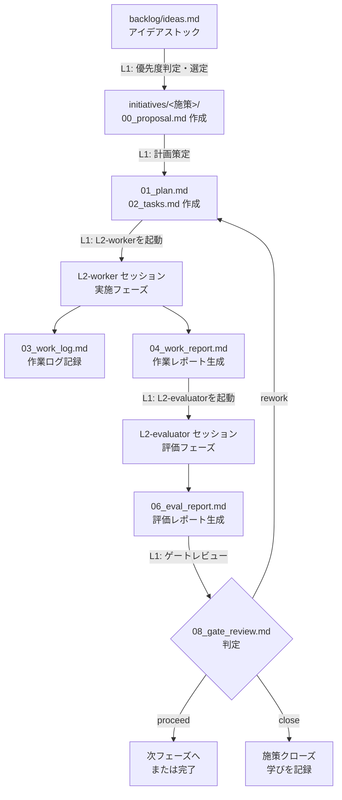

# ワークフロー全体図

## フロー概要



---

## フェーズ別オーナーシップ表

| フェーズ | 主担当 | 成果物 | L1の関与 |
|---|---|---|---|
| アイデア収集 | 人間 / L1 | `backlog/ideas.md` | 追記・精査・優先度付け |
| 提案 | L1 | `00_proposal.md` | 生成・承認 |
| 計画 | L1 | `01_plan.md` `02_tasks.md` | 生成・承認 |
| 実施 | L2-worker | `03_work_log.md` `04_work_report.md` | 起動・受け取り |
| 評価計画 | L1 | `05_eval_plan.md` | 生成・承認 |
| 評価 | L2-evaluator | `06_eval_report.md` | 起動・受け取り |
| 課題管理 | L1（解消） / L2（記録） | `07_issues.md` | 判断・対応指示 |
| ゲートレビュー | L1 | `08_gate_review.md` | 記入・判定 |

---

## ファイル更新権限マトリクス

| ファイル | L1 | L2-worker | L2-evaluator |
|---|---|---|---|
| `00_proposal.md` | 読み書き | 読み取り | 読み取り |
| `01_plan.md` | 読み書き | 読み取り | 読み取り |
| `02_tasks.md` | 読み書き | チェック更新のみ | 読み取り |
| `03_work_log.md` | 読み取り | 追記のみ | 読み取り |
| `04_work_report.md` | 読み取り | 読み書き | 読み取り |
| `05_eval_plan.md` | 読み書き | 読み取り | 読み取り |
| `06_eval_report.md` | 読み取り | なし | 読み書き |
| `07_issues.md` | 読み書き | 追記のみ | 読み取り |
| `08_gate_review.md` | 読み書き | なし | なし |

---

## 施策のライフサイクル

```
[idea] → [candidate] → [selected] → [in-progress] → [done]
                                                   ↘ [cancelled]
```

| ステータス | 意味 | 遷移条件 |
|---|---|---|
| `idea` | アイデア段階 | — |
| `candidate` | 精査済み、施策化検討中 | L1が精査完了 |
| `selected` | 施策化決定 | L1が `initiatives/` フォルダ作成 |
| `in-progress` | 実施中 | L2-worker セッション開始 |
| `done` | 完了 | ゲートレビューで `proceed` かつ全フェーズ完了 |
| `cancelled` | キャンセル | ゲートレビューで `close` |
