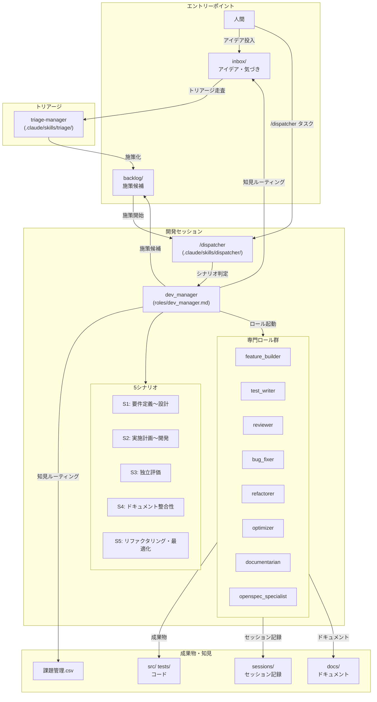
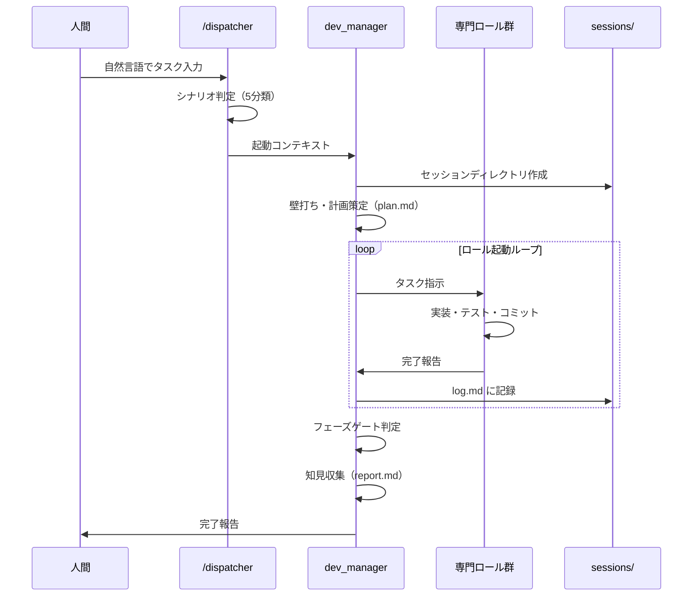
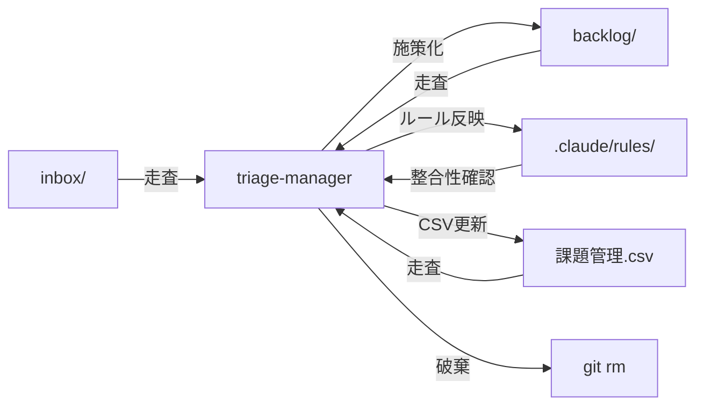

# 設計プロセスガイド

本ドキュメントは ai-driven-dev-patterns における設計プロセスの全体像を描き、人間のエントリーポイントからセッション完了・知見ルーティングまでの流れを可視化する。

> 詳細な設計書は `docs/design/` 配下を参照。本ガイドは「どこから始めて、どう進めるか」のナビゲーションに徹する。

---

## 1. 全体像

---

## 2. プロセスの流れ

### 2.1 エントリーポイント

人間が開発タスクを開始する方法は2つ。

| 方法 | 手順 | 適するケース |
|------|------|-------------|
| **直接起動** | `/dispatcher <タスク説明>` | やりたいことが明確な場合 |
| **backlog 経由** | `backlog/` から施策を選び `/dispatcher` で起動 | トリアージで承認された施策候補がある場合 |

### 2.2 シナリオ判定

dispatcher がユーザーの入力を解析し、5シナリオのいずれかに分類して dev_manager に渡す。

| シナリオ | 目的 | 主要ロール | 主な成果物 |
|---------|------|-----------|-----------|
| S1: 要件定義〜設計 | 設計ドキュメント作成 | documentarian, reviewer | `docs/design/` |
| S2: 実施計画〜開発 | コード実装 | feature_builder, test_writer, reviewer | `src/`, `tests/` |
| S3: 独立評価 | 品質監査 | reviewer（独立） | 評価レポート |
| S4: ドキュメント整合性 | ドキュメント更新 | documentarian, reviewer | `docs/` |
| S5: リファクタリング・最適化 | コード品質改善 | refactorer/optimizer, reviewer | `src/` |

詳細なフローとプロンプト例は [docs/session-guide.md](session-guide.md) を参照。

### 2.3 セッション実行

dev_manager がセッションディレクトリを作成し、ロール起動計画に従って専門ロールを順次起動する。

### 2.4 知見ルーティング

セッション完了時に dev_manager が知見を収集し、適切な場所にルーティングする。

| 知見の種類 | ルーティング先 | 例 |
|-----------|-------------|-----|
| セッション横断のルール・パターン | `roles/` or `.claude/rules/` | コーディング規約の追加 |
| 判断保留の気づき | `inbox/` | 次回トリアージで判断してほしい問い |
| 具体的な次施策候補 | `backlog/` | 新機能の提案 |
| 施策横断で再発しうる課題 | `課題管理.csv` | ツールの制約、構造的問題 |
| セッション内の課題 | `sessions/<name>/issues.md` | バグ報告、設計上の問題 |

### 2.5 トリアージ

定期的にトリアージセッション（`.claude/skills/triage/`）を実行し、inbox・backlog・課題管理.csv を整理する。

---

## 3. ディレクトリマップ

| ディレクトリ | 役割 | 主な利用者 |
|-------------|------|-----------|
| `roles/` | ロール定義（実行プロンプト） | dev_manager, 各専門ロール |
| `roles/_base/common.md` | 全ロール共通指示 | 全専門ロール |
| `.claude/skills/` | スキル定義（オンデマンド参照） | Claude |
| `.claude/skills/dispatcher/` | シナリオ判定・ルーティング | 人間（エントリー） |
| `.claude/skills/triage/` | トリアージセッション | 定期実行 |
| `.claude/rules/` | 常時参照ルール | 全セッション |
| `sessions/` | セッション作業記録 | dev_manager |
| `docs/` | 人間向けドキュメント | 人間 |
| `docs/design/` | 詳細設計書 | 人間, documentarian |
| `openspec/` | 仕様定義（Source of Truth） | openspec_specialist |
| `src/` | アプリケーションコード | feature_builder 等 |
| `tests/` | テストコード | test_writer 等 |
| `inbox/` | 気づき・知見の一時保管 | dev_manager, 人間 |
| `backlog/` | 施策候補の保管 | triage, dev_manager |

---

## 4. 関連ドキュメント

| ドキュメント | 内容 |
|------------|------|
| [session-guide.md](session-guide.md) | /dispatcher の使い方・シナリオ別詳細フロー |
| [design/dev-workflow-overview.md](design/dev-workflow-overview.md) | コード開発ワークフロー概念設計 |
| [design/dev-workflow-detail.md](design/dev-workflow-detail.md) | セッション内部の詳細設計 |
| [design/session-operation-flow.md](design/session-operation-flow.md) | セッション外部の運用フロー設計 |
| [design/session-flow-foundations.md](design/session-flow-foundations.md) | ライフサイクルモデル・dispatcher 仕様 |
| [design/session-flow-advanced.md](design/session-flow-advanced.md) | 横断的関心事・統合マッピング |

---

**作成者**: L2-worker (design-process-setup)
**作成日**: 2026-03-07
