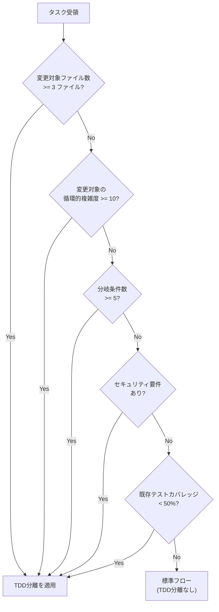
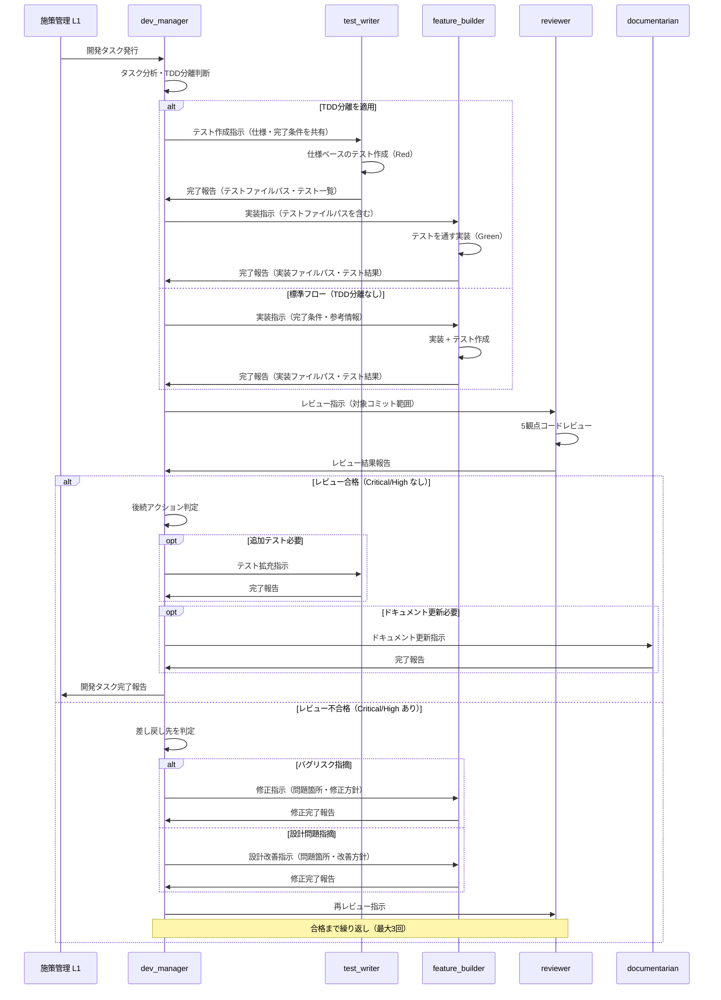
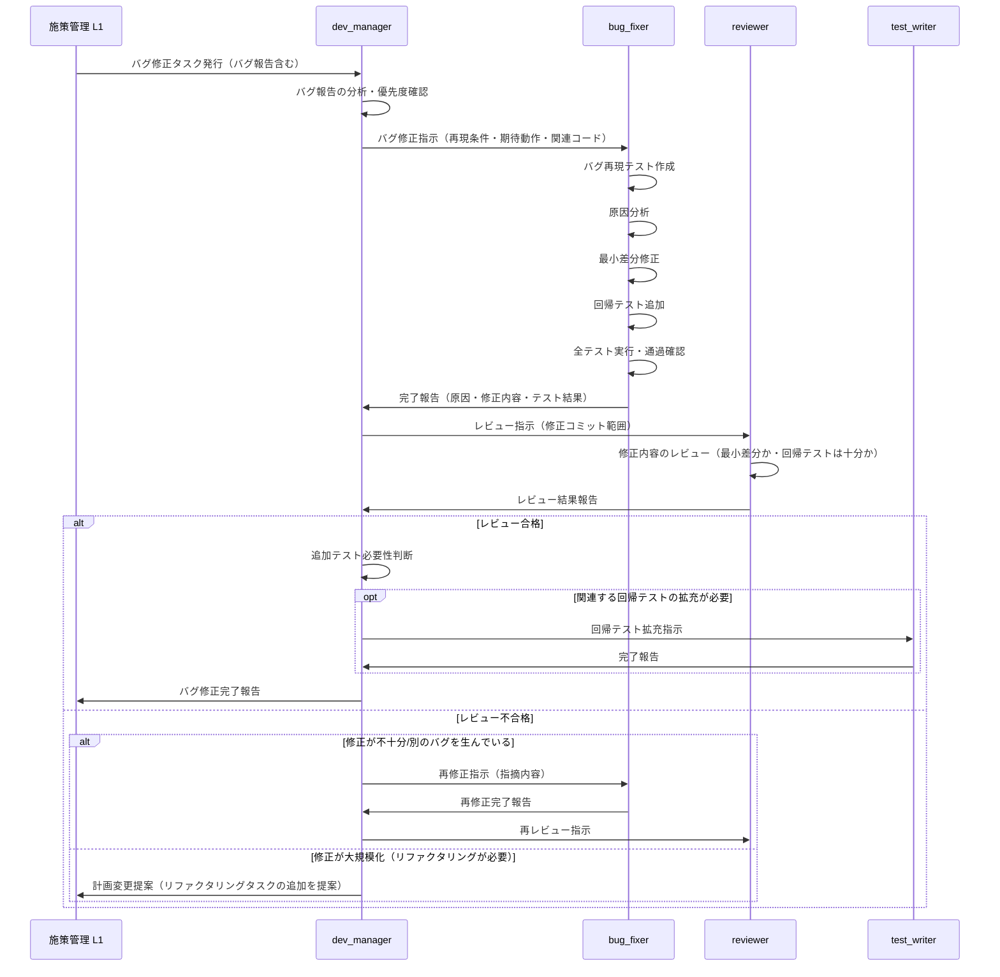
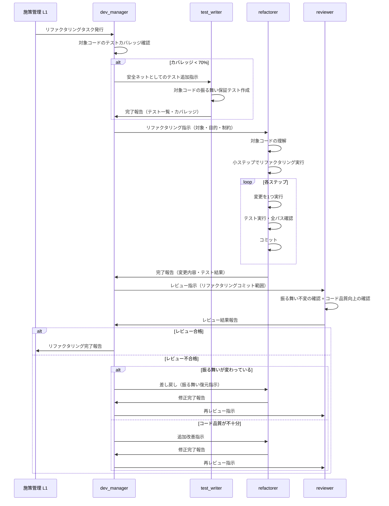
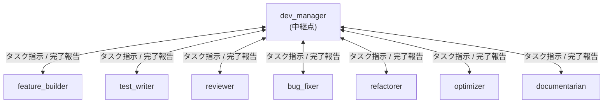
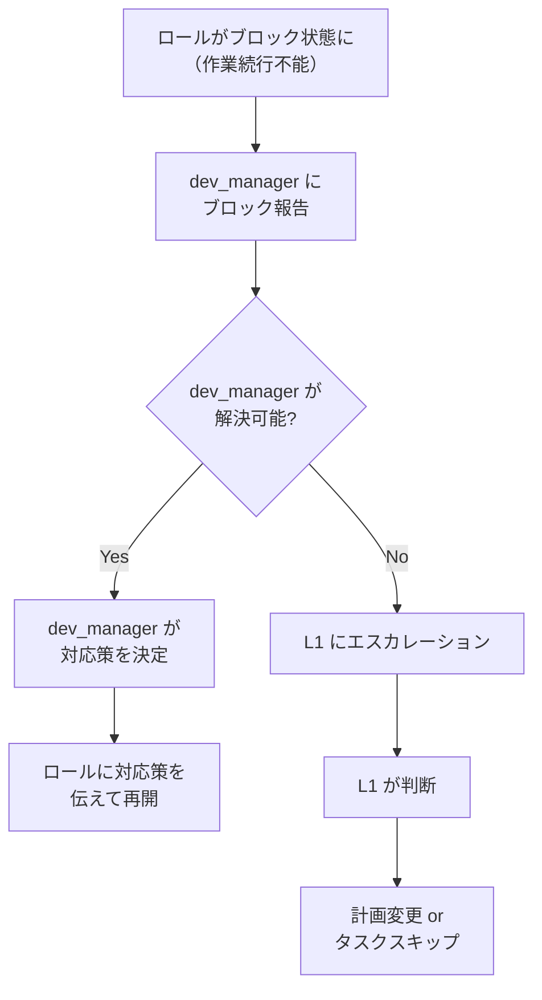

# コード開発ワークフロー詳細設計

## 1. 概要

本ドキュメントは、フェーズ1の概念設計（`docs/design/dev-workflow-overview.md`）をベースに、コード開発ワークフローの詳細設計をまとめたものである。

**含む内容**:
- 主要3シナリオ（新機能開発・バグ修正・リファクタリング）のワークフロー詳細設計（T-006）
- ロール間連携プロトコル設計（T-007）
- 既存ロール修正提案・新規ロール要件定義（T-008）

**前提ドキュメント**: `docs/design/dev-workflow-overview.md`（フェーズ1概念設計）

**パス表記**: 本ドキュメント内のファイルパスは、リポジトリルート（`ai-driven-dev-patterns/`）からの相対パスで統一する（E-ISS-001対応）。

---

## 2. TDD分離トリガーの定量的判断基準（E-ISS-002対応）

フェーズ1では「条件付き分離」を推奨方針としたが、dev_manager が判断するための定量的基準が未定義であった。以下に定量的判断基準を定義する。

### 2.1 判断フロー

dev_manager はタスク受領時に以下のフローで TDD分離の要否を判断する。



### 2.2 定量的閾値一覧

| 判断基準 | 閾値 | 計測方法 | 根拠 |
|---------|------|---------|------|
| 変更対象ファイル数 | >= 3 ファイル | タスク指示から特定 | 複数ファイルにまたがる変更は影響範囲が広く、独立検証の価値が高い |
| 循環的複雑度 (Cyclomatic Complexity) | >= 10 | 静的解析ツール（radon, pylint 等） | McCabe の基準で「高複雑度」に分類される閾値。テスト漏れのリスクが高い |
| 分岐条件数 | >= 5 | タスク指示 or 対象コードの分岐数 | 5分岐以上では条件の組み合わせ爆発が起き、独立したテスト設計が有効 |
| セキュリティ要件 | あり（認証・認可・暗号化・入力検証） | タスク指示のラベル / 対象モジュール | セキュリティ関連は仕様ベースのテストが不可欠 |
| 既存テストカバレッジ | < 50% | カバレッジレポート | カバレッジが低い領域は回帰リスクが高く、事前テスト作成が安全ネットになる |

### 2.3 定量化が困難な場合のフォールバック

上記の定量的閾値を計測できない場合（新規モジュールで静的解析が不可能、カバレッジ計測環境が未整備等）、以下の定性的判断を適用する。

- **タスク指示に「複雑」「重要」「安全性」のキーワードが含まれる** → TDD分離を適用
- **dev_manager の判断で「実装者以外の視点でのテスト設計が有効」と判断** → TDD分離を適用
- **判断に迷った場合** → TDD分離を適用（安全側に倒す）

---

## 3. シナリオ別ワークフロー詳細設計（T-006）

### 3.1 シナリオ1: 新機能開発

#### 3.1.1 シーケンス図



#### 3.1.2 ロールの起動順序

| 順序 | ロール | 条件 |
|------|--------|------|
| 1 | dev_manager | 常時（タスク受領時） |
| 2 | test_writer | TDD分離トリガー該当時のみ |
| 3 | feature_builder | 常時 |
| 4 | reviewer | 常時 |
| 5 | feature_builder (再) | レビュー不合格時のみ |
| 6 | reviewer (再) | 差し戻し修正後 |
| 7 | test_writer | 追加テストが必要な場合のみ |
| 8 | documentarian | ドキュメント更新が必要な場合のみ |

#### 3.1.3 各ステップの入力/出力

| ステップ | 実行ロール | 入力 | 出力 |
|---------|-----------|------|------|
| タスク分析 | dev_manager | L1 からのタスク指示 | TDD分離判断結果、ロール起動計画 |
| テスト作成（TDD） | test_writer | 仕様・完了条件・対象モジュール | テストファイル（`tests/` 配下）、テスト一覧 |
| 実装 | feature_builder | タスク指示、（TDD時）テストファイル | 実装コード（`src/` 配下）、テスト結果、コミット |
| レビュー | reviewer | 対象コミット範囲（ハッシュ or HEAD~N） | 問題リスト（Critical/High/Medium/Low 分類）、改善提案 |
| 差し戻し修正 | feature_builder | reviewer の問題リスト、修正方針 | 修正済みコード、コミット |
| テスト拡充 | test_writer | 対象モジュール、目標カバレッジ | 追加テストファイル、カバレッジレポート |
| ドキュメント更新 | documentarian | 対象ドキュメント、更新内容指示 | 更新済みドキュメント（`docs/` 配下）、コミット |

#### 3.1.4 分岐条件

| 分岐ポイント | 条件 | 遷移先 |
|-------------|------|--------|
| TDD分離判断 | セクション2.2 の閾値該当 | test_writer 先行起動 |
| TDD分離判断 | 閾値非該当 | feature_builder 直接起動 |
| レビュー結果判定 | Critical/High が 0件 | 合格 → 後続アクション判定 |
| レビュー結果判定 | Critical/High が 1件以上 | 不合格 → 差し戻し |
| 差し戻し先判定 | バグリスク / 実装不備 | feature_builder に差し戻し |
| 差し戻し先判定 | 設計上の問題 | feature_builder に設計改善指示（軽微な場合）、または計画変更提案（大規模な場合） |
| 差し戻し回数 | 3回以上不合格 | dev_manager がブロック報告を L1 に送付 |
| 後続アクション | カバレッジが目標未達 or reviewer が追加テストを推奨 | test_writer 起動 |
| 後続アクション | 公開APIの追加/変更あり | documentarian 起動 |

---

### 3.2 シナリオ2: バグ修正

#### 3.2.1 シーケンス図



#### 3.2.2 ロールの起動順序

| 順序 | ロール | 条件 |
|------|--------|------|
| 1 | dev_manager | 常時（タスク受領時） |
| 2 | bug_fixer | 常時 |
| 3 | reviewer | 常時 |
| 4 | bug_fixer (再) | レビュー不合格時のみ |
| 5 | reviewer (再) | 差し戻し修正後 |
| 6 | test_writer | 回帰テスト拡充が必要な場合のみ |

#### 3.2.3 各ステップの入力/出力

| ステップ | 実行ロール | 入力 | 出力 |
|---------|-----------|------|------|
| バグ報告分析 | dev_manager | L1 からのバグ報告（再現条件・期待動作） | 優先度判定、bug_fixer への指示 |
| バグ修正 | bug_fixer | バグ報告、再現条件、関連コードパス | 修正コード（`src/` 配下）、再現テスト + 回帰テスト（`tests/` 配下）、コミット |
| レビュー | reviewer | 修正コミット範囲 | 問題リスト（最小差分か・回帰テスト十分か・新規バグなし確認） |
| 再修正 | bug_fixer | reviewer の指摘内容 | 修正済みコード、コミット |
| 回帰テスト拡充 | test_writer | 修正モジュール、エッジケース候補 | 追加テスト、カバレッジレポート |

#### 3.2.4 分岐条件

| 分岐ポイント | 条件 | 遷移先 |
|-------------|------|--------|
| レビュー結果判定 | Critical/High が 0件 | 合格 → 追加テスト判定 |
| レビュー結果判定 | 修正不十分 or 新規バグ発見 | bug_fixer に差し戻し |
| レビュー結果判定 | 大規模修正が必要 | dev_manager → L1 に計画変更提案 |
| 差し戻し回数 | 3回以上不合格 | dev_manager がブロック報告を L1 に送付 |
| 追加テスト判定 | バグ周辺のカバレッジ < 50% or 類似バグの再発リスクあり | test_writer 起動 |

---

### 3.3 シナリオ3: リファクタリング

#### 3.3.1 シーケンス図



#### 3.3.2 ロールの起動順序

| 順序 | ロール | 条件 |
|------|--------|------|
| 1 | dev_manager | 常時（タスク受領時） |
| 2 | test_writer | 対象コードのカバレッジ < 70% の場合のみ |
| 3 | refactorer | 常時 |
| 4 | reviewer | 常時 |
| 5 | refactorer (再) | レビュー不合格時のみ |
| 6 | reviewer (再) | 差し戻し修正後 |

#### 3.3.3 各ステップの入力/出力

| ステップ | 実行ロール | 入力 | 出力 |
|---------|-----------|------|------|
| カバレッジ確認 | dev_manager | 対象コードパス | カバレッジ数値、test_writer 起動判断 |
| 安全ネットテスト | test_writer | 対象モジュール、現状の振る舞い | 振る舞い保証テスト（`tests/` 配下）、カバレッジレポート |
| リファクタリング | refactorer | 対象コード、目的（DRY化・設計改善等）、制約 | リファクタリング済みコード（`src/` 配下）、コミット群 |
| レビュー | reviewer | リファクタリングコミット範囲 | 振る舞い不変の確認結果、コード品質評価 |

#### 3.3.4 分岐条件

| 分岐ポイント | 条件 | 遷移先 |
|-------------|------|--------|
| カバレッジ確認 | 対象コードのカバレッジ < 70% | test_writer で安全ネットテスト追加 |
| カバレッジ確認 | カバレッジ >= 70% | refactorer 直接起動 |
| レビュー結果判定 | 振る舞い不変 + 品質向上確認 | 合格 → 完了報告 |
| レビュー結果判定 | 振る舞いが変わっている | refactorer に差し戻し（振る舞い復元） |
| レビュー結果判定 | 品質向上が不十分 | refactorer に追加改善指示 |
| 差し戻し回数 | 3回以上不合格 | dev_manager がブロック報告を L1 に送付 |

---

## 4. ロール間連携プロトコル設計（T-007）

### 4.1 タスクの引き渡し方法

#### 4.1.1 基本方針: dev_manager 中継方式

ロール間のタスク引き渡しは、原則として **dev_manager を中継点とする hub-and-spoke 方式** を採用する。ロール同士が直接タスクを受け渡すことはしない。



**理由**:
1. **コンテキストの一元管理**: dev_manager がすべてのロールの進捗とコンテキストを把握できる
2. **判断の集約**: 差し戻し・追加タスク・優先度変更の判断を1箇所で行える
3. **ロールの独立性維持**: 各ロールは自分のタスクに集中でき、他ロールの状態を知る必要がない
4. **common.md との整合**: 現行の「L1 に報告」パターンを踏襲（dev_manager が開発領域の L1 相当）

#### 4.1.2 タスク指示テンプレート

dev_manager から各ロールへのタスク指示は以下の形式で行う。

```markdown
## タスク指示

### タスクID
DT-XXX（dev_manager が採番。DT = Development Task）

### 対象ロール
{feature_builder | test_writer | reviewer | bug_fixer | refactorer | optimizer | documentarian}

### タスク概要
{何をするかの1行要約}

### 完了条件
- [ ] {条件1}
- [ ] {条件2}

### 入力情報
- 対象ファイル: {ファイルパス（リポジトリルートからの相対パス）}
- 参考情報: {前段ロールの成果物パス、仕様参照先等}
- コンテキスト: {前段の完了報告サマリー}

### 制約
- {制約1（例: 最小差分で修正すること）}
- {制約2（例: 振る舞いを変えないこと）}
```

#### 4.1.3 完了報告テンプレート

各ロールから dev_manager への完了報告は `roles/_base/common.md` の「6. 完了報告の形式」を基本とし、以下を追加する。

```markdown
## 完了報告

### タスクID
DT-XXX

### 実施内容
- {やったこと（箇条書き）}

### 成果物
- {ファイルパス（リポジトリルートからの相対パス）}: {概要}

### テスト結果
- {パス / 失敗 / テスト対象外}

### 次段ロールへの申し送り
- {後続ロールが知るべき情報（例: テストファイルのパス、注意点）}

### 発見した課題（ロール外タスク）
- {あれば。形式: [対象ロール] 概要}
```

### 4.2 成果物の受け渡し形式

#### 4.2.1 基本原則

ロール間の成果物受け渡しは **git コミット + ファイルパス参照方式** を採用する。

1. 各ロールは作業完了時に成果物を git コミットする
2. 完了報告に成果物のファイルパス（リポジトリルートからの相対パス）を記載する
3. 後続ロールは完了報告に記載されたファイルパスから成果物を参照する

#### 4.2.2 成果物のファイル配置規約

| ロール | 主な出力先 | ファイル命名規約 |
|--------|-----------|----------------|
| feature_builder | `src/` | プロジェクトの既存命名規約に従う |
| test_writer | `tests/` | `test_{対象モジュール名}.py` |
| bug_fixer | `src/`, `tests/` | 既存ファイルの修正 + 回帰テスト追加 |
| refactorer | `src/` | 既存ファイルの修正（新規ファイルは分割時のみ） |
| optimizer | `src/` | 既存ファイルの修正 |
| documentarian | `docs/`, `README.md`, `CHANGELOG.md` | プロジェクトの既存命名規約に従う |
| reviewer | (ファイル出力なし) | 完了報告の中に問題リストを記載 |

#### 4.2.3 reviewer の問題リスト形式

reviewer はファイルを出力しないため、完了報告の中に以下の形式で問題リストを記載する。

```markdown
### 問題リスト

| # | 重大度 | 対象ファイル | 行番号 | 観点 | 問題の概要 | 推奨対応 |
|---|--------|------------|--------|------|-----------|---------|
| 1 | Critical | src/auth.py | 42 | セキュリティ | SQL インジェクション | プレースホルダー使用 |
| 2 | High | src/api.py | 105 | バグリスク | None チェック欠如 | ガード節追加 |
| 3 | Medium | src/utils.py | 23 | 設計 | 重複コード | 共通関数抽出 |

### 総合判定
- **判定**: 不合格（Critical 1件、High 1件）
- **差し戻し先**: feature_builder（#1, #2 の修正）
- **後続推奨**: refactorer（#3 の対応）
```

### 4.3 ブロッカー発生時のエスカレーション手順

#### 4.3.1 エスカレーションフロー



#### 4.3.2 ブロック報告テンプレート

```markdown
## ブロック報告

### タスクID
DT-XXX

### ブロック理由
{なぜ作業を続行できないか}

### 試行した対応
- {対応1とその結果}
- {対応2とその結果}

### 必要な判断
{dev_manager / L1 に判断してほしいこと}

### 影響
{このタスクがブロックされた場合の後続への影響}
```

#### 4.3.3 エスカレーション基準

| レベル | 条件 | エスカレーション先 |
|--------|------|-----------------|
| Level 1 | ロール内で解決不可（テスト失敗が修正できない、要件不明確等） | dev_manager |
| Level 2 | dev_manager で解決不可（計画変更が必要、スコープ外の判断等） | 施策管理 L1 |
| Level 3 | L1 で解決不可（技術的制約、外部依存等） | 人間（ユーザー） |

#### 4.3.4 差し戻し回数の上限

全シナリオ共通で、同一タスクの差し戻し（レビュー不合格 → 再修正 → 再レビュー）は **最大3回** までとする。3回を超えた場合は dev_manager が Level 2 エスカレーション（L1 への報告）を行う。

### 4.4 コンテキスト共有の仕組み

#### 4.4.1 コンテキスト共有の課題

各ロールは独立したサブエージェント（独立コンテキストウィンドウ）として実行されるため、他ロールの作業内容を直接参照できない。以下の仕組みでコンテキストを共有する。

#### 4.4.2 コンテキスト共有手段

| 手段 | 用途 | 詳細 |
|------|------|------|
| **タスク指示** | 前段ロールの成果物情報を後段に伝達 | dev_manager がタスク指示の「入力情報」「コンテキスト」に前段の完了報告サマリーを記載 |
| **git コミット履歴** | 成果物の実体を参照 | 後段ロールが `git log`, `git show`, `git diff` で前段の変更内容を参照 |
| **ファイルパス参照** | 成果物ファイルを直接読む | 完了報告に記載されたファイルパスを使って、後段ロールが `Read` ツールで参照 |
| **完了報告の申し送り** | 暗黙知・注意点の伝達 | 完了報告の「次段ロールへの申し送り」に記載 |

#### 4.4.3 dev_manager のコンテキスト蓄積

dev_manager は開発セッション全体を通じて起動されるため、以下のコンテキストを蓄積する。

- 各ロールの完了報告（成果物パス・テスト結果・申し送り）
- レビュー結果（問題リスト・判定結果）
- ブロック報告と対応策
- タスクの進捗状態

このコンテキストを活用して、後続ロールへのタスク指示に必要な情報を含める。

#### 4.4.4 コンテキスト伝達の具体例

**例: TDD分離フローでの test_writer → feature_builder へのコンテキスト伝達**

1. test_writer が完了報告を提出:
   ```
   成果物: tests/test_auth.py（テスト5件追加）
   申し送り: ログイン関数のシグネチャは login(username: str, password: str) -> AuthResult を想定
   ```
2. dev_manager が feature_builder へのタスク指示に含める:
   ```
   入力情報:
   - テストファイル: tests/test_auth.py
   コンテキスト:
   - test_writer がテスト5件を作成済み。想定シグネチャ: login(username, password) -> AuthResult
   - テストを通す実装を行うこと
   ```

---

## 5. 既存ロール修正提案（T-008）

### 5.1 各既存ロールの修正提案

#### 5.1.1 `roles/_base/common.md` への修正提案

| 修正箇所 | 修正内容 | 修正理由 |
|---------|---------|---------|
| セクション1「エージェントの役割と想定アーキテクチャ」 | dev_manager ロールの存在を明記。L1 → dev_manager → L2（各ロール）の3層アーキテクチャを説明に追加 | 現行は L1 → L2 の2層のみ。開発ワークフローでは dev_manager が中間層として機能する |
| セクション2「タスクの発生元」 | dev_manager からのタスク指示（DT-XXX 形式）を発生元に追加 | 現行は L1 の `02_tasks.md` のみ。開発ワークフローでは dev_manager が細分化したタスクを各ロールに配分する |
| セクション5「コミット規約」 | タスクID（DT-XXX）をコミットメッセージの footer に含めるルールを追加 | トレーサビリティの確保。どのタスク指示に対するコミットか追跡可能にする |
| セクション6「完了報告の形式」 | 「次段ロールへの申し送り」セクションを追加 | ロール間のコンテキスト伝達を標準化する |

**影響範囲**: 全7ロール（common.md を参照する全ロールに影響）

#### 5.1.2 `roles/feature_builder.md` への修正提案

| 修正箇所 | 修正内容 | 修正理由 |
|---------|---------|---------|
| セクション「作業の流れ」> 1. タスク確認 | dev_manager からのタスク指示（DT-XXX 形式）の読み取りを追加。TDD分離フロー時は test_writer のテストファイルパスを入力として受け取る旨を明記 | dev_manager 経由のタスク受領フローを明確化 |
| セクション「作業の流れ」> 3. 実装 | TDD分離フロー時の実装手順を追加: 「test_writer が作成したテストを読み、テストを通す実装を行う」 | TDD分離時の feature_builder の動き方が未定義 |
| セクション「完了報告」 | reviewer への申し送り情報（変更の意図・注意点）を含めるよう追記 | レビューの効率化 |

**影響範囲**: feature_builder のみ

#### 5.1.3 `roles/test_writer.md` への修正提案

| 修正箇所 | 修正内容 | 修正理由 |
|---------|---------|---------|
| セクション「作業の流れ」 | TDD分離フローでの先行テスト作成手順を新規追加。仕様ベースでのテスト設計方法、feature_builder が参照できるテストファイルの構成方法を記載 | 現行は「カバレッジ向上」の事後タスクのみ。TDD分離での先行テスト作成フローが未定義 |
| セクション「完了報告」 | テストが想定する関数シグネチャ・モジュール構造を申し送りに含めるよう追記 | feature_builder がテストを通す実装を行う際に必要な情報 |

**影響範囲**: test_writer のみ

#### 5.1.4 `roles/reviewer.md` への修正提案

| 修正箇所 | 修正内容 | 修正理由 |
|---------|---------|---------|
| セクション「作業の流れ」> 1. レビュー対象の確認 | dev_manager から指定されたコミット範囲（DT-XXX のコミット群）をレビューする手順を追加。PR単位・ファイル単位のレビュー指示にも対応 | 現行は「直近N件のコミット」に限定。タスク単位でのレビュー指定に対応する必要がある |
| セクション「作業の流れ」> 4. タスクの起票 | 問題リスト形式（セクション4.2.3）での報告を標準化。起票先は dev_manager に一本化 | 現行は「L1 へ報告」と曖昧。dev_manager を中継点として明確化 |
| 「完了報告」 | 総合判定（合格/不合格）と差し戻し先の推奨を含めるよう追記 | dev_manager が差し戻し判断を行うための情報 |

**影響範囲**: reviewer のみ

#### 5.1.5 `roles/bug_fixer.md` への修正提案

| 修正箇所 | 修正内容 | 修正理由 |
|---------|---------|---------|
| セクション「作業の流れ」> 1. タスク確認 | dev_manager からのバグ修正指示（DT-XXX 形式）の読み取りを追加。バグ報告の標準形式（再現条件・期待動作・関連コード）を明記 | バグ報告の受け取り形式が未定義だった |
| セクション「やらないこと」> 3. 大規模なリファクタリング | エスカレーション基準を定量化: 「修正対象が3ファイル以上にまたがる場合、または修正行数が100行を超える場合」はリファクタリングタスクとして dev_manager にエスカレーション | 「大規模修正が必要な場合」の判断基準が不明確だった |

**影響範囲**: bug_fixer のみ

#### 5.1.6 `roles/refactorer.md` への修正提案

| 修正箇所 | 修正内容 | 修正理由 |
|---------|---------|---------|
| セクション「作業の流れ」> 2. 現状の理解 | テストカバレッジの確認手順を追加。カバレッジ < 70% の場合は dev_manager に安全ネットテストの追加を要請する旨を明記 | テストがない対象コードへのリファクタリング時の安全ネット確保手順が弱かった |
| 新規セクション「発動条件」 | dev_manager からの起動条件を明記: (1) reviewer の設計問題指摘 (2) bug_fixer のエスカレーション (3) L1 からの計画的リファクタリング指示 | 「いつリファクタリングを実施するか」のトリガー条件が不明確だった |

**影響範囲**: refactorer のみ

#### 5.1.7 `roles/optimizer.md` への修正提案

| 修正箇所 | 修正内容 | 修正理由 |
|---------|---------|---------|
| 新規セクション「発動条件」 | dev_manager からの起動条件を明記: (1) reviewer のパフォーマンス問題指摘 (2) L1 からの計画的最適化指示 (3) 計測で目標値未達が確認された場合 | 「いつ最適化が必要か」の判断基準が未定義だった |
| セクション「作業の流れ」> 2. 現状の計測 | 計測ツールの選定ガイドラインを追加。言語/フレームワーク非依存の汎用的な計測方法（実行時間計測）を基本とし、プロジェクト固有ツールがある場合はそちらを優先 | 計測ツールの前提が Python 固有（cProfile, tracemalloc）だった |

**影響範囲**: optimizer のみ

#### 5.1.8 `roles/documentarian.md` への修正提案

| 修正箇所 | 修正内容 | 修正理由 |
|---------|---------|---------|
| 新規セクション「発動条件」 | dev_manager からの起動条件を明記: (1) 公開APIの追加/変更後 (2) 新機能実装完了後 (3) L1 からのドキュメント整備指示 (4) リリース前 | 「いつドキュメントを更新するか」のトリガーが L1 指示依存だった |
| セクション「作業の流れ」 | `docs/design/` 配下の設計書作成時は `.claude/rules/design-doc.md` および `.claude/rules/code-in-docs.md` のルールを参照する旨を明記 | docs/ 配下の設計書作成ルールへの参照が欠如していた |

**影響範囲**: documentarian のみ

### 5.2 新規ロール: dev_manager の要件定義

#### 5.2.1 基本情報

| 項目 | 内容 |
|------|------|
| ロール名 | dev_manager |
| ファイルパス | `roles/dev_manager.md` |
| 位置づけ | コード開発セッションのオーケストレーター。施策管理 L1 と各開発ロールの間に位置する |

#### 5.2.2 責務

1. **セッション管理**: 開発タスク受領時にセッションディレクトリ（`sessions/{シナリオ名}_{タスク名}/`）を作成し、壁打ち・計画・作業ログ・完了報告・課題を4ファイルで管理する。各専門ロール起動時にサブディレクトリ（`<role-name>/`）を作成する
2. **タスク分配**: 施策管理 L1 から受けた開発タスクを分析し、適切なロールへの細分化タスク（DT-XXX）を作成・配分する
3. **TDD分離判断**: セクション2の定量的基準に基づき、TDD分離の要否を判断する
4. **ロール起動順序の決定**: シナリオ（新機能・バグ修正・リファクタリング等）に応じて適切なロール起動順序を決定する
5. **レビュー結果に基づく判断**: reviewer の報告を受けて、合格判定・差し戻し先の決定・エスカレーションを行う
6. **コンテキスト中継**: 前段ロールの成果物情報を後段ロールのタスク指示に含める
7. **進捗管理**: 各ロールの完了報告を受けて、次のロール起動を判断する
8. **完了報告**: 全ロールの作業が完了したら、施策管理 L1 に開発タスクの完了を報告する

#### 5.2.3 作業フロー

```
1. L1 からの開発タスクを受領する
2. セッションディレクトリを作成する（sessions/{シナリオ名}_{タスク名}/）
3. 壁打ちを行い、plan.md に記録する（目的・スコープ・不明点の解消）
4. タスクを分析し、シナリオ（新機能/バグ修正/リファクタリング/テスト拡充/最適化/ドキュメント）を判定する
5. TDD分離判断を行う（新機能シナリオの場合）
6. ロール起動計画を策定し、plan.md に記録する（起動順序・タスク指示の内容）
7. 各ロールを順次起動し、完了報告を受け取る（経過を log.md に記録）
   - 起動時に専門ロールのサブディレクトリ（<role-name>/）を作成する
   - 各専門ロールは自身のサブディレクトリ内で4ファイルを管理する
8. レビュー結果に基づき、合格/差し戻し/エスカレーションを判断する（判断を log.md に記録）
9. 全ロール完了後、report.md を作成し、L1 に開発タスク完了を報告する
```

#### 5.2.4 やること

- セッションディレクトリ（`sessions/{シナリオ名}_{タスク名}/`）の作成と管理
- 壁打ち・実施計画の plan.md への記録
- 開発タスクのシナリオ判定とロール起動計画の策定
- TDD分離の要否判断（定量的基準に基づく）
- 各ロールへのタスク指示の作成と配分
- 各専門ロール起動時のサブディレクトリ作成
- ロール起動・判断の経過を log.md に記録
- レビュー結果に基づく合格/差し戻し判定
- ブロッカー発生時のエスカレーション判断
- コンテキストの中継（前段→後段への情報伝達）
- セッション完了時の report.md 作成と L1 への完了報告
- 課題の issues.md への記録

#### 5.2.5 やらないこと

- コードの実装・修正・レビュー（各専門ロールに委譲する）
- 施策管理 L1 の管理ファイル（`00_proposal.md` 等）の編集
- 開発タスクのスコープ変更（L1 に計画変更を提案する）
- 1回の起動で複数の独立した開発タスクを処理（1タスク1起動の原則）

#### 5.2.6 施策管理 L1 との責務分界

| 判断事項 | 担当 |
|---------|------|
| 「何を作るか」（タスクの定義） | 施策管理 L1 |
| 「どう作るか」（ロール起動計画） | dev_manager |
| 「品質は十分か」（レビュー合否） | dev_manager（reviewer の報告に基づく） |
| 「計画を変えるか」（スコープ変更） | 施策管理 L1（dev_manager が提案） |
| 「次にどのタスクを実行するか」 | 施策管理 L1（dev_manager は1タスクの完了に責任） |

### 5.3 `roles/_base/common.md` への修正提案の詳細

#### 5.3.1 セクション1への追記案

「想定アーキテクチャ」に以下を追記する。

```
### コード開発ワークフロー時のアーキテクチャ

コード開発タスクでは、dev_manager が L1 と各ロールの間に位置する。

```
L1 施策管理マネージャー
  │
  └── dev_manager（開発マネージャー）
        │
        ├── feature_builder（機能実装）
        ├── test_writer（テスト整備）
        ├── reviewer（レビュー）
        ├── bug_fixer（バグ修正）
        ├── refactorer（リファクタリング）
        ├── optimizer（最適化）
        └── documentarian（ドキュメント整備）
```

- L1 が dev_manager を起動し、開発タスクを委譲する
- dev_manager が適切なロールを起動し、タスクを配分する
- 各ロールは dev_manager に完了報告する
- dev_manager が L1 に開発タスクの完了を報告する
```

#### 5.3.2 セクション6への追記案

「完了報告の形式」に以下のセクションを追記する。

```
### 次段ロールへの申し送り（開発ワークフロー時）
- 後続ロールが知るべき情報（成果物パス、注意点、前提条件等）
- dev_manager が後段ロールのタスク指示に転記するための情報
```

---

## 6. まとめ

### 6.1 設計の全体構造

| 設計要素 | 定義箇所 |
|---------|---------|
| ワークフロー全体像・概念設計 | `docs/design/dev-workflow-overview.md` |
| TDD分離の定量的判断基準 | 本ドキュメント セクション2 |
| 新機能開発シナリオ詳細 | 本ドキュメント セクション3.1 |
| バグ修正シナリオ詳細 | 本ドキュメント セクション3.2 |
| リファクタリングシナリオ詳細 | 本ドキュメント セクション3.3 |
| タスク引き渡し方法 | 本ドキュメント セクション4.1 |
| 成果物受け渡し形式 | 本ドキュメント セクション4.2 |
| エスカレーション手順 | 本ドキュメント セクション4.3 |
| コンテキスト共有 | 本ドキュメント セクション4.4 |
| 既存ロール修正提案 | 本ドキュメント セクション5.1 |
| dev_manager 要件定義 | 本ドキュメント セクション5.2 |
| common.md 修正提案 | 本ドキュメント セクション5.3 |

### 6.2 後続施策への引き継ぎ

本ドキュメントは「設計」であり、ロール定義ファイルの実際の修正は後続施策「コード開発ワークフロー・ロール定義の実装」で行う。後続施策では以下を実施する。

1. `roles/dev_manager.md` の新規作成（セクション5.2の要件定義に基づく）
2. `roles/_base/common.md` の修正（セクション5.3の提案に基づく）
3. 既存7ロールの修正（セクション5.1の各提案に基づく）
4. テスト実行コマンドの確定と全ロールへの反映

---

**作成者**: L2-worker
**作成日**: 2026-03-01
**関連施策**: コード開発ワークフロー設計の探索（フェーズ2）
**前提ドキュメント**: `docs/design/dev-workflow-overview.md`
**後続施策**: コード開発ワークフロー・ロール定義の実装
