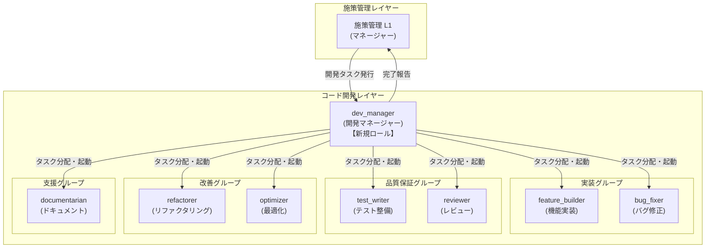
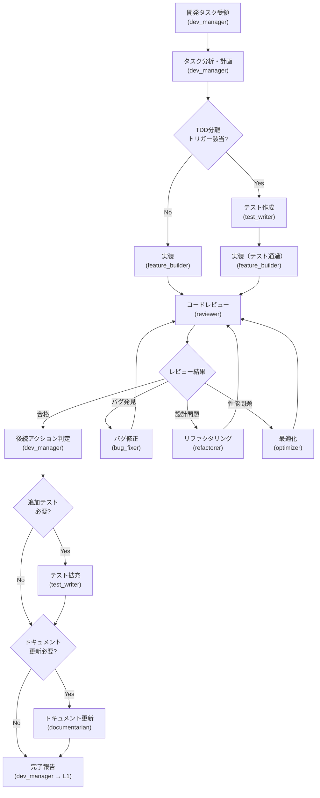
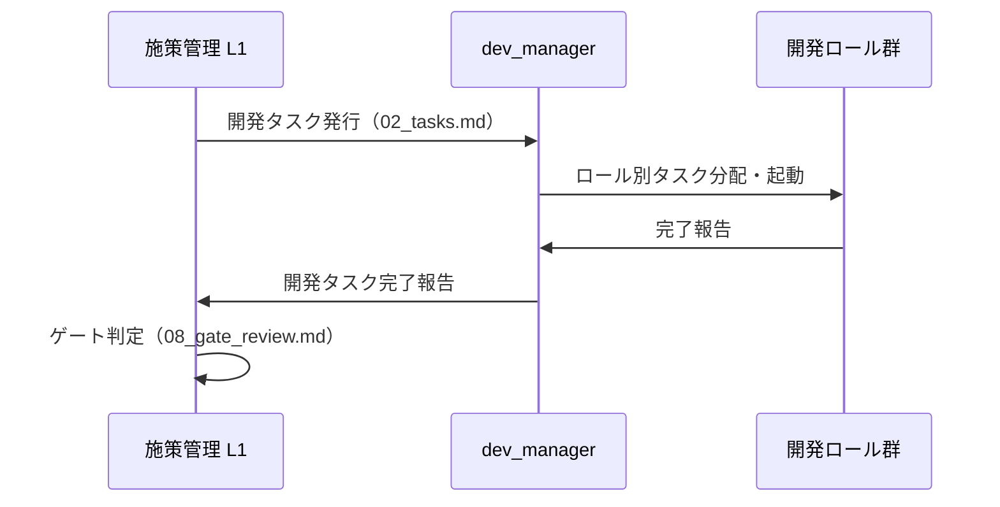
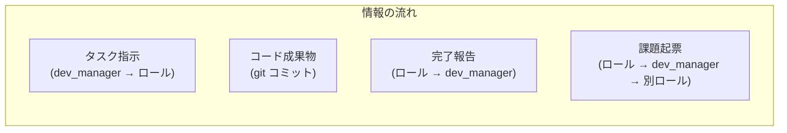

# コード開発ワークフロー概念設計

## 1. 概要

本ドキュメントは、`roles/` 配下の既存7ロール（feature_builder, test_writer, reviewer, bug_fixer, refactorer, optimizer, documentarian）を活用したコード開発ワークフローの概念設計をまとめたものである。

施策管理ワークフロー（dev-process-improvement の L1/L2）とは独立した仕組みとして、コード開発セッションにおけるロールの連携・起動順序・データフローを定義する。

**本ドキュメントの位置づけ**: 探索フェーズ（フェーズ1）の概要設計。後続のフェーズ2でシナリオ別詳細設計に発展させる。

---

## 2. ワークフロー全体像

### 2.1 ロール構成と階層

### 2.2 標準的な開発フロー

### 2.3 ロールの起動パターン

| パターン | 説明 | 起動順序 |
|---------|------|---------|
| **標準実装** | 新機能の実装（TDD分離なし） | dev_manager → feature_builder → reviewer → (documentarian) |
| **TDD実装** | 品質重視の新機能実装 | dev_manager → test_writer → feature_builder → reviewer → (documentarian) |
| **バグ修正** | 既知バグの修正 | dev_manager → bug_fixer → reviewer |
| **リファクタリング** | コード品質改善 | dev_manager → refactorer → reviewer |
| **最適化** | パフォーマンス改善 | dev_manager → optimizer → reviewer |
| **テスト拡充** | カバレッジ向上 | dev_manager → test_writer → (reviewer) |
| **ドキュメント整備** | ドキュメント更新 | dev_manager → documentarian |

---

## 3. 施策管理ワークフローとの差異

### 3.1 比較表

| 観点 | 施策管理ワークフロー | コード開発ワークフロー |
|------|-------------------|---------------------|
| **目的** | 開発プロセス改善の施策管理 | コードの実装・品質保証・保守 |
| **マネージャー** | L1（施策管理マネージャー） | dev_manager（開発マネージャー） |
| **ワーカー** | L2-worker（汎用実施）、L2-evaluator（評価） | 7つの専門ロール（feature_builder 等） |
| **活動ディレクトリ** | `dev-process-improvement/initiatives/` | `src/`, `tests/`, `docs/`, `openspec/` |
| **管理ファイル** | 00_proposal 〜 08_gate_review | タスクリスト（形式未定）、git コミット履歴 |
| **品質ゲート** | L2-evaluator による評価 → L1 ゲート判定 | reviewer によるコードレビュー → dev_manager 判定 |
| **フロー制御** | フェーズゲート方式（通過/条件付き/差し戻し） | ロール間の順次起動（レビュー不合格時の差し戻しあり） |
| **成果物** | 設計ドキュメント、プロセス改善提案 | コード、テスト、ドキュメント |

### 3.2 連携ポイント

施策管理ワークフローとコード開発ワークフローは以下の接点で連携する。

- 施策管理 L1 は「何を作るか」を決め、dev_manager に委譲する
- dev_manager は「どう作るか」を決め、適切なロールを起動する
- dev_manager は開発タスクの完了を施策管理 L1 に報告する
- 施策管理 L1 はゲート判定で全体の品質を確認する

---

## 4. ロール間データフロー

### 4.1 各ロールの入力と出力

| ロール | 入力 | 出力 |
|--------|------|------|
| **dev_manager** | 施策管理 L1 からの開発タスク | ロール別タスク指示、完了報告 |
| **feature_builder** | タスク指示（概要・完了条件・参考情報） | 実装コード（`src/`）、完了条件に対応するテスト（`tests/`）、コミット |
| **test_writer** | テスト対象モジュール、目標カバレッジ | テストコード（`tests/`）、カバレッジレポート、発見したバグの起票 |
| **reviewer** | レビュー対象のコミット/差分 | 問題の分類（Critical/High/Medium/Low）、ロール別タスク起票 |
| **bug_fixer** | バグ報告（再現条件・期待動作） | 修正コード（`src/`）、回帰テスト（`tests/`）、コミット |
| **refactorer** | リファクタリング対象・目的 | リファクタリング済みコード（`src/`）、コミット |
| **optimizer** | 最適化対象・目標値 | 最適化済みコード（`src/`）、計測結果（before/after）、コミット |
| **documentarian** | ドキュメント更新対象・指示 | 更新済みドキュメント（`docs/`, `README.md`, `CHANGELOG.md`）、コミット |

### 4.2 ロール間の情報の受け渡し

現在のロール定義では、ロール間の情報受け渡しは以下の手段で行われる。

1. **L1/dev_manager を介したタスク起票**: ロールが発見した問題を他ロールへのタスクとして起票し、L1/dev_manager が次のロールを起動する
2. **git コミット**: 各ロールの成果物はコミットとして記録され、後続ロール（特に reviewer）がコミット差分を参照する
3. **完了報告**: 各ロールが L1 に報告する形式（common.md の「完了報告の形式」）で、次のロールへの申し送り事項を伝達する

---

## 5. T-001〜T-003 分析結果サマリー

### 5.1 既存ロール適合度サマリー（T-001）

| ロール | 適合度 | 判断理由 | 主要な修正点 |
|--------|--------|---------|-------------|
| feature_builder | **高** | 開発ワークフローの中心。TDD意識・完了条件駆動の設計がタスク管理と親和的 | openspec連携TODO、テスト実行コマンド未確定 |
| test_writer | **高** | 独立したテスト専門ロール。品質基準（FIRST/AAA）が明確 | feature_builder との連携プロトコル未定義 |
| reviewer | **高** | 品質ゲートとして不可欠。5観点・4段階分類が体系的 | レビュー対象指定方法の拡張、タスク起票先の明確化 |
| bug_fixer | **高** | 再現テスト→原因分析→最小差分修正のフローが体系的 | バグ報告の受け取り形式・配置先の定義 |
| refactorer | **中** | 発動タイミングが不明確。他ロールからの起票駆動でのみ動作 | ワークフロー内での発動条件の定義 |
| optimizer | **低** | 非定常タスク。通常フローへの組み込みが困難 | 最適化必要性の判断基準、計測ツールの汎用化 |
| documentarian | **中** | 発動タイミングが L1 指示依存。自動組み込みが弱い | ワークフロー内での発動条件の定義 |

### 5.2 TDD分離評価サマリー（T-002）

**推奨方針: 条件付き分離**

- デフォルトは feature_builder が実装とテストを一体で行う
- 複雑度が高い・セキュリティ要件が高い・カバレッジが低い領域では、test_writer を先行起動するTDD分離を適用
- 分離トリガーの判断は dev_manager が行う

| 評価軸 | 結論 |
|--------|------|
| メリット | 独立検証、専門性活用、品質ゲート強化、コンテキスト分離 |
| デメリット | コンテキスト切替コスト、フィードバックループ遅延、テスト設計の前提不足 |
| 有効なケース | 複雑なロジック、セキュリティ要件、外部API連携、大規模改修 |
| 不要なケース | 単純CRUD、1ファイル変更、ドキュメントのみ、プロトタイプ |

### 5.3 不足ロール要件サマリー（T-003）

| ロール候補 | 必要性 | 根拠 |
|-----------|--------|------|
| **dev_manager** | **必要** | 7ロールのオーケストレーション・タスク分配・品質ゲート判定を担う。施策管理L1とは活動ディレクトリ・対象ファイル・管理プロセスが異なるため独立ロールが必要 |
| designer | 要検討 | openspec連携が確定するまで保留。確定後に再評価。当面はfeature_builderの要件理解ステップで対応 |
| その他 | 不要 | CI/CD管理・セキュリティ専門は現時点では既存ロールの守備範囲で対応可能 |

### 5.4 全ロール共通の課題

1. **openspec 連携が未定義**（ISS-006）: 全ロールに TODO が残っており、開発ライフサイクルとの統合が未完了
2. **テスト実行コマンドが未確定**: 全ロールで `<!-- TODO -->` 状態。プロジェクト固有の設定が必要
3. **タスクの受け渡し形式が未定義**: ロール間でタスクを起票する際のファイル形式・配置先が未定義（common.md では「L1 に報告」としか記載がない）
4. **ロール間通信プロトコルの欠如**: ロールが他ロールへタスクを起票する際の具体的な手順・テンプレートがない

---

## 6. 今後の課題と次フェーズへの引き継ぎ

### フェーズ2で対応すべき事項

1. **主要3シナリオの詳細設計**: 新機能開発・バグ修正・リファクタリングの mermaid sequence 図レベルの詳細フロー
2. **ロール間連携プロトコル設計**: タスク引き渡し方法・成果物受け渡し形式・エスカレーション手順・コンテキスト共有の仕組み
3. **既存ロール修正提案**: T-001 で特定した修正点の具体化。特に feature_builder と test_writer の連携プロトコル
4. **dev_manager ロールの詳細定義**: 責務・作業フロー・判断基準の具体化
5. **`_base/common.md` の修正提案**: 開発ワークフロー対応のための共通基盤の拡張

---

**作成者**: L2-worker
**作成日**: 2026-03-01
**関連施策**: コード開発ワークフロー設計の探索（フェーズ1）
**後続施策**: コード開発ワークフロー・ロール定義の実装
