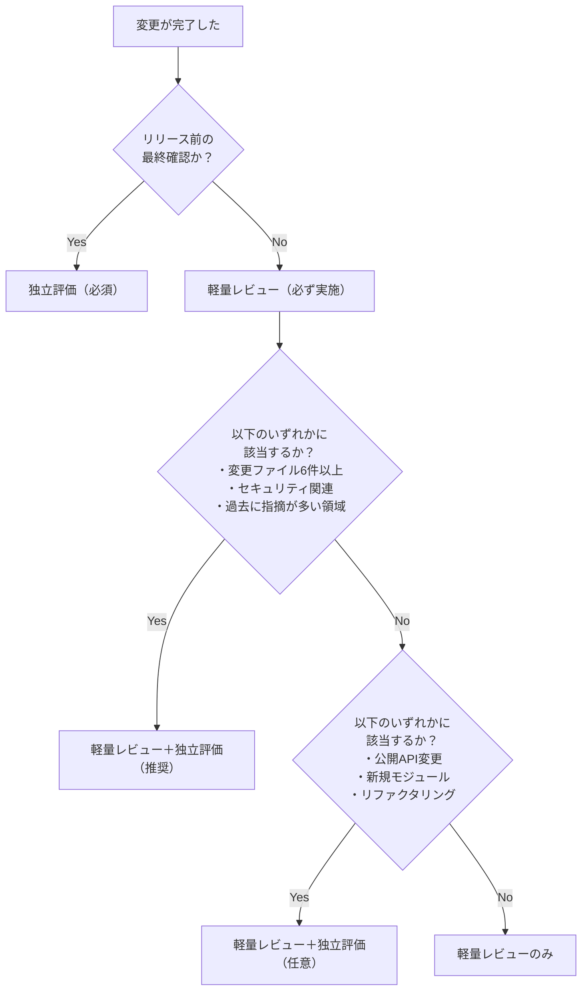
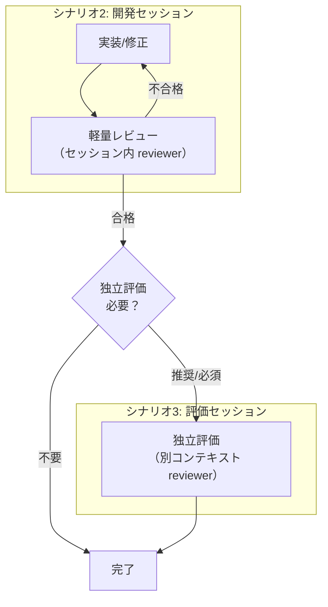
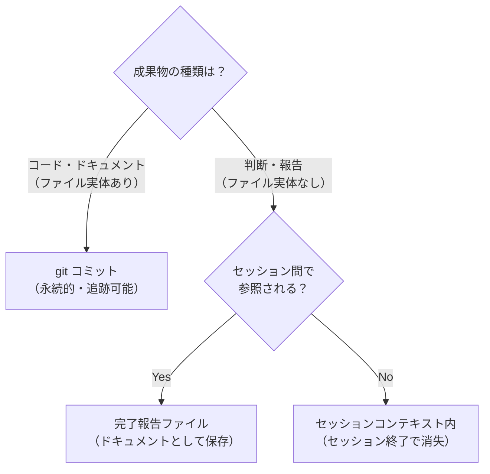
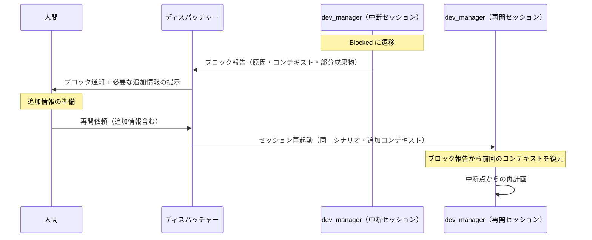
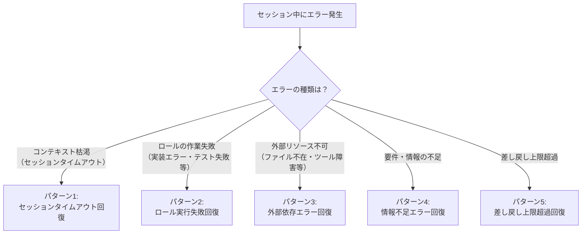
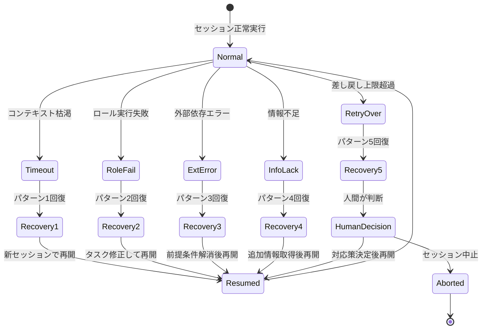
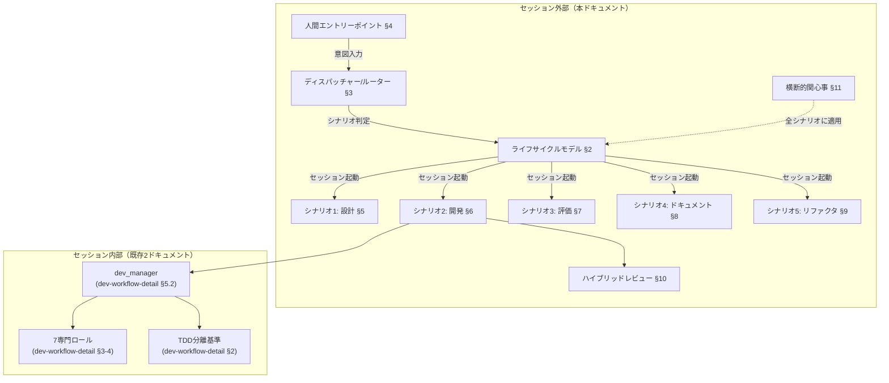

# セッション運用フロー設計: 応用編

> **本ドキュメントの位置づけ**
>
> 本ドキュメントは「セッション運用フロー設計」を3分割した文書群の1つであり、横断的関心事・既存設計との統合マッピング・まとめを定義する。
>
> - **ハブ**: [session-operation-flow.md](session-operation-flow.md) -- 全体概要と各ファイルへのナビゲーション
> - [session-flow-foundations.md](session-flow-foundations.md) -- §1-§4 概要・ライフサイクルモデル・ディスパッチャー・エントリーポイント
> - [session-flow-scenarios.md](session-flow-scenarios.md) -- §5-§9 シナリオ別セッションフロー
> - **本ドキュメント（応用編）**: §10 ハイブリッドレビュー方式、§11 横断的関心事、§12 既存設計との統合マッピング、§13 まとめと次ステップ

---

## 10. ハイブリッドレビュー方式

### 10.1 概要

本設計では2種類のレビュー方式を使い分ける。

| 方式 | 実施場所 | 実施ロール | コンテキスト |
|------|---------|-----------|-------------|
| **軽量レビュー** | 開発セッション内（シナリオ2） | reviewer | 開発コンテキストを共有 |
| **独立評価** | 別セッション（シナリオ3） | reviewer | 開発コンテキストなし（独立） |

### 10.2 判定基準テーブル

以下の条件に基づき、軽量レビュー（デフォルト）と独立評価（オプション）を使い分ける。

| # | 条件 | 軽量レビュー | 独立評価 | 理由 |
|---|------|------------|---------|------|
| 1 | 変更ファイル数 1-5 件 | ○ | - | 小規模変更はセッション内レビューで十分 |
| 2 | 変更ファイル数 6 件以上 | ○ | ○（推奨） | 大規模変更は見落としリスクが高い |
| 3 | セキュリティ関連の変更 | ○ | ○（推奨） | セキュリティは独立した視点で再確認すべき |
| 4 | 公開API の変更 | ○ | ○（任意） | 下位互換影響の評価には独立視点が有効 |
| 5 | 新規モジュールの追加 | ○ | ○（任意） | アーキテクチャ適合性の評価に有効 |
| 6 | バグ修正（単一ファイル） | ○ | - | 最小差分修正のためセッション内で十分 |
| 7 | リファクタリング | ○ | ○（任意） | 振る舞い不変の独立確認が有効 |
| 8 | リリース前の最終確認 | - | ○（必須） | リリース品質の独立確認は必須 |
| 9 | 過去にレビュー指摘が多い領域 | ○ | ○（推奨） | 品質リスクが高い領域は独立評価で補強 |
| 10 | プロトタイプ・PoC | ○ | - | 品質基準が緩いため軽量レビューで十分 |

**凡例**: ○ = 実施する、-（ハイフン） = 実施不要

### 10.3 判定フロー図

### 10.4 具体的な判定例

#### 例1: 単一ファイルのバグ修正 → 軽量レビューのみ

| 判定要素 | 値 |
|---------|-----|
| 変更種別 | バグ修正 |
| 変更ファイル数 | 1 件（`src/auth/login.py`）+ テスト1件 |
| セキュリティ関連 | No |
| リリース前確認 | No |
| **判定結果** | **軽量レビューのみ** |
| 理由 | 最小差分の修正であり、セッション内 reviewer のレビューで十分。独立評価のコストに見合わない |

#### 例2: 新機能追加（認証機能） → 軽量レビュー＋独立評価（推奨）

| 判定要素 | 値 |
|---------|-----|
| 変更種別 | 新機能開発 |
| 変更ファイル数 | 8 件（認証モジュール全体） |
| セキュリティ関連 | Yes（認証・認可） |
| リリース前確認 | No |
| **判定結果** | **軽量レビュー＋独立評価（推奨）** |
| 理由 | セキュリティ関連かつ変更ファイル数6件以上。軽量レビューで基本的な品質を確認後、独立評価でセキュリティ観点の深掘りレビューを実施すべき |

#### 例3: ドキュメント更新のみ → 軽量レビューのみ

| 判定要素 | 値 |
|---------|-----|
| 変更種別 | ドキュメント整合性（シナリオ4） |
| 変更ファイル数 | 3 件（設計書・README・CHANGELOG） |
| セキュリティ関連 | No |
| リリース前確認 | No |
| **判定結果** | **軽量レビューのみ** |
| 理由 | ドキュメントの整合性確認はシナリオ4内の reviewer レビューで十分。コード変更を伴わないため独立評価は不要 |

#### 例4: リリース前の最終確認 → 独立評価（必須）

| 判定要素 | 値 |
|---------|-----|
| 変更種別 | リリース前チェック |
| 変更ファイル数 | N/A（累積変更の評価） |
| セキュリティ関連 | N/A（全観点で評価） |
| リリース前確認 | Yes |
| **判定結果** | **独立評価（必須）** |
| 理由 | リリース品質の保証には開発バイアスを排除した独立評価が必須。全5観点（セキュリティ・設計品質・テスト十分性・パフォーマンス・保守性）で網羅的に評価する |

### 10.5 両方式の関係

- 軽量レビューはシナリオ2内で**常に実施**される（開発品質の最低保証）
- 独立評価はシナリオ3として**オプションで実施**される（追加の品質保証）
- 独立評価は軽量レビューの代替ではなく、補完として機能する

---

## 11. 横断的関心事

セッション間で共通する設計上の関心事として、状態永続化・コンテキスト引き継ぎ・エラー回復の3つを定義する。これらは[§2](session-flow-foundations.md#2-セッションライフサイクルモデル) のセッションライフサイクルモデルと全5シナリオ（[§5](session-flow-scenarios.md#5-シナリオ1-要件定義設計)〜[§9](session-flow-scenarios.md#9-シナリオ5-リファクタリング最適化)）に横断的に適用される。

### 11.1 状態永続化

#### 11.1.1 永続化対象

セッションの状態を3カテゴリに分類し、それぞれの永続化方式を定義する。

| カテゴリ | 永続化対象 | 永続化タイミング | 永続化方式 |
|---------|-----------|---------------|-----------|
| **セッション状態** | ライフサイクルステージ（§2.2 の7ステージ） | ステージ遷移時 | セッション完了報告に最終状態を記録 |
| | 完了したロール一覧と各完了報告 | ロール完了時 | dev_manager のコンテキスト内に蓄積、完了報告に集約 |
| | 未完了タスク（ブロック理由含む） | Blocked/Failed 遷移時 | ブロック報告/失敗報告として記録 |
| **成果物** | コード変更（実装・テスト・リファクタリング） | ロール作業完了時 | git コミット（`dev-workflow-detail.md` §4.2 のファイル配置規約に従う） |
| | 設計ドキュメント | ロール作業完了時 | `docs/design/` 配下にファイルとして保存、git コミット |
| | テスト結果・カバレッジレポート | テスト実行時 | 完了報告内に記載（永続ファイルとしては保存しない） |
| **判断履歴** | TDD分離判断結果と根拠 | Planning ステージ | dev_manager の完了報告に記録 |
| | レビュー結果（問題リスト・総合判定） | Reviewing ステージ | reviewer の完了報告に記録 |
| | エスカレーション履歴 | エスカレーション発生時 | ブロック報告として記録 |
| | 差し戻し履歴（回数・理由） | 差し戻し発生時 | dev_manager のコンテキスト内に蓄積 |

#### 11.1.2 永続化方式の選択基準

| 永続化方式 | 特性 | 適用場面 |
|-----------|------|---------|
| **git コミット** | 永続的・差分追跡可能・ブランチ管理可能 | コード変更、ドキュメント変更 |
| **完了報告ファイル** | セッション間で参照可能・人間可読 | 開発セッション→評価セッションの引き渡し、人間への報告 |
| **セッションコンテキスト** | セッション内でのみ有効・低コスト | dev_manager の進捗管理、差し戻しカウンター |

#### 11.1.3 永続化の設計原則

1. **成果物は git で永続化**: コードとドキュメントの変更は必ず git コミットとして記録する。`dev-workflow-detail.md` §4.2 のファイル配置規約に従う
2. **判断履歴は完了報告に集約**: TDD判断・レビュー結果・エスカレーション履歴は dev_manager の最終完了報告に含める。後続セッション（特にシナリオ3: 独立評価）が参照可能にする
3. **セッション状態は復元可能にする**: Blocked からの回復時（[§2.2.6](session-flow-foundations.md#226-blocked状態遷移と回復)）に前回のコンテキストを復元できるよう、ブロック報告に十分な情報を含める
4. **冪等性の確保**: [§2.3](session-flow-foundations.md#23-設計原則) の設計原則に従い、永続化操作は冪等であること。git コミットの重複防止、ドキュメント更新の競合解消手段を設ける

### 11.2 コンテキスト引き継ぎ

#### 11.2.1 引き継ぎシナリオの分類

セッション間のコンテキスト引き継ぎは以下の2パターンに分類される。

| # | パターン | 説明 | 具体例 |
|---|---------|------|--------|
| 1 | **同一シナリオの継続（中断→再開）** | セッションが Blocked/Failed で中断した後、同一シナリオで再開する | シナリオ2 の開発セッションが情報不足で Blocked → 追加情報を得て再開 |
| 2 | **異なるシナリオへの引き継ぎ** | あるシナリオの完了後、別のシナリオで後続作業を行う | シナリオ2（開発）→ シナリオ3（独立評価）、シナリオ1（設計）→ シナリオ2（実装） |

#### 11.2.2 引き継ぎプロトコル

**パターン1: 同一シナリオの継続（中断→再開）**

引き継ぎ情報:

| 情報 | 引き渡し手段 | 内容 |
|------|-------------|------|
| ブロック報告 | ブロック報告ドキュメント（[§4.3.2](session-flow-foundations.md#432-セッション起動コンテキスト) のテンプレート） | ブロック理由・試行した対応・部分成果物パス |
| 部分成果物 | git コミット（コミット済みの変更） | 中断時点までの実装・テスト |
| 前回のコンテキスト | ブロック報告内の「コンテキスト」セクション | 完了済みロール・TDD判断結果・差し戻し回数 |
| 追加情報 | 人間からの入力 | ブロック原因の解消に必要な情報 |

**パターン2: 異なるシナリオへの引き継ぎ**

[§7.3](session-flow-scenarios.md#73-コンテキスト引き渡し方法)（シナリオ3 のコンテキスト引き渡し方法）で一部設計済み。ここでは全シナリオ間の引き継ぎパターンを網羅する。

| 引き継ぎ元 | 引き継ぎ先 | 引き渡し情報 | 引き渡し手段 |
|-----------|-----------|-------------|-------------|
| シナリオ1（設計） | シナリオ2（開発） | 設計ドキュメントパス、設計方針、制約条件 | セッション起動時の入力に設計書パスを含める |
| シナリオ2（開発） | シナリオ3（独立評価） | 対象コード（ファイルパス・コミット範囲）、完了報告、設計書パス、既知のリスク | [§7.3](session-flow-scenarios.md#73-コンテキスト引き渡し方法) の引き渡しプロトコルに従う |
| シナリオ2（開発） | シナリオ4（ドキュメント整合性） | 変更したコードのファイルパス、対応するドキュメントパス | セッション起動時の入力に含める |
| シナリオ5（リファクタリング） | シナリオ3（独立評価） | リファクタリング済みコードパス、品質指標（before/after）、完了報告 | [§7.3](session-flow-scenarios.md#73-コンテキスト引き渡し方法) の引き渡しプロトコルに従う |
| シナリオ2（開発） | シナリオ5（リファクタリング） | reviewer が指摘した設計問題の詳細、対象コードパス | レビュー結果報告のファイルパスを含める |

#### 11.2.3 引き継ぎの設計原則

1. **コンテキスト分離の原則**: 新しいセッションは新しいコンテキストウィンドウで起動される。前のセッションの内部状態（ロール間のやり取り、判断過程）は直接引き渡さない。引き渡すのは成果物とドキュメントのみ（[§7.3.3](session-flow-scenarios.md#733-コンテキスト分離の原則) 参照）
2. **ファイルパス参照方式**: 引き継ぎ情報は原則としてファイルパスで参照する。セッション起動時の入力にパスを含め、受け側セッションがファイルを読み取る
3. **git コミットによる成果物共有**: コード変更はすべて git コミットとして共有される。コミット範囲（ハッシュまたは HEAD~N）を指定することで、前セッションの変更を正確に特定できる
4. **人間を介した引き継ぎ**: シナリオ間の引き継ぎは人間がディスパッチャーへの入力として情報を整理する。自動的なセッション連鎖は行わない

### 11.3 エラー回復

セッション中断時の復旧方法を3パターン以上定義する。[§2.2.6](session-flow-foundations.md#226-blocked状態遷移と回復)（Blocked）および[§2.2.7](session-flow-foundations.md#227-failed状態遷移と回復)（Failed）の状態遷移と連動する。

#### 11.3.1 エラーパターンの分類

#### 11.3.2 パターン1: セッションタイムアウト回復

**発生条件**: セッションのコンテキストウィンドウが枯渇し、ロールの作業が途中で中断された場合。

| 項目 | 内容 |
|------|------|
| **ライフサイクル遷移** | Executing → Blocked |
| **自動保全される情報** | git コミット済みの変更（コミット済みの成果物は保全される） |
| **消失する情報** | dev_manager のセッションコンテキスト（差し戻し回数、進捗状態等） |
| **回復手順** | 1. 人間が同一シナリオでセッションを再起動する 2. git log から前セッションの成果物（コミット済み分）を確認する 3. 未完了の作業を特定し、中断点から再開する |
| **回復の前提** | ロールがこまめに git コミットしていること（[§2.3](session-flow-foundations.md#23-設計原則) の冪等性原則） |
| **防止策** | - 各ロールは作業の区切りごとにコミットする（長時間の未コミット作業を避ける） - dev_manager は複雑なタスクを小さなサブタスクに分割し、各サブタスク完了時にコミットを確認する |

#### 11.3.3 パターン2: ロール実行失敗回復

**発生条件**: ロール（feature_builder、test_writer 等）がタスクを完遂できなかった場合（実装が困難、テストが書けない等）。

| 項目 | 内容 |
|------|------|
| **ライフサイクル遷移** | Executing → Blocked（Level 1 エスカレーション: dev_manager に報告） |
| **保全される情報** | ロールの完了報告（失敗の原因・試行した対応）、コミット済みの部分成果物 |
| **回復手順** | 1. dev_manager がブロック報告を分析する 2. **解決可能な場合**: タスク指示を修正して同一ロールに再指示、または別ロールにタスクを振り替える 3. **解決不可能な場合**: Level 2 エスカレーション（人間に報告） 4. 人間が追加情報・方針変更を提供した後、再計画して再開 |
| **典型例** | - feature_builder が要件の解釈に迷い実装できない → dev_manager が要件を明確化して再指示 - test_writer がテスト対象の仕様が不明確でテストを書けない → 人間に仕様確認を求めてBlocked |

#### 11.3.4 パターン3: 外部依存エラー回復

**発生条件**: セッションが外部リソースに依存しており、そのリソースが利用不可能な場合（対象ファイルが存在しない、テスト実行環境が利用不可等）。

| 項目 | 内容 |
|------|------|
| **ライフサイクル遷移** | Initializing → Failed（初期化時の場合）、Executing → Blocked（実行中の場合） |
| **回復手順** | 1. エラーの原因を特定する（ファイル不在・権限不足・ツール未インストール等） 2. **初期化時の失敗**: 人間に前提条件の確認を求める。前提条件が満たされた後に再起動 3. **実行中のブロック**: dev_manager が代替手段を検討する。代替不可能な場合は人間に報告してBlocked |
| **典型例** | - 対象のソースコードファイルが削除されている → 人間に確認し、正しいファイルパスで再起動 - テスト実行環境（pytest等）が未設定 → 人間にセットアップを依頼してBlocked - 参照先の設計ドキュメントが古い → 人間に最新版の所在を確認 |
| **防止策** | - Initializing ステージで前提条件（ファイル存在・ツール可用性）を事前チェックする - セッション起動コンテキスト（[§4.3.2](session-flow-foundations.md#432-セッション起動コンテキスト)）に必要な前提条件を明記する |

#### 11.3.5 パターン4: 情報不足エラー回復

**発生条件**: タスクの遂行に必要な情報（要件の詳細、設計判断等）が不足している場合。

| 項目 | 内容 |
|------|------|
| **ライフサイクル遷移** | Planning → Blocked（計画段階での不足）、Executing → Blocked（実行中の不足） |
| **回復手順** | 1. dev_manager が不足情報を特定し、確認プロンプトを生成する 2. ディスパッチャー経由で人間に追加情報を要求する 3. 人間が追加情報を提供した後、Blocked → Planning（再計画が必要な場合）または Blocked → Executing（再開可能な場合）に遷移 |
| **典型例** | - 「ログイン機能を実装して」だが、認証方式（パスワード・OAuth・多要素認証）が不明 → 人間に確認 - レビューで「この設計判断の根拠は？」と指摘されたが、設計書に記載がない → 人間に設計意図を確認 |

#### 11.3.6 パターン5: 差し戻し上限超過回復

**発生条件**: Reviewing → Executing の差し戻しが3回を超えた場合（[§2.3](session-flow-foundations.md#23-設計原則) の設計原則）。

| 項目 | 内容 |
|------|------|
| **ライフサイクル遷移** | Reviewing → Blocked |
| **回復手順** | 1. dev_manager が Level 2 エスカレーション（人間への報告）を行う 2. エスカレーション報告に含める情報: 差し戻し履歴（各回の指摘内容と修正内容）、根本原因の分析、提案する対応策 3. 人間が判断: (a) 追加の差し戻しを許可、(b) 別のアプローチでの再実装を指示、(c) 現状で妥協して合格とする、(d) セッションを中止する |
| **防止策** | - 1回目の差し戻し時に dev_manager が根本原因を分析し、表面的な修正ではなく根本解決を指示する - 2回目の差し戻し時に dev_manager がアプローチの変更を検討する |

#### 11.3.7 エラー回復の全体像

---

## 12. 既存設計との統合マッピング

本設計（`session-operation-flow.md`）と既存2ドキュメント（`dev-workflow-overview.md`、`dev-workflow-detail.md`）の対応関係をデザインデルタ表として整理する。

### 12.1 `dev-workflow-overview.md` との統合マッピング

| 既存ドキュメント | セクション | 本設計の対応セクション | 変更の種類 | 必要なアクション |
|----------------|-----------|---------------------|-----------|----------------|
| `dev-workflow-overview.md` | §1 概要 | §1 概要（§1.1 位置づけ） | 上位レイヤーとして補完 | 本設計がセッション「外部」設計であることを明記済み。既存ドキュメントの§1 に本設計への参照リンクを追加することを推奨 |
| `dev-workflow-overview.md` | §2.1 ロール構成と階層 | §3.3 セッション型レジストリ | 上位レイヤーとして補完 | 既存のロール構成図は外部システム → dev_manager → 7ロールの階層。本設計では人間→ディスパッチャー→ dev_manager に変更（§4.1.2）。**既存図の矢印の注釈を更新する必要がある** |
| `dev-workflow-overview.md` | §2.2 標準的な開発フロー | §6.4 シナリオ2 セッションフロー | 整合性確認済み | 既存の開発フロー（TDD判定→実装→レビュー→後処理）は本設計のシナリオ2 内で完全に包含される。変更不要 |
| `dev-workflow-overview.md` | §2.3 ロールの起動パターン | §3.3.1 シナリオ別ロール構成マッピング | 上位レイヤーとして補完 | 既存の起動パターン（標準実装・TDD実装・バグ修正・リファクタリング・最適化・テスト拡充・ドキュメント整備）は本設計の5シナリオに包含される。既存ドキュメントに「詳細は session-operation-flow.md §3.3 参照」の注記追加を推奨 |
| `dev-workflow-overview.md` | §3.1 外部システムとの比較表 | §4.4 dev_manager の内部責務 | **変更が必要** | 既存の比較表では外部システムからの直接タスク発行と記載。本設計では人間が直接エントリーするため、**§3 の連携ポイントの記述を更新する必要がある** |
| `dev-workflow-overview.md` | §3.2 連携ポイント | §4.4 dev_manager の内部責務 | **変更が必要** | 既存のシーケンス図で外部システムからの直接タスク発行が描かれている。本設計では人間がディスパッチャー経由で開発フローを利用する方式に変更。**シーケンス図の更新が必要** |
| `dev-workflow-overview.md` | §4 ロール間データフロー | §11.1 状態永続化 + `dev-workflow-detail.md` §4 | 整合性確認済み | 既存のデータフロー（タスク指示→コード成果物→完了報告→課題起票）は変更なし。本設計では永続化の観点を追加 |
| `dev-workflow-overview.md` | §5 T-001〜T-003 分析サマリ | §5.2.1 既存ロールの不足、§7.2.1 既存ロールの不足 | 整合性確認済み | T-001〜T-003 の分析結果は本設計でそのまま活用されている。追加の分析として、シナリオ1 での planner/architect 不足、シナリオ3 での tester/eval_manager 不足を新たに特定 |
| `dev-workflow-overview.md` | §6 今後の課題と次フェーズへの引き継ぎ | §13 まとめと次ステップ | 整合性確認済み | フェーズ2 で対応すべき事項はすべて `dev-workflow-detail.md` で対応済み。残存する課題は §13 の次ステップに引き継ぐ |

### 12.2 `dev-workflow-detail.md` との統合マッピング

| 既存ドキュメント | セクション | 本設計の対応セクション | 変更の種類 | 必要なアクション |
|----------------|-----------|---------------------|-----------|----------------|
| `dev-workflow-detail.md` | §1 概要 | §1.1 本ドキュメントの位置づけ | 上位レイヤーとして補完 | 本設計の§1.1 で3ドキュメントの関係を明記済み。既存ドキュメントの§1 にも本設計への参照追加を推奨 |
| `dev-workflow-detail.md` | §2 TDD分離定量基準 | §6.3 既存設計との整合性 | 整合性確認済み | TDD分離の定量基準はそのまま採用。シナリオ2 の Planning ステージで dev_manager が§2 の基準を適用する |
| `dev-workflow-detail.md` | §3.1 新機能開発 | §6 シナリオ2（新機能開発パス） | 整合性確認済み | 既存のシーケンス図（TDD分離あり/なし・レビューループ・後処理フロー）をセッション外部フローとして包含。変更なし |
| `dev-workflow-detail.md` | §3.2 バグ修正 | §6 シナリオ2（バグ修正パス） | 整合性確認済み | 既存のシーケンス図（再現テストファースト・最小差分修正）をセッション外部フローとして包含。変更なし |
| `dev-workflow-detail.md` | §3.3 リファクタリング | §9 シナリオ5 | 整合性確認済み | 既存のリファクタリングフロー（カバレッジチェック→安全ネットテスト→小ステップリファクタリング→レビュー）をそのまま採用。optimizer ロールによる最適化パスを追加 |
| `dev-workflow-detail.md` | §4.1 タスク引き渡し方法 | §11.2 コンテキスト引き継ぎ | 上位レイヤーとして補完 | 既存のタスク引き渡し（dev_manager 中継方式・DT-XXX テンプレート）は変更なし。本設計ではセッション間の引き継ぎプロトコルを追加定義 |
| `dev-workflow-detail.md` | §4.2 成果物受け渡し形式 | §11.1 状態永続化 | 上位レイヤーとして補完 | 既存の git コミット + ファイルパス参照方式は変更なし。本設計では永続化対象の分類と永続化方式の選択基準を追加定義 |
| `dev-workflow-detail.md` | §4.3 エスカレーション手順 | §11.3 エラー回復 | 上位レイヤーとして補完 | 既存のエスカレーション手順（Level 1〜3）は変更なし。本設計では5つのエラーパターンと回復手順を追加定義。エスカレーション先として「人間」を明記 |
| `dev-workflow-detail.md` | §4.4 コンテキスト共有 | §11.2 コンテキスト引き継ぎ | 上位レイヤーとして補完 | 既存のコンテキスト共有（タスク指示・git コミット・ファイルパス参照・完了報告の申し送り）は変更なし。本設計ではセッション間の引き継ぎ（同一シナリオ継続・異なるシナリオ）を追加定義 |
| `dev-workflow-detail.md` | §5.1 各ロール修正提案 | 直接対応なし（後続タスクの対象） | 追加が必要 | 既存の修正提案（8ロール分）は後続タスク「ロール定義の実装」で実施する。本設計ではシナリオ1・シナリオ3 での不足ロール（planner, architect, tester, eval_manager）を新たに特定しており、この情報も修正提案に追加する必要がある |
| `dev-workflow-detail.md` | §5.2 dev_manager 要件定義 | §4.4 dev_manager の内部責務（不変部分の確認） | **変更が必要** | 既存の dev_manager 要件定義では外部システムからの開発タスク受領と報告を前提としていた。本設計では起動トリガー源と完了報告先が変更されるため、**§5.2.3 の作業フローと §5.2.5 のやらないことを更新する必要がある** |
| `dev-workflow-detail.md` | §5.3 common.md 修正提案 | 直接対応なし（後続タスクの対象） | 追加が必要 | 既存の修正提案は変更なし。本設計で追加された情報（セッション間引き継ぎプロトコル、エラー回復手順）を common.md に反映する修正提案を追加すべき |
| `dev-workflow-detail.md` | §6 まとめ・引き渡し | §13 まとめと次ステップ | 上位レイヤーとして補完 | 既存のまとめで列挙された後続タスクは本設計の§13 に引き継ぐ |

### 12.3 統合マッピングのサマリ

| 変更の種類 | 件数 | 説明 |
|-----------|------|------|
| 上位レイヤーとして補完 | 9件 | 本設計が既存設計のセッション外部レイヤーとして機能。既存設計の変更は不要で、参照リンクの追加を推奨 |
| 整合性確認済み | 8件 | 既存設計と本設計の間に矛盾がないことを確認。変更不要 |
| 変更が必要 | 3件 | 外部システム→dev_manager の直接接続を人間→ディスパッチャー→dev_manager に変更する部分。既存ドキュメントの更新が必要 |
| 追加が必要 | 2件 | ロール修正提案への不足ロール情報追加、common.md 修正提案へのセッション間プロトコル追加 |

### 12.4 変更が必要な箇所の詳細

後続タスク「ロール定義の実装」で対応すべき変更を優先度順に列挙する。

| # | 対象ドキュメント | 変更箇所 | 変更内容 | 優先度 |
|---|---------------|---------|---------|--------|
| 1 | `dev-workflow-overview.md` §3.2 | 連携ポイントのシーケンス図 | 外部システムからの直接タスク発行を、人間がディスパッチャー経由で開発フローを利用する方式に変更 | 高 |
| 2 | `dev-workflow-overview.md` §3.1 | 外部システムとの比較表 | dev_manager への入力元を人間/ディスパッチャーに変更 | 高 |
| 3 | `dev-workflow-detail.md` §5.2.3 | dev_manager の作業フロー | ステップ1 を「ディスパッチャーからのセッション起動を受け取る」に変更 | 高 |
| 4 | `dev-workflow-overview.md` §2.1 | ロール構成と階層の図 | 矢印の注釈を更新（人間→ディスパッチャー→ dev_manager） | 中 |
| 5 | `dev-workflow-detail.md` §5.1 | 各ロール修正提案 | シナリオ1・シナリオ3 で特定した不足ロール情報を追加 | 中 |
| 6 | `dev-workflow-detail.md` §5.3 | common.md 修正提案 | セッション間引き継ぎプロトコル・エラー回復手順の反映を追加 | 低 |
| 7 | `dev-workflow-overview.md` §1 | 概要 | 本設計（session-operation-flow.md）への参照リンクを追加 | 低 |
| 8 | `dev-workflow-detail.md` §1 | 概要 | 本設計への参照リンクを追加 | 低 |

---

## 13. まとめと次ステップ

### 13.1 本設計の達成事項

本ドキュメントでは、コード開発ワークフローにおけるセッション外部の運用フロー設計を完成させた。

| 設計要素 | 対応セクション | 状態 |
|---------|---------------|------|
| セッションライフサイクルモデル（7ステージ状態遷移） | §2 | 完了 |
| セッションディスパッチャー/ルーター（意図分類・フロー図・レジストリ） | §3 | 完了 |
| 人間エントリーポイント仕様（入力形式・起動トリガー・責務分界） | §4 | 完了 |
| シナリオ1: 要件定義→設計 | §5 | 完了 |
| シナリオ2: 実施計画→開発（軽量レビュー込み） | §6 | 完了 |
| シナリオ3: 独立評価 | §7 | 完了 |
| シナリオ4: ドキュメント整合性 | §8 | 完了 |
| シナリオ5: リファクタリング・最適化 | §9 | 完了 |
| ハイブリッドレビュー方式 | §10 | 完了 |
| 横断的関心事（状態永続化・コンテキスト引き継ぎ・エラー回復） | §11 | 完了 |
| 既存設計との統合マッピング | §12 | 完了 |

### 13.2 3ドキュメントの設計カバー範囲（最終版）

### 13.3 後続タスク: ロール定義の実装

本設計は「設計」であり、実際のロール定義ファイルの作成・修正は後続タスクで行う。

#### 13.3.1 実装すべき内容

| # | 実装項目 | 参照元 | 優先度 |
|---|---------|--------|--------|
| 1 | `roles/dev_manager.md` の新規作成 | `dev-workflow-detail.md` §5.2 + 本設計 §4.4 の変更点 | 高 |
| 2 | `roles/_base/common.md` の修正 | `dev-workflow-detail.md` §5.3 + 本設計 §11（セッション間プロトコル追加） | 高 |
| 3 | 既存7ロールの修正 | `dev-workflow-detail.md` §5.1 + 本設計 §5.2.1, §7.2.1（不足ロール情報追加） | 中 |
| 4 | `dev-workflow-overview.md` の更新 | 本設計 §12.4 #1〜#4 | 中 |
| 5 | `dev-workflow-detail.md` の更新 | 本設計 §12.4 #3, #5〜#6 | 中 |
| 6 | ディスパッチャー/ルーターの実装方式決定 | 本設計 §3（スキルとして実装するか、common.md に組み込むか等） | 中 |
| 7 | テスト実行コマンドの確定と全ロールへの反映 | `dev-workflow-overview.md` §5.4 | 低 |

#### 13.3.2 実装優先順位の提案

```mermaid
gantt
    title 後続タスク「ロール定義の実装」実装順序（提案）
    dateFormat X
    axisFormat %s

    section 高優先度
    dev_manager.md 新規作成          :a1, 0, 3
    common.md 修正                   :a2, 0, 2

    section 中優先度
    既存7ロール修正                   :a3, after a1, 4
    既存設計ドキュメント更新            :a4, after a2, 2
    ディスパッチャー実装方式決定         :a5, after a1, 2

    section 低優先度
    テスト実行コマンド確定              :a6, after a3, 2
```

**推奨する実装順序**:
1. **Phase A**: `dev_manager.md` 新規作成 + `common.md` 修正（高優先度2件を並行）
2. **Phase B**: 既存7ロール修正 + 既存設計ドキュメント更新 + ディスパッチャー実装方式決定
3. **Phase C**: テスト実行コマンド確定・全ロール反映

### 13.4 既知の制約と今後の検討事項

| # | 制約/検討事項 | 関連セクション | 対応方針 |
|---|-------------|---------------|---------|
| 1 | 不足ロール（planner, architect, tester, eval_manager）の新設は本設計のスコープ外 | §5.2.1, §7.2.1 | 当面は dev_manager + 既存ロールで補完。不足が顕著になった時点で新設を検討 |
| 2 | ディスパッチャーの実装形態が未確定（Claude Code のスキル・サブエージェント・CLAUDE.md のいずれで実装するか） | §3 | 後続タスクで実装方式を決定する |
| 3 | セッション間の自動連鎖は行わない設計（人間を介した引き継ぎ）| §11.2.3 | 運用の成熟に伴い、自動連鎖の導入を検討する余地あり |
| 4 | openspec 連携が未定義（ISS-006） | `dev-workflow-overview.md` §5.4 | openspec 開発ライフサイクルが定義された後に統合タスクを実施 |

---

**作成日**: 2026-03-01
**関連設計タスク**: シナリオ別セッション運用フロー設計（Phase 1, Phase 2, Phase 3）
**前提ドキュメント**: `docs/design/dev-workflow-overview.md`, `docs/design/dev-workflow-detail.md`
