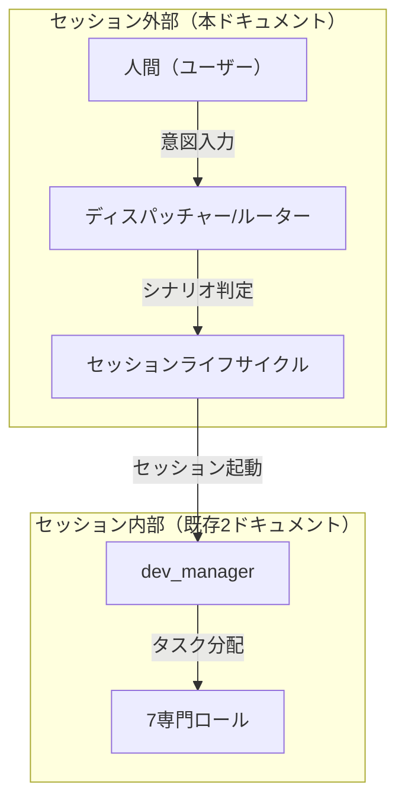
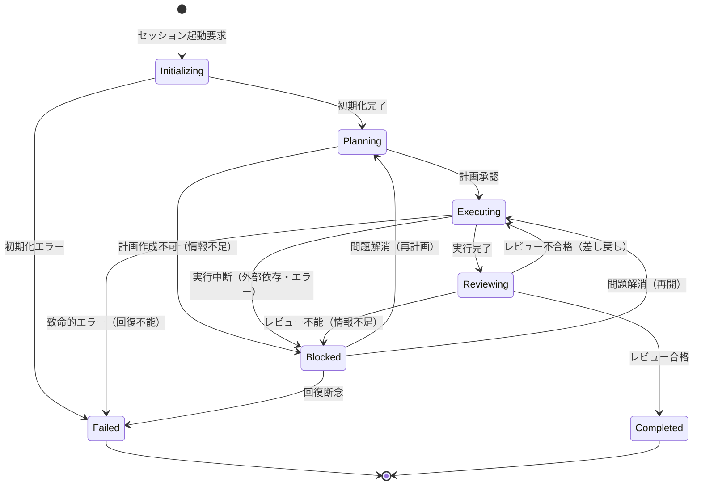
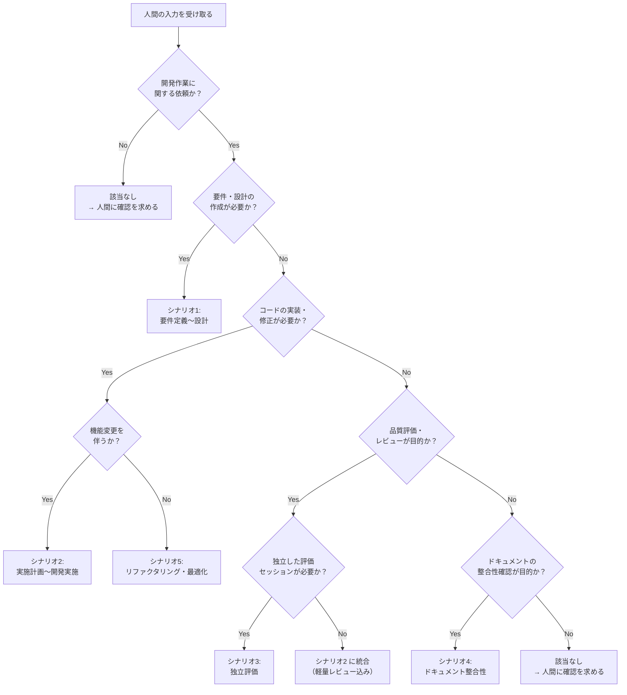
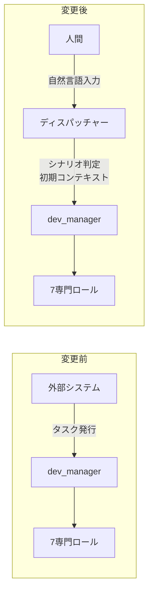
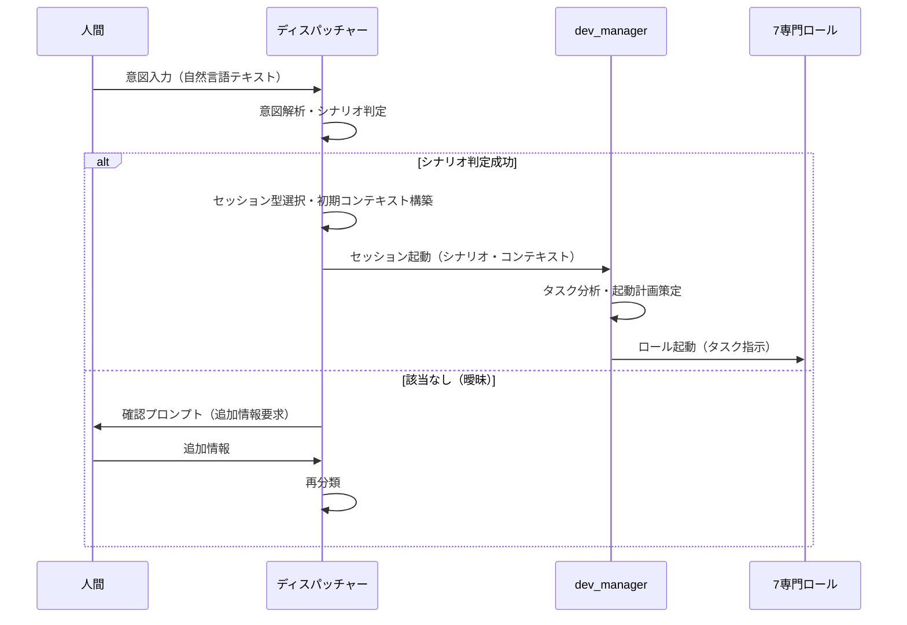

# セッション運用フロー設計: 基盤編

> **本ドキュメントの位置づけ**
>
> 本ドキュメントは「セッション運用フロー設計」を3分割した文書群の1つであり、基盤となる概念・モデル・仕様を定義する。
>
> - **ハブ**: [session-operation-flow.md](session-operation-flow.md) -- 全体概要と各ファイルへのナビゲーション
> - **本ドキュメント（基盤編）**: §1 概要、§2 ライフサイクルモデル、§3 ディスパッチャー/ルーター、§4 エントリーポイント仕様
> - [session-flow-scenarios.md](session-flow-scenarios.md) -- §5-§9 シナリオ別セッションフロー
> - [session-flow-advanced.md](session-flow-advanced.md) -- §10-§13 横断的関心事・統合マッピング・まとめ

---

## 1. 概要

### 1.1 本ドキュメントの位置づけ

本ドキュメントは、コード開発ワークフローにおける**セッション外部**の運用フロー設計をまとめたものである。人間のエントリーポイントからセッションが起動し、完了するまでの上位レイヤーを定義する。

**3ドキュメントによる設計カバー範囲**:

| ドキュメント | 設計対象 | スコープ |
|-------------|---------|---------|
| `dev-workflow-overview.md` | 概要設計 | ロール互換性分析、TDD戦略、ロールギャップ分析 |
| `dev-workflow-detail.md` | セッション**内部**設計 | 3シナリオの詳細フロー、ロール間連携プロトコル、ロール修正提案、dev_manager 要件定義 |
| **本ドキュメント** | セッション**外部**設計 | ライフサイクルモデル、ディスパッチャー/ルーター、エントリーポイント、5シナリオの運用フロー、横断的関心事 |

### 1.2 既存ドキュメントとの関係



- **本ドキュメント**は「人間が何かを入力してからセッションが起動するまで」と「セッションが完了するまでのライフサイクル」を定義する
- **既存ドキュメント**は「セッション内部で dev_manager がどのロールをどう起動するか」を定義する
- 境界: dev_manager の起動トリガーが本ドキュメントの出口であり、既存ドキュメントの入口である

### 1.3 用語定義

| 用語 | 定義 |
|------|------|
| セッション | 特定の目的を持つ一連の作業の実行単位。起動から完了まで一貫したコンテキストを持つ |
| ディスパッチャー | 人間の意図を解析し、適切なシナリオ・セッション構成を選択するルーティングロジック |
| シナリオ | 開発作業の種類を分類したもの。5つのシナリオ + 「該当なし」で構成される |
| セッション型 | シナリオに対応するロール構成・フロー・品質ゲートの組み合わせ |
| エントリーポイント | 人間がセッションを起動するための入力インターフェース |

---

## 2. セッションライフサイクルモデル

### 2.1 状態遷移図



### 2.2 各ステージの定義

#### 2.2.1 Initializing（初期化）

| 項目 | 内容 |
|------|------|
| **何が起きるか** | セッションのコンテキストが構築される。ディスパッチャーがシナリオを判定し、セッション型を選択する。必要なロール構成が決定され、初期コンテキスト（入力情報・参照ドキュメント・制約条件）が設定される |
| **入力** | 人間からの意図入力（自然言語テキスト） |
| **出力** | 判定されたシナリオ、セッション型、初期コンテキスト、起動するロール一覧 |
| **遷移条件 → Planning** | シナリオ判定が完了し、セッション型が確定した場合 |
| **遷移条件 → Failed** | 入力の解析に失敗した場合、必須の前提条件（対象ファイルの存在等）が満たされていない場合 |

#### 2.2.2 Planning（計画）

| 項目 | 内容 |
|------|------|
| **何が起きるか** | dev_manager（またはシナリオに応じたオーケストレーター）がタスクを分析し、ロール起動計画を策定する。TDD分離判断（該当シナリオの場合）、ロール起動順序の決定、タスク指示の作成が行われる |
| **入力** | 初期コンテキスト、セッション型の定義 |
| **出力** | ロール起動計画（起動順序・各ロールへのタスク指示）、TDD分離判断結果 |
| **遷移条件 → Executing** | ロール起動計画が策定され、最初のロールの起動準備が完了した場合 |
| **遷移条件 → Blocked** | タスクの分析に必要な情報が不足している場合（対象コードが見つからない、要件が曖昧等） |

#### 2.2.3 Executing（実行）

| 項目 | 内容 |
|------|------|
| **何が起きるか** | 計画に基づき、各ロールが順次起動される。ロールはタスク指示に従い作業を実行し、完了報告を返す。dev_manager が進捗を管理し、次のロール起動を判断する |
| **入力** | ロール起動計画、各ロールの完了報告（前段ロールの結果を後段に伝達） |
| **出力** | 各ロールの成果物（コード・テスト・ドキュメント等）、完了報告の集約 |
| **遷移条件 → Reviewing** | 全ロールの作業が完了した場合（reviewer を含むシナリオでは reviewer の判定完了） |
| **遷移条件 → Blocked** | ロールがブロック状態に陥り、dev_manager でも解決できない場合 |
| **遷移条件 → Failed** | 致命的なエラーが発生し、セッションの回復が不可能な場合（例: 対象リポジトリの破損） |

#### 2.2.4 Reviewing（レビュー）

| 項目 | 内容 |
|------|------|
| **何が起きるか** | セッション内レビュー（reviewer ロール）またはセッション全体の品質確認が行われる。レビュー結果に基づき、合格/差し戻しが判定される |
| **入力** | 全ロールの成果物、レビュー基準（シナリオごとの品質ゲート定義） |
| **出力** | レビュー結果（合格/不合格）、不合格時の差し戻し指示（対象ロール・修正内容） |
| **遷移条件 → Completed** | レビュー合格（Critical/High の問題なし）かつ全品質ゲート通過 |
| **遷移条件 → Executing** | レビュー不合格。差し戻し先ロールが特定され、修正指示が作成された場合。差し戻し回数が上限（3回）以内であること |
| **遷移条件 → Blocked** | レビューに必要な情報が不足している場合。差し戻し回数が上限（3回）を超えた場合 |

#### 2.2.5 Completed（完了）

| 項目 | 内容 |
|------|------|
| **何が起きるか** | セッションが正常に完了する。成果物が確定し、完了報告が生成される。セッションのコンテキスト（何をやったか、成果物はどこか）が永続化される |
| **入力** | レビュー合格判定 |
| **出力** | 完了報告（成果物一覧・テスト結果・品質指標）、永続化されたセッションコンテキスト |
| **終了動作** | セッションリソースの解放、後続セッションへの引き継ぎ情報の準備 |

#### 2.2.6 Blocked（ブロック）

| 項目 | 内容 |
|------|------|
| **何が起きるか** | セッションの進行が外部要因により停止している。ブロック理由が記録され、人間へのエスカレーションが行われる |
| **入力** | ブロックの原因（情報不足・外部依存・回復不能エラー等） |
| **出力** | ブロック報告（原因・影響・必要な判断） |
| **回復パス → Planning** | 情報不足が解消された場合（人間が追加情報を提供した等）。計画の見直しが必要 |
| **回復パス → Executing** | 外部依存が解消された場合。実行を中断点から再開可能 |
| **遷移条件 → Failed** | 回復の見込みがなく、人間がセッションの中止を指示した場合 |

#### 2.2.7 Failed（失敗）

| 項目 | 内容 |
|------|------|
| **何が起きるか** | セッションが異常終了する。失敗原因が記録され、クリーンアップが行われる |
| **入力** | 失敗の原因（初期化エラー・致命的エラー・回復断念） |
| **出力** | 失敗報告（原因・試行した対応・部分的な成果物があれば参照先） |
| **終了動作** | 部分的な成果物の保全（コミット済みの変更は保持）、セッションリソースの解放 |

### 2.3 ライフサイクルの設計原則

1. **最大差し戻し回数**: Reviewing → Executing の差し戻しは同一レビュー観点で最大3回。3回超過で Blocked に遷移し、エスカレーションする
2. **状態の永続化**: 各ステージ遷移時にセッションの状態を永続化する。Blocked や Failed からの回復時に前回のコンテキストを復元可能にする
3. **冪等性**: Blocked からの回復時、同じ入力で同じ結果を再現できること。副作用のある操作（git push 等）は Executing の最終段階でのみ行う

---

## 3. セッションディスパッチャー/ルーター

### 3.1 意図分類基準

人間の入力（自然言語テキスト）から、以下の5シナリオ + 「該当なし」に分類する。

#### 3.1.1 分類のための入力パターン表

| # | シナリオ | キーワード・入力パターン | 判定条件 |
|---|---------|----------------------|---------|
| 1 | 要件定義〜設計 | 「〜を作りたい」「〜の設計をしたい」「要件を整理したい」「仕様を決めたい」「アーキテクチャを検討したい」 | ユーザーの要求がまだ要件・仕様・設計として言語化されておらず、設計ドキュメントの作成が必要 |
| 2 | 実施計画作成〜開発実施 | 「〜を実装して」「〜を開発して」「〜機能を追加して」「設計書に基づいて実装して」「テストを書いて」 | 要件・設計が存在し（または入力に含まれ）、コードの実装が必要 |
| 3 | 独立評価 | 「〜をレビューして」「品質を確認して」「セキュリティ監査をして」「リリース前チェック」 | 既存のコード・成果物に対する客観的な品質評価が目的。開発セッションとは独立したコンテキストで実施 |
| 4 | ドキュメント整合性 | 「ドキュメントを更新して」「設計書とコードの整合性を確認して」「README を最新化して」 | 既存ドキュメントと実態（コード・設計・運用）の乖離を検知し、整合させることが目的 |
| 5 | リファクタリング・最適化 | 「リファクタリングして」「パフォーマンスを改善して」「コード品質を上げて」「〜を最適化して」 | 機能変更を伴わないコード品質改善またはパフォーマンス最適化が目的 |
| N/A | 該当なし | 上記いずれにも該当しない | 曖昧な入力、複数シナリオにまたがる要求、開発作業以外の依頼 |

#### 3.1.2 分類の優先順位

複数シナリオに該当しうる場合は、以下の優先順位で判定する。

1. **明示的なキーワード一致**: 入力に特定シナリオのキーワードが含まれる場合、そのシナリオを優先
2. **入力の主目的**: 入力の主な目的（何を達成したいか）に基づいて判定
3. **前提条件の有無**: 設計書の存在が前提ならシナリオ2（実施）、存在しないならシナリオ1（要件定義〜設計）
4. **曖昧な場合**: 「該当なし」として人間に確認を求める

### 3.2 分類フロー図



### 3.3 セッション型レジストリ

#### 3.3.1 シナリオ別ロール構成マッピング

| # | シナリオ | オーケストレーター | 起動ロール | 品質ゲート | 備考 |
|---|---------|-----------------|-----------|-----------|------|
| 1 | 要件定義〜設計 | dev_manager | documentarian, reviewer | reviewer による設計レビュー | 既存7ロールに「設計専門」は不在。documentarian が設計ドキュメント作成を担当し、reviewer が品質確認する。不足する能力（要件分析等）は dev_manager が補完 |
| 2 | 実施計画〜開発実施 | dev_manager | feature_builder, test_writer, reviewer, (bug_fixer), (documentarian) | reviewer による軽量コードレビュー | `dev-workflow-detail.md` §3 の3シナリオ（新機能・バグ修正・リファクタリング内の実装部分）に対応。TDD分離判断を含む |
| 3 | 独立評価 | dev_manager | reviewer | reviewer による独立レビュー | 開発セッションとは別コンテキストで起動。開発セッションの成果物を入力として受け取る |
| 4 | ドキュメント整合性 | dev_manager | documentarian, reviewer | reviewer によるドキュメントレビュー | コードと設計書の差分検出、ドキュメント更新、整合性確認 |
| 5 | リファクタリング・最適化 | dev_manager | refactorer, optimizer, test_writer, reviewer | reviewer による品質レビュー + テストカバレッジ確認 | `dev-workflow-detail.md` §3.3 のリファクタリングシナリオに対応。安全ネットテストを含む |
| N/A | 該当なし | - | - | - | 人間に追加情報を求める。入力を具体化した後に再分類する |

#### 3.3.2 シナリオ別のライフサイクル特性

| # | シナリオ | Planning の特徴 | Executing の特徴 | Reviewing の特徴 |
|---|---------|----------------|-----------------|-----------------|
| 1 | 要件定義〜設計 | 要件の構造化、設計方針の決定 | ドキュメント作成が中心、コード生成なし | 設計レビュー（網羅性・整合性・実現可能性） |
| 2 | 実施計画〜開発実施 | TDD分離判断、ロール起動順序決定 | コード実装・テスト作成・差し戻しループ | コードレビュー（5観点・4段階重大度） |
| 3 | 独立評価 | 評価観点の決定、評価計画の作成 | 成果物の網羅的評価 | 評価レポートの妥当性確認 |
| 4 | ドキュメント整合性 | 対象ドキュメントの特定、差分検出計画 | ドキュメント更新、整合性修正 | 整合性確認レビュー |
| 5 | リファクタリング・最適化 | カバレッジ確認、安全ネットテスト判断 | リファクタリング/最適化実行、振る舞い不変確認 | 品質レビュー（振る舞い不変 + 品質向上確認） |

### 3.4 「該当なし」ケースの処理

ディスパッチャーが入力を5シナリオのいずれにも分類できない場合、以下の処理を行う。

1. **曖昧さの特定**: どの部分が曖昧か（目的不明・スコープ不明・前提不明）を分析する
2. **確認プロンプトの生成**: 分類に必要な追加情報を求める質問を人間に提示する
3. **再分類**: 人間からの追加情報を受けて再度分類フローを実行する

**確認プロンプトの例**:
- 「設計から始めますか、それとも設計は既にありますか？」（シナリオ1 vs 2 の判別）
- 「機能を変更しますか、それともコード品質の改善ですか？」（シナリオ2 vs 5 の判別）
- 「開発中のレビューですか、それとも独立した品質評価ですか？」（シナリオ2の軽量レビュー vs シナリオ3 の判別）

---

## 4. 人間エントリーポイント仕様

### 4.1 設計の背景

#### 4.1.1 変更の動機

従来の設計では、dev_manager の起動トリガーは外部システム経由のタスク発行に限定されていた。しかし、知見#9 で「開発フローは独立し、人間が直接エントリーする」方針に変更された。

本設計では、**起動トリガー源のみを変更**し、dev_manager の内部責務（ハブ&スポーク構造、DT-XXX タスク管理、TDD判定等）は不変とする。

#### 4.1.2 変更前後の比較



### 4.2 入力形式

#### 4.2.1 人間からの入力

人間はディスパッチャーに対して自然言語テキストで意図を入力する。

**入力に含めるべき情報**:

| 情報 | 必須/任意 | 説明 | 例 |
|------|---------|------|------|
| 目的 | 必須 | 何を達成したいか | 「ログイン機能を追加したい」 |
| 対象 | 推奨 | 対象ファイル・モジュール・ドキュメント | 「src/auth/ モジュール」 |
| 制約 | 任意 | 制約条件・品質要件 | 「セキュリティ要件あり」「既存テストを壊さないこと」 |
| コンテキスト | 任意 | 背景情報・関連する設計書 | 「設計書は docs/design/auth.md を参照」 |

#### 4.2.2 入力例

```
# シナリオ1 の例
「ユーザー認証機能の要件を整理して、設計ドキュメントを作成したい。
OAuth 2.0 をベースにする方針。」

# シナリオ2 の例
「docs/design/auth.md の設計に基づいて、ログイン機能を実装して。
src/auth/ 配下に実装。セキュリティ要件あり。」

# シナリオ3 の例
「先日実装したログイン機能を独立してレビューしたい。
対象: src/auth/ の直近のコミット群。セキュリティ観点を重点的に。」

# シナリオ4 の例
「docs/design/auth.md が実装の現状と乖離しているので更新したい。」

# シナリオ5 の例
「src/auth/login.py の認証処理をリファクタリングしたい。
循環的複雑度が高いので分割したい。機能変更は不要。」
```

### 4.3 起動トリガー

#### 4.3.1 トリガーフロー



#### 4.3.2 初期コンテキストの設定

ディスパッチャーが dev_manager に渡す初期コンテキストは以下の構造を持つ。

```markdown
## セッション起動コンテキスト

### シナリオ
{シナリオ番号}: {シナリオ名}

### セッション型
{セッション型レジストリから選択されたロール構成}

### 目的
{人間の入力から抽出した目的の1行要約}

### 対象
- ファイル/モジュール: {対象パス}
- 参照ドキュメント: {設計書等のパス}

### 制約
- {制約1}
- {制約2}

### 品質要件
- {セキュリティ要件の有無}
- {パフォーマンス要件の有無}
- {テストカバレッジ目標}

### 原文
{人間の入力テキスト全文}
```

### 4.4 dev_manager の内部責務（不変部分の確認）

以下は `dev-workflow-detail.md` §5.2 で定義済みであり、本設計では変更しない。

| 責務 | 内容 | 変更有無 |
|------|------|---------|
| タスク分配 | DT-XXX 形式のタスク作成・配分 | **不変** |
| TDD分離判断 | §2 の定量的基準に基づく判断 | **不変** |
| ロール起動順序 | シナリオに応じた起動順序決定 | **不変** |
| レビュー判定 | reviewer の報告に基づく合格/差し戻し | **不変** |
| コンテキスト中継 | 前段→後段の情報伝達 | **不変** |
| 進捗管理 | 各ロールの完了報告管理 | **不変** |
| 完了報告 | ディスパッチャーまたは人間に報告 | **報告先のみ変更** |

唯一の変更点は以下の通り:
- **起動トリガー源**: 外部システムからのタスク発行 → ディスパッチャーからのセッション起動
- **完了報告先**: ディスパッチャー経由で人間

---

**作成日**: 2026-03-01
**前提ドキュメント**: `docs/design/dev-workflow-overview.md`, `docs/design/dev-workflow-detail.md`
