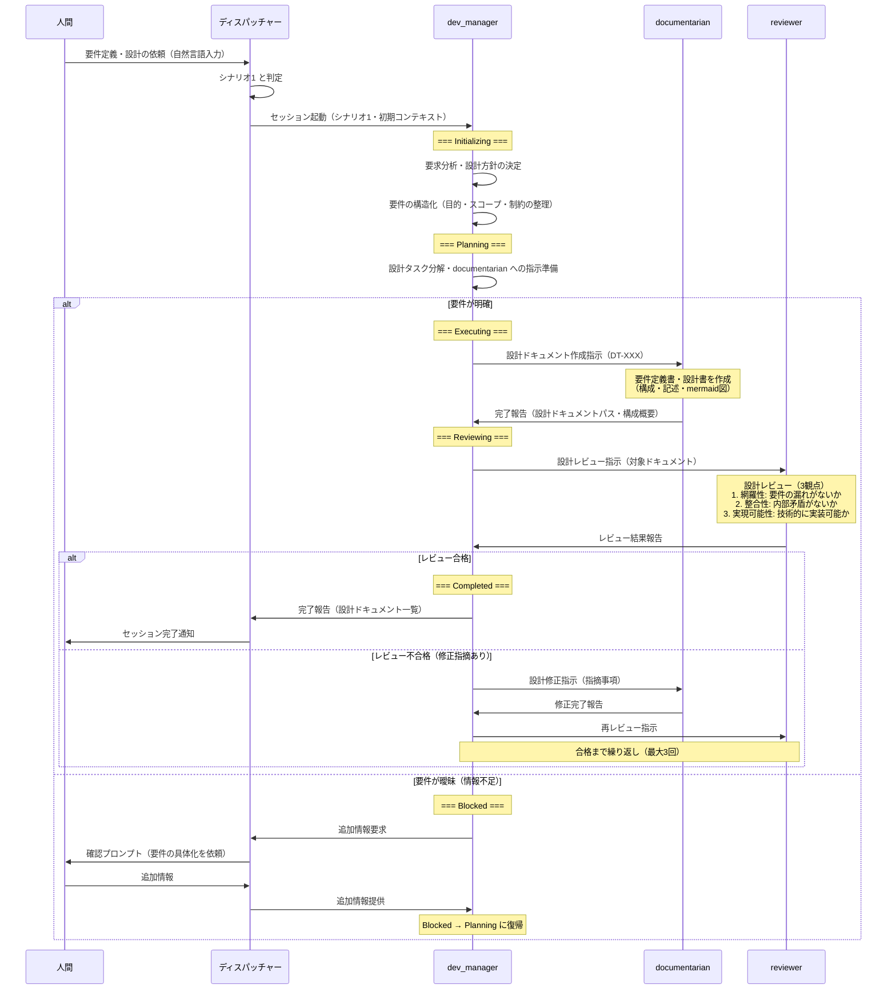
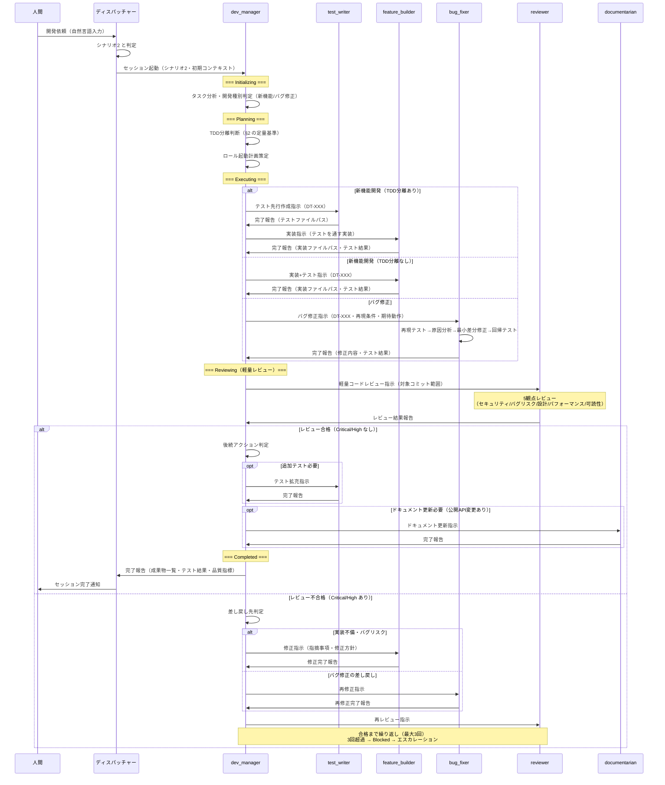
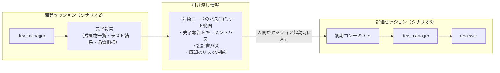
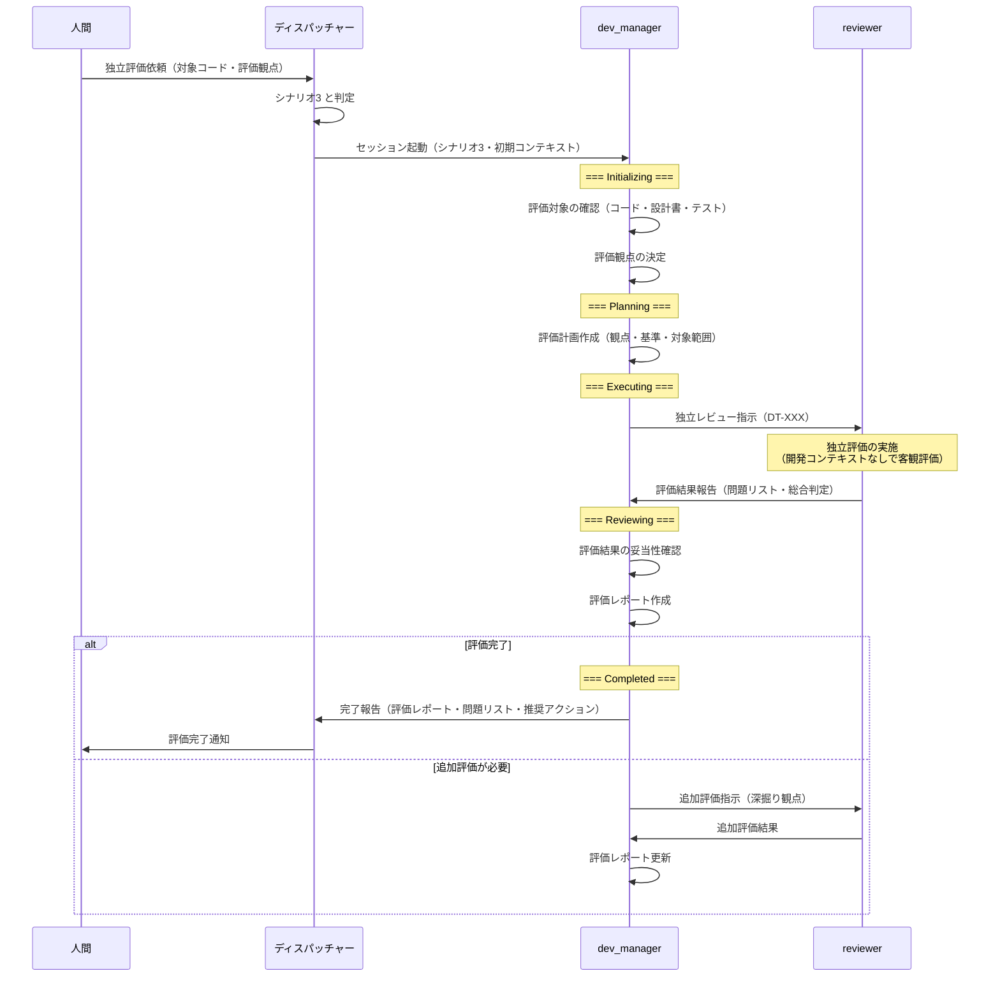
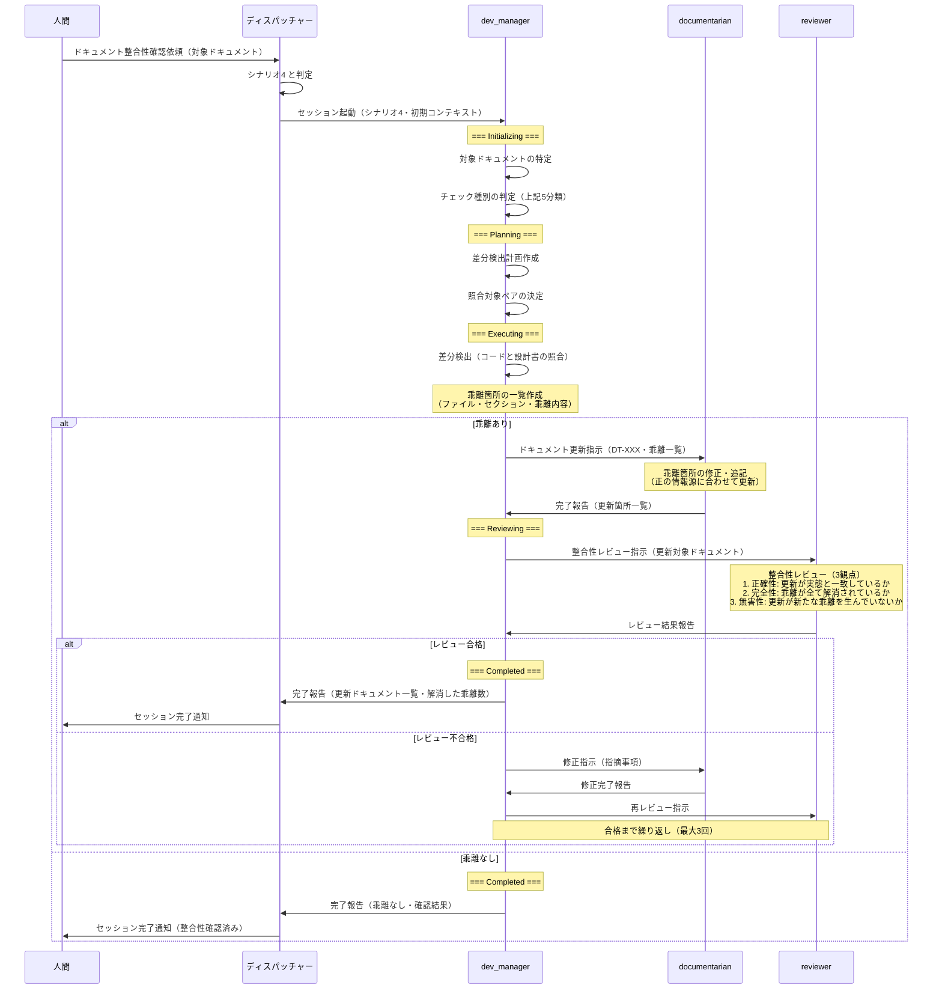
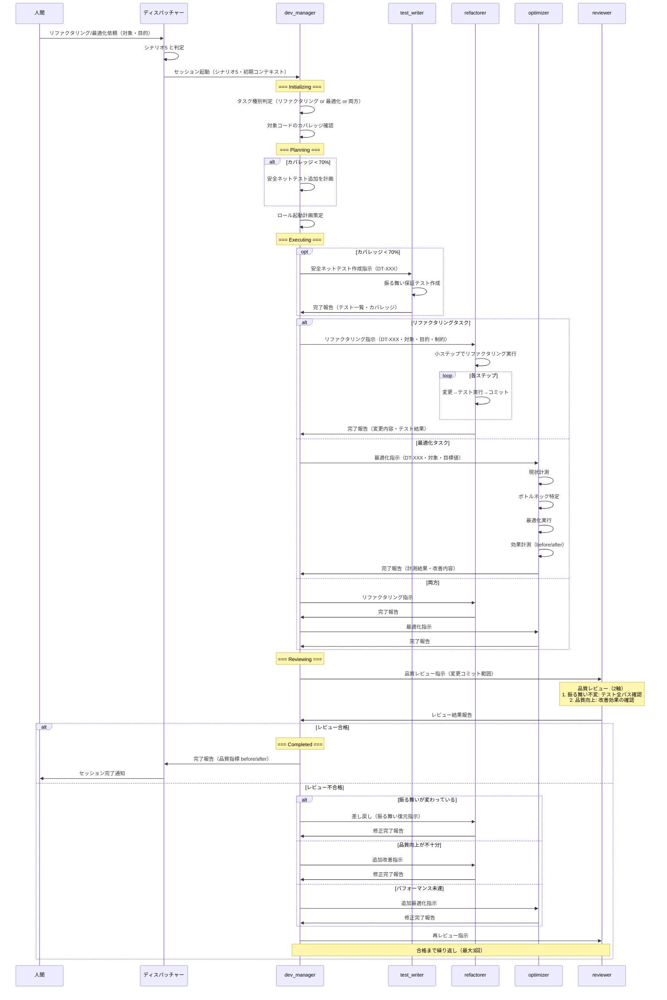

# セッション運用フロー設計: シナリオ編

> **本ドキュメントの位置づけ**
>
> 本ドキュメントは「セッション運用フロー設計」を3分割した文書群の1つであり、5つのシナリオ別セッションフローを定義する。
>
> - **ハブ**: [session-operation-flow.md](session-operation-flow.md) -- 全体概要と各ファイルへのナビゲーション
> - [session-flow-foundations.md](session-flow-foundations.md) -- §1-§4 概要・ライフサイクルモデル・ディスパッチャー・エントリーポイント
> - **本ドキュメント（シナリオ編）**: §5 要件定義→設計、§6 実施計画→開発、§7 独立評価、§8 ドキュメント整合性、§9 リファクタリング・最適化
> - [session-flow-advanced.md](session-flow-advanced.md) -- §10-§13 横断的関心事・統合マッピング・まとめ

---

## 5. シナリオ1: 要件定義→設計

### 5.1 概要

ユーザーの要求（「〜を作りたい」「〜の設計をしたい」）を受け、要件の構造化と設計ドキュメントの作成を行うセッション。コード実装は行わず、設計ドキュメントの作成とレビューが主な活動となる。

### 5.2 ロール構成

| ロール | 役割 | 起動条件 | 備考 |
|--------|------|---------|------|
| dev_manager | オーケストレーター | 常時 | 要件分析・設計方針の判断も補完する（既存ロールに不足する能力） |
| documentarian | 設計ドキュメント作成 | 常時 | 設計書の構成・記述を担当 |
| reviewer | 設計レビュー | documentarian 完了後 | 網羅性・整合性・実現可能性を評価 |

#### 5.2.1 既存ロールの不足

本シナリオでは以下の能力が既存7ロールに不足している。

| 不足する能力 | 本来想定されるロール | 現状の対応 | 影響 |
|-------------|-------------------|-----------|------|
| **要件分析** | planner（未定義） | dev_manager が補完 | dev_manager の責務が拡大する。将来的に planner ロールの新設を検討すべき |
| **アーキテクチャ設計** | architect（未定義） | dev_manager + documentarian で分担 | 技術的判断は dev_manager、ドキュメント化は documentarian。大規模設計では専門性が不足する可能性あり |
| **要件の妥当性検証** | tester/analyst（未定義） | reviewer が設計レビューで代替 | reviewer はコードレビューが主務であり、要件の妥当性検証には追加のレビュー観点定義が必要 |

### 5.3 セッションフロー

### 5.4 入出力仕様

#### 5.4.1 セッション入力

| 項目 | 必須/任意 | 内容 |
|------|---------|------|
| 目的 | 必須 | 何を設計したいか（「ユーザー認証機能の設計」等） |
| 背景・動機 | 推奨 | なぜこの設計が必要か |
| 制約条件 | 任意 | 技術スタック・互換性要件・非機能要件等 |
| 参考情報 | 任意 | 既存の関連ドキュメント・類似システムの参照先 |

#### 5.4.2 セッション出力

| 成果物 | 配置先 | 作成ロール |
|--------|--------|-----------|
| 設計ドキュメント | `docs/design/` | documentarian |
| レビュー結果 | （完了報告内） | reviewer |
| 設計方針の決定記録 | （完了報告内） | dev_manager |

### 5.5 品質ゲート

| ゲート | 判定基準 | 判定者 |
|--------|---------|--------|
| 設計レビュー | 網羅性・整合性・実現可能性の3観点で Critical/High 指摘なし | reviewer |
| dev_manager 承認 | 設計が元の要求を満たしているか確認 | dev_manager |

---

## 6. シナリオ2: 実施計画→開発（軽量レビュー込み）

### 6.1 概要

設計をもとに実施計画を作成し、ロール分担で開発を行うセッション。開発の中心シナリオであり、新機能開発・バグ修正・テスト拡充を含む。セッション内で reviewer による軽量コードレビューを実施する。

### 6.2 ロール構成

| ロール | 役割 | 起動条件 | 備考 |
|--------|------|---------|------|
| dev_manager | オーケストレーター | 常時 | タスク分析・TDD判断・ロール起動計画 |
| feature_builder | 機能実装 | 新機能開発時 | TDD分離時は test_writer の後に起動 |
| test_writer | テスト作成 | TDD分離判定該当時、または追加テスト必要時 | 先行テスト作成 or 事後テスト拡充 |
| bug_fixer | バグ修正 | バグ修正タスク時 | 再現テスト→修正→回帰テスト |
| reviewer | 軽量コードレビュー | 実装・修正完了後 | 5観点レビュー（セッション内） |
| documentarian | ドキュメント更新 | 公開API変更時（任意） | 実装後の後処理として起動 |

### 6.3 既存設計との整合性

本シナリオは `dev-workflow-detail.md` §3 の3シナリオ設計をセッション外部の運用フローとして包含する。

| dev-workflow-detail.md のシナリオ | 本シナリオでの位置づけ | 整合性 |
|--------------------------------|---------------------|--------|
| §3.1 新機能開発 | 本シナリオの新機能開発パス（feature_builder 中心） | 完全整合。TDD分離判断・レビューループ・後処理フローをそのまま採用 |
| §3.2 バグ修正 | 本シナリオのバグ修正パス（bug_fixer 中心） | 完全整合。再現テストファースト・最小差分修正のフローをそのまま採用 |
| §3.3 リファクタリング | **シナリオ5（§9）に分離**。ただし開発中に reviewer が設計問題を指摘した場合、本シナリオ内で refactorer を起動する場合がある | 部分的に重複。小規模リファクタリングは本シナリオ内で処理、大規模はシナリオ5 |

**変更点（セッション外部フローとしての差分）**:
- 起動トリガーが外部システムではなく人間（ディスパッチャー経由）
- 完了報告先がディスパッチャー経由で人間
- ライフサイクル状態（Initializing→Planning→Executing→Reviewing→Completed）に沿った遷移管理

### 6.4 セッションフロー

### 6.5 軽量レビューの仕様

#### 6.5.1 起動タイミング

軽量レビュー（セッション内 reviewer）は以下のタイミングで起動する。

| タイミング | 対象 | 起動条件 |
|-----------|------|---------|
| 実装完了後 | feature_builder の成果物 | 常時（新機能開発パス） |
| バグ修正完了後 | bug_fixer の成果物 | 常時（バグ修正パス） |
| 差し戻し修正完了後 | 修正後の成果物 | 差し戻し修正完了時 |

#### 6.5.2 レビュー範囲

| 観点 | 確認内容 | 重大度分類 |
|------|---------|-----------|
| セキュリティ | 脆弱性・認証認可の問題 | Critical |
| バグリスク | null チェック漏れ・境界値・例外処理 | High |
| 設計 | 責務分離・DRY原則・命名規約 | Medium |
| パフォーマンス | N+1問題・不要なループ・メモリリーク | Medium |
| 可読性 | コメント・命名の分かりやすさ | Low |

#### 6.5.3 フィードバックフロー

1. reviewer が問題リストを重大度付きで dev_manager に報告
2. dev_manager が差し戻しの要否を判定（Critical/High が1件以上 → 差し戻し）
3. 差し戻し時: dev_manager が対象ロール（feature_builder or bug_fixer）に修正指示
4. 修正完了後: reviewer に再レビュー指示
5. 最大3回の差し戻しで解決しない場合: Blocked に遷移しエスカレーション

### 6.6 入出力仕様

#### 6.6.1 セッション入力

| 項目 | 必須/任意 | 内容 |
|------|---------|------|
| 目的 | 必須 | 何を実装・修正するか |
| 対象 | 推奨 | 対象ファイル・モジュール |
| 設計書参照 | 推奨 | `docs/design/` 配下の設計ドキュメントパス |
| 制約 | 任意 | セキュリティ要件・互換性要件等 |

#### 6.6.2 セッション出力

| 成果物 | 配置先 | 作成ロール |
|--------|--------|-----------|
| 実装コード | `src/` | feature_builder / bug_fixer |
| テストコード | `tests/` | test_writer / feature_builder / bug_fixer |
| レビュー結果 | （完了報告内） | reviewer |
| ドキュメント更新 | `docs/` | documentarian（任意） |
| git コミット | git 履歴 | 各ロール |

---

## 7. シナリオ3: 独立評価（オプション）

### 7.1 概要

開発セッション（シナリオ2）とは別のコンテキストで、既存のコードや成果物に対する客観的な品質評価を行うセッション。開発セッションのバイアスを排除し、独立した視点で品質を評価する。セキュリティ監査・リリース前チェック・品質評価を目的とする場合に起動される。

### 7.2 ロール構成

| ロール | 役割 | 起動条件 | 備考 |
|--------|------|---------|------|
| dev_manager | オーケストレーター | 常時 | 評価計画の作成・評価結果の集約 |
| reviewer | 独立評価 | 常時 | 開発コンテキストなしで客観的にレビュー |

#### 7.2.1 既存ロールの不足

| 不足する能力 | 本来想定されるロール | 現状の対応 | 影響 |
|-------------|-------------------|-----------|------|
| **体系的テスト実行** | tester（未定義） | reviewer のレビュー + 手動テスト指示 | 自動テストの実行・カバレッジ計測は reviewer の守備範囲外。dev_manager が補完 |
| **評価管理** | eval_manager（未定義） | dev_manager が代行 | dev_manager の責務が拡大する。大規模評価では専門の評価管理者が必要 |

### 7.3 コンテキスト引き渡し方法

開発セッション（シナリオ2）から評価セッション（シナリオ3）へのコンテキスト引き渡しは以下の方法で行う。

#### 7.3.1 引き渡し情報

| 情報種別 | 具体的な内容 | 引き渡し手段 |
|---------|-------------|-------------|
| **対象コード** | 評価対象のファイルパス・コミット範囲 | セッション起動時の入力に含める |
| **開発セッションの完了報告** | 実装概要・テスト結果・品質指標 | 完了報告ドキュメント（ファイルパス参照） |
| **設計ドキュメント** | 元の設計書・要件定義 | `docs/design/` 配下のファイルパス参照 |
| **既知の制約・リスク** | 開発時に認識したリスクや技術的負債 | セッション起動時の入力に含める |

#### 7.3.2 引き渡しフロー

#### 7.3.3 コンテキスト分離の原則

- 評価セッションは**新しいコンテキストウィンドウ**で起動される
- 開発セッションの内部状態（ロール間のやり取り、判断過程）は引き渡さない
- 成果物とドキュメントのみを入力とし、開発者のバイアスを排除する

### 7.4 セッションフロー

### 7.5 評価観点と判定基準

#### 7.5.1 標準評価観点

| # | 評価観点 | 確認内容 | 判定基準 |
|---|---------|---------|---------|
| 1 | セキュリティ | 脆弱性・認証認可・入力検証・暗号化 | OWASP Top 10 に該当する問題がないこと |
| 2 | 設計品質 | 責務分離・結合度・凝集度・SOLID原則 | 重大な設計違反がないこと |
| 3 | テスト十分性 | カバレッジ・境界値・異常系テスト | カバレッジ目標達成、主要パスのテストあり |
| 4 | パフォーマンス | N+1問題・メモリリーク・計算量 | 明らかなボトルネックがないこと |
| 5 | 保守性 | 可読性・命名・コメント・複雑度 | 循環的複雑度 < 15、命名規約遵守 |

#### 7.5.2 総合判定

| 判定 | 条件 | 推奨アクション |
|------|------|---------------|
| 合格 | Critical 0件 かつ High 0件 | 後続作業なし |
| 条件付き合格 | Critical 0件 かつ High 1-2件 | 指摘事項を開発セッション（シナリオ2）で修正 |
| 不合格 | Critical 1件以上、または High 3件以上 | 開発セッション（シナリオ2）で大幅修正が必要 |

### 7.6 入出力仕様

#### 7.6.1 セッション入力

| 項目 | 必須/任意 | 内容 |
|------|---------|------|
| 評価対象 | 必須 | ファイルパス・コミット範囲 |
| 評価観点 | 推奨 | 重点評価観点（セキュリティ・パフォーマンス等） |
| 設計書参照 | 推奨 | 元の設計ドキュメントパス |
| 開発セッション完了報告 | 任意 | 開発セッションの完了報告パス |

#### 7.6.2 セッション出力

| 成果物 | 内容 | 出力先 |
|--------|------|--------|
| 評価レポート | 観点別の問題リスト・総合判定・推奨アクション | （完了報告内） |

---

## 8. シナリオ4: ドキュメント整合性

### 8.1 概要

既存ドキュメントを実態（コード・設計・運用）と照合し、乖離を検知して整合性を合わせるセッション。ドキュメントの腐敗を防ぎ、信頼性を維持することが目的。

### 8.2 ロール構成

| ロール | 役割 | 起動条件 | 備考 |
|--------|------|---------|------|
| dev_manager | オーケストレーター | 常時 | 整合性チェック計画の作成・差分検出 |
| documentarian | ドキュメント更新 | 差分検出後 | 乖離箇所の修正・追記 |
| reviewer | 整合性レビュー | 更新完了後 | 更新が正確か、新たな乖離を生んでいないか確認 |

### 8.3 整合性チェック対象の分類

| # | チェック種別 | 照合元 | 照合先 | 典型的な乖離 |
|---|------------|--------|--------|-------------|
| 1 | コード ⇔ 設計書 | `src/` のコード実装 | `docs/design/` の設計ドキュメント | APIシグネチャの変更、クラス構成の変更が設計書に未反映 |
| 2 | コード ⇔ README | `src/` のコード実装 | `README.md` | セットアップ手順の陳腐化、使用方法の変更が未反映 |
| 3 | 設計書 ⇔ 運用実態 | `docs/design/` の設計ドキュメント | 実際のディレクトリ構成・設定ファイル | 設計で想定したディレクトリ構成と実態の乖離 |
| 4 | ロール定義 ⇔ 運用実態 | `roles/*.md` のロール定義 | 実際のワークフロー運用 | ロール定義に記載のないワークフローが実態で行われている |
| 5 | CHANGELOG ⇔ コミット履歴 | `CHANGELOG.md` | `git log` | リリースノートに記載されていない変更 |

### 8.4 セッションフロー

### 8.5 入出力仕様

#### 8.5.1 セッション入力

| 項目 | 必須/任意 | 内容 |
|------|---------|------|
| 対象ドキュメント | 必須 | 整合性を確認したいドキュメントパス |
| 照合元 | 推奨 | コード・設計書・運用実態のいずれか |
| チェック範囲 | 任意 | 全体チェック or 特定セクションのみ |

#### 8.5.2 セッション出力

| 成果物 | 配置先 | 作成ロール |
|--------|--------|-----------|
| 更新済みドキュメント | `docs/`, `README.md` 等 | documentarian |
| 乖離検出レポート | （完了報告内） | dev_manager |
| 整合性レビュー結果 | （完了報告内） | reviewer |
| git コミット | git 履歴 | documentarian |

### 8.6 品質ゲート

| ゲート | 判定基準 | 判定者 |
|--------|---------|--------|
| 整合性レビュー | 正確性・完全性・無害性の3観点で問題なし | reviewer |

---

## 9. シナリオ5: リファクタリング・最適化

### 9.1 概要

機能変更を伴わないコード品質改善（リファクタリング）またはパフォーマンス最適化を行うセッション。振る舞い不変を保証しつつ、コードの内部品質を改善する。

### 9.2 ロール構成

| ロール | 役割 | 起動条件 | 備考 |
|--------|------|---------|------|
| dev_manager | オーケストレーター | 常時 | カバレッジ確認・タスク種別判定 |
| test_writer | 安全ネットテスト作成 | 対象コードのカバレッジ < 70% | リファクタリング前の振る舞い保証テスト |
| refactorer | リファクタリング実行 | リファクタリングタスク時 | 小ステップ・振る舞い不変 |
| optimizer | パフォーマンス最適化 | 最適化タスク時 | 計測→ボトルネック特定→改善 |
| reviewer | 品質レビュー | 実行完了後 | 振る舞い不変確認 + 品質向上確認 |

### 9.3 既存設計との整合性

本シナリオは `dev-workflow-detail.md` §3.3 のリファクタリングシナリオをセッション外部の運用フローとして包含し、パフォーマンス最適化を追加する。

| dev-workflow-detail.md の内容 | 本シナリオでの位置づけ | 整合性 |
|-----------------------------|---------------------|--------|
| §3.3 リファクタリングシーケンス図 | 本シナリオのリファクタリングパスとして採用 | 完全整合。カバレッジチェック→安全ネットテスト→小ステップリファクタリング→レビューのフロー |
| §3.3 カバレッジ < 70% で test_writer 先行 | そのまま採用 | 完全整合 |
| §3.3 振る舞い不変確認のレビュー | そのまま採用。追加で品質向上度合いの確認も実施 | 完全整合 |

**追加要素（dev-workflow-detail.md に未定義）**:
- optimizer ロールによるパフォーマンス最適化パスを追加
- リファクタリングと最適化の判定基準を定義

### 9.4 セッションフロー

### 9.5 品質ゲート

| ゲート | 判定基準 | 判定者 |
|--------|---------|--------|
| テスト全パス | 既存テスト + 安全ネットテストが全て通過すること | dev_manager（テスト実行結果を確認） |
| 振る舞い不変 | リファクタリング前後でテスト結果が変わらないこと | reviewer |
| 品質向上確認 | 改善目的（複雑度低減・DRY化・パフォーマンス改善等）が達成されていること | reviewer |

### 9.6 入出力仕様

#### 9.6.1 セッション入力

| 項目 | 必須/任意 | 内容 |
|------|---------|------|
| 目的 | 必須 | 何を改善するか（複雑度低減・パフォーマンス改善等） |
| 対象 | 必須 | 対象ファイル・モジュール |
| 制約 | 推奨 | 「機能変更不可」「下位互換維持」等 |
| 目標値 | 任意 | 循環的複雑度の目標値、パフォーマンス目標値 |

#### 9.6.2 セッション出力

| 成果物 | 配置先 | 作成ロール |
|--------|--------|-----------|
| リファクタリング済みコード | `src/` | refactorer |
| 最適化済みコード | `src/` | optimizer |
| 安全ネットテスト | `tests/` | test_writer |
| 品質指標（before/after） | （完了報告内） | dev_manager |
| レビュー結果 | （完了報告内） | reviewer |
| git コミット群 | git 履歴 | refactorer / optimizer |

---
