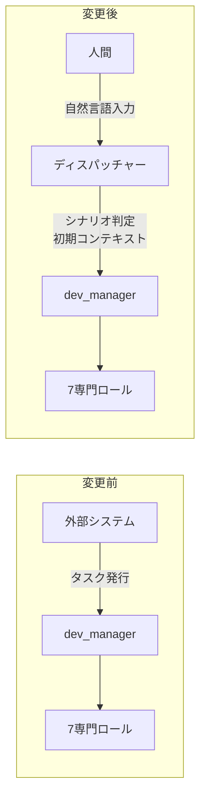
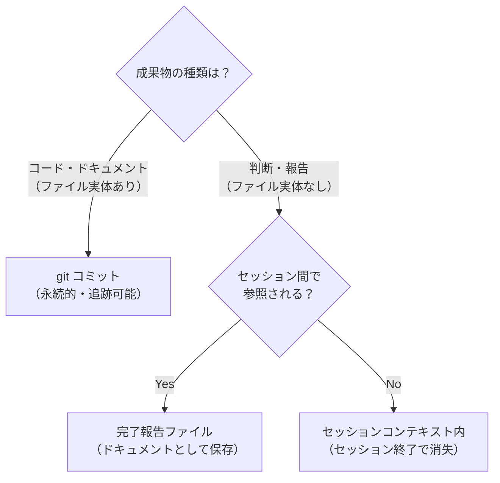
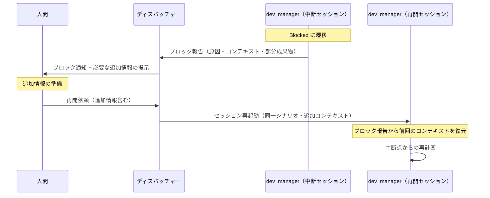
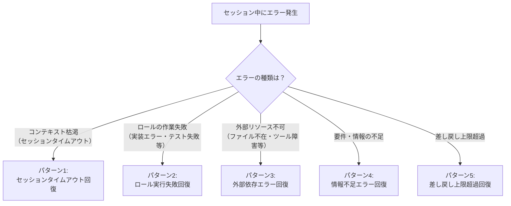
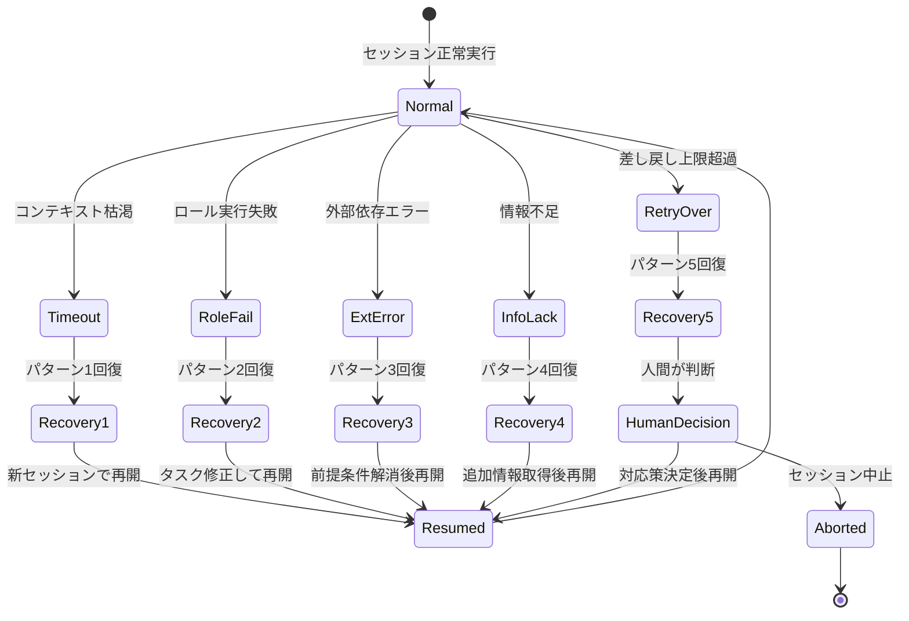
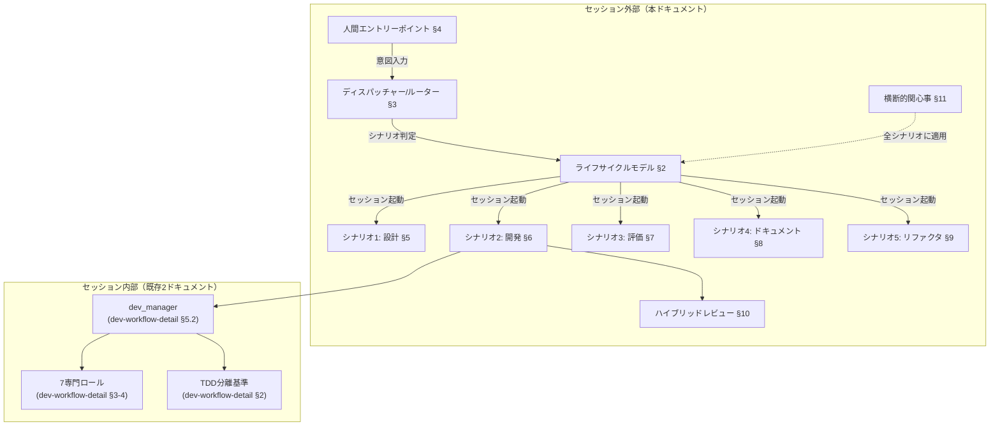

# セッション運用フロー設計

## 1. 概要

### 1.1 本ドキュメントの位置づけ

本ドキュメントは、コード開発ワークフローにおける**セッション外部**の運用フロー設計をまとめたものである。人間のエントリーポイントからセッションが起動し、完了するまでの上位レイヤーを定義する。

**3ドキュメントによる設計カバー範囲**:

| ドキュメント | 設計対象 | スコープ |
|-------------|---------|---------|
| `dev-workflow-overview.md` | 概要設計 | ロール互換性分析、TDD戦略、ロールギャップ分析 |
| `dev-workflow-detail.md` | セッション**内部**設計 | 3シナリオの詳細フロー、ロール間連携プロトコル、ロール修正提案、dev_manager 要件定義 |
| **本ドキュメント** | セッション**外部**設計 | ライフサイクルモデル、ディスパッチャー/ルーター、エントリーポイント、5シナリオの運用フロー、横断的関心事 |

### 1.2 既存ドキュメントとの関係


- **本ドキュメント**は「人間が何かを入力してからセッションが起動するまで」と「セッションが完了するまでのライフサイクル」を定義する
- **既存ドキュメント**は「セッション内部で dev_manager がどのロールをどう起動するか」を定義する
- 境界: dev_manager の起動トリガーが本ドキュメントの出口であり、既存ドキュメントの入口である

### 1.3 用語定義

| 用語 | 定義 |
|------|------|
| セッション | 特定の目的を持つ一連の作業の実行単位。起動から完了まで一貫したコンテキストを持つ |
| ディスパッチャー | 人間の意図を解析し、適切なシナリオ・セッション構成を選択するルーティングロジック |
| シナリオ | 開発作業の種類を分類したもの。5つのシナリオ + 「該当なし」で構成される |
| セッション型 | シナリオに対応するロール構成・フロー・品質ゲートの組み合わせ |
| エントリーポイント | 人間がセッションを起動するための入力インターフェース |

---

## 2. セッションライフサイクルモデル

### 2.1 状態遷移図


### 2.2 各ステージの定義

#### 2.2.1 Initializing（初期化）

| 項目 | 内容 |
|------|------|
| **何が起きるか** | セッションのコンテキストが構築される。ディスパッチャーがシナリオを判定し、セッション型を選択する。必要なロール構成が決定され、初期コンテキスト（入力情報・参照ドキュメント・制約条件）が設定される |
| **入力** | 人間からの意図入力（自然言語テキスト） |
| **出力** | 判定されたシナリオ、セッション型、初期コンテキスト、起動するロール一覧 |
| **遷移条件 → Planning** | シナリオ判定が完了し、セッション型が確定した場合 |
| **遷移条件 → Failed** | 入力の解析に失敗した場合、必須の前提条件（対象ファイルの存在等）が満たされていない場合 |

#### 2.2.2 Planning（計画）

| 項目 | 内容 |
|------|------|
| **何が起きるか** | dev_manager（またはシナリオに応じたオーケストレーター）がタスクを分析し、ロール起動計画を策定する。TDD分離判断（該当シナリオの場合）、ロール起動順序の決定、タスク指示の作成が行われる |
| **入力** | 初期コンテキスト、セッション型の定義 |
| **出力** | ロール起動計画（起動順序・各ロールへのタスク指示）、TDD分離判断結果 |
| **遷移条件 → Executing** | ロール起動計画が策定され、最初のロールの起動準備が完了した場合 |
| **遷移条件 → Blocked** | タスクの分析に必要な情報が不足している場合（対象コードが見つからない、要件が曖昧等） |

#### 2.2.3 Executing（実行）

| 項目 | 内容 |
|------|------|
| **何が起きるか** | 計画に基づき、各ロールが順次起動される。ロールはタスク指示に従い作業を実行し、完了報告を返す。dev_manager が進捗を管理し、次のロール起動を判断する |
| **入力** | ロール起動計画、各ロールの完了報告（前段ロールの結果を後段に伝達） |
| **出力** | 各ロールの成果物（コード・テスト・ドキュメント等）、完了報告の集約 |
| **遷移条件 → Reviewing** | 全ロールの作業が完了した場合（reviewer を含むシナリオでは reviewer の判定完了） |
| **遷移条件 → Blocked** | ロールがブロック状態に陥り、dev_manager でも解決できない場合 |
| **遷移条件 → Failed** | 致命的なエラーが発生し、セッションの回復が不可能な場合（例: 対象リポジトリの破損） |

#### 2.2.4 Reviewing（レビュー）

| 項目 | 内容 |
|------|------|
| **何が起きるか** | セッション内レビュー（reviewer ロール）またはセッション全体の品質確認が行われる。レビュー結果に基づき、合格/差し戻しが判定される |
| **入力** | 全ロールの成果物、レビュー基準（シナリオごとの品質ゲート定義） |
| **出力** | レビュー結果（合格/不合格）、不合格時の差し戻し指示（対象ロール・修正内容） |
| **遷移条件 → Completed** | レビュー合格（Critical/High の問題なし）かつ全品質ゲート通過 |
| **遷移条件 → Executing** | レビュー不合格。差し戻し先ロールが特定され、修正指示が作成された場合。差し戻し回数が上限（3回）以内であること |
| **遷移条件 → Blocked** | レビューに必要な情報が不足している場合。差し戻し回数が上限（3回）を超えた場合 |

#### 2.2.5 Completed（完了）

| 項目 | 内容 |
|------|------|
| **何が起きるか** | セッションが正常に完了する。成果物が確定し、完了報告が生成される。セッションのコンテキスト（何をやったか、成果物はどこか）が永続化される |
| **入力** | レビュー合格判定 |
| **出力** | 完了報告（成果物一覧・テスト結果・品質指標）、永続化されたセッションコンテキスト |
| **終了動作** | セッションリソースの解放、後続セッションへの引き継ぎ情報の準備 |

#### 2.2.6 Blocked（ブロック）

| 項目 | 内容 |
|------|------|
| **何が起きるか** | セッションの進行が外部要因により停止している。ブロック理由が記録され、人間へのエスカレーションが行われる |
| **入力** | ブロックの原因（情報不足・外部依存・回復不能エラー等） |
| **出力** | ブロック報告（原因・影響・必要な判断） |
| **回復パス → Planning** | 情報不足が解消された場合（人間が追加情報を提供した等）。計画の見直しが必要 |
| **回復パス → Executing** | 外部依存が解消された場合。実行を中断点から再開可能 |
| **遷移条件 → Failed** | 回復の見込みがなく、人間がセッションの中止を指示した場合 |

#### 2.2.7 Failed（失敗）

| 項目 | 内容 |
|------|------|
| **何が起きるか** | セッションが異常終了する。失敗原因が記録され、クリーンアップが行われる |
| **入力** | 失敗の原因（初期化エラー・致命的エラー・回復断念） |
| **出力** | 失敗報告（原因・試行した対応・部分的な成果物があれば参照先） |
| **終了動作** | 部分的な成果物の保全（コミット済みの変更は保持）、セッションリソースの解放 |

### 2.3 ライフサイクルの設計原則

1. **最大差し戻し回数**: Reviewing → Executing の差し戻しは同一レビュー観点で最大3回。3回超過で Blocked に遷移し、エスカレーションする
2. **状態の永続化**: 各ステージ遷移時にセッションの状態を永続化する。Blocked や Failed からの回復時に前回のコンテキストを復元可能にする
3. **冪等性**: Blocked からの回復時、同じ入力で同じ結果を再現できること。副作用のある操作（git push 等）は Executing の最終段階でのみ行う

---

## 3. セッションディスパッチャー/ルーター

### 3.1 意図分類基準

人間の入力（自然言語テキスト）から、以下の5シナリオ + 「該当なし」に分類する。

#### 3.1.1 分類のための入力パターン表

| # | シナリオ | キーワード・入力パターン | 判定条件 |
|---|---------|----------------------|---------|
| 1 | 要件定義〜設計 | 「〜を作りたい」「〜の設計をしたい」「要件を整理したい」「仕様を決めたい」「アーキテクチャを検討したい」 | ユーザーの要求がまだ要件・仕様・設計として言語化されておらず、設計ドキュメントの作成が必要 |
| 2 | 実施計画作成〜開発実施 | 「〜を実装して」「〜を開発して」「〜機能を追加して」「設計書に基づいて実装して」「テストを書いて」 | 要件・設計が存在し（または入力に含まれ）、コードの実装が必要 |
| 3 | 独立評価 | 「〜をレビューして」「品質を確認して」「セキュリティ監査をして」「リリース前チェック」 | 既存のコード・成果物に対する客観的な品質評価が目的。開発セッションとは独立したコンテキストで実施 |
| 4 | ドキュメント整合性 | 「ドキュメントを更新して」「設計書とコードの整合性を確認して」「README を最新化して」 | 既存ドキュメントと実態（コード・設計・運用）の乖離を検知し、整合させることが目的 |
| 5 | リファクタリング・最適化 | 「リファクタリングして」「パフォーマンスを改善して」「コード品質を上げて」「〜を最適化して」 | 機能変更を伴わないコード品質改善またはパフォーマンス最適化が目的 |
| N/A | 該当なし | 上記いずれにも該当しない | 曖昧な入力、複数シナリオにまたがる要求、開発作業以外の依頼 |

#### 3.1.2 分類の優先順位

複数シナリオに該当しうる場合は、以下の優先順位で判定する。

1. **明示的なキーワード一致**: 入力に特定シナリオのキーワードが含まれる場合、そのシナリオを優先
2. **入力の主目的**: 入力の主な目的（何を達成したいか）に基づいて判定
3. **前提条件の有無**: 設計書の存在が前提ならシナリオ2（実施）、存在しないならシナリオ1（要件定義〜設計）
4. **曖昧な場合**: 「該当なし」として人間に確認を求める

### 3.2 分類フロー図


### 3.3 セッション型レジストリ

#### 3.3.1 シナリオ別ロール構成マッピング

| # | シナリオ | オーケストレーター | 起動ロール | 品質ゲート | 備考 |
|---|---------|-----------------|-----------|-----------|------|
| 1 | 要件定義〜設計 | dev_manager | documentarian, reviewer | reviewer による設計レビュー | 既存7ロールに「設計専門」は不在。documentarian が設計ドキュメント作成を担当し、reviewer が品質確認する。不足する能力（要件分析等）は dev_manager が補完 |
| 2 | 実施計画〜開発実施 | dev_manager | feature_builder, test_writer, reviewer, (bug_fixer), (documentarian) | reviewer による軽量コードレビュー | `dev-workflow-detail.md` §3 の3シナリオ（新機能・バグ修正・リファクタリング内の実装部分）に対応。TDD分離判断を含む |
| 3 | 独立評価 | dev_manager | reviewer | reviewer による独立レビュー | 開発セッションとは別コンテキストで起動。開発セッションの成果物を入力として受け取る |
| 4 | ドキュメント整合性 | dev_manager | documentarian, reviewer | reviewer によるドキュメントレビュー | コードと設計書の差分検出、ドキュメント更新、整合性確認 |
| 5 | リファクタリング・最適化 | dev_manager | refactorer, optimizer, test_writer, reviewer | reviewer による品質レビュー + テストカバレッジ確認 | `dev-workflow-detail.md` §3.3 のリファクタリングシナリオに対応。安全ネットテストを含む |
| N/A | 該当なし | - | - | - | 人間に追加情報を求める。入力を具体化した後に再分類する |

#### 3.3.2 シナリオ別のライフサイクル特性

| # | シナリオ | Planning の特徴 | Executing の特徴 | Reviewing の特徴 |
|---|---------|----------------|-----------------|-----------------|
| 1 | 要件定義〜設計 | 要件の構造化、設計方針の決定 | ドキュメント作成が中心、コード生成なし | 設計レビュー（網羅性・整合性・実現可能性） |
| 2 | 実施計画〜開発実施 | TDD分離判断、ロール起動順序決定 | コード実装・テスト作成・差し戻しループ | コードレビュー（5観点・4段階重大度） |
| 3 | 独立評価 | 評価観点の決定、評価計画の作成 | 成果物の網羅的評価 | 評価レポートの妥当性確認 |
| 4 | ドキュメント整合性 | 対象ドキュメントの特定、差分検出計画 | ドキュメント更新、整合性修正 | 整合性確認レビュー |
| 5 | リファクタリング・最適化 | カバレッジ確認、安全ネットテスト判断 | リファクタリング/最適化実行、振る舞い不変確認 | 品質レビュー（振る舞い不変 + 品質向上確認） |

### 3.4 「該当なし」ケースの処理

ディスパッチャーが入力を5シナリオのいずれにも分類できない場合、以下の処理を行う。

1. **曖昧さの特定**: どの部分が曖昧か（目的不明・スコープ不明・前提不明）を分析する
2. **確認プロンプトの生成**: 分類に必要な追加情報を求める質問を人間に提示する
3. **再分類**: 人間からの追加情報を受けて再度分類フローを実行する

**確認プロンプトの例**:
- 「設計から始めますか、それとも設計は既にありますか？」（シナリオ1 vs 2 の判別）
- 「機能を変更しますか、それともコード品質の改善ですか？」（シナリオ2 vs 5 の判別）
- 「開発中のレビューですか、それとも独立した品質評価ですか？」（シナリオ2の軽量レビュー vs シナリオ3 の判別）

---

## 4. 人間エントリーポイント仕様

### 4.1 設計の背景

#### 4.1.1 変更の動機

従来の設計では、dev_manager の起動トリガーは外部システム経由のタスク発行に限定されていた。しかし、知見#9 で「開発フローは独立し、人間が直接エントリーする」方針に変更された。

本設計では、**起動トリガー源のみを変更**し、dev_manager の内部責務（ハブ&スポーク構造、DT-XXX タスク管理、TDD判定等）は不変とする。

#### 4.1.2 変更前後の比較



### 4.2 入力形式

#### 4.2.1 人間からの入力

人間はディスパッチャーに対して自然言語テキストで意図を入力する。

**入力に含めるべき情報**:

| 情報 | 必須/任意 | 説明 | 例 |
|------|---------|------|------|
| 目的 | 必須 | 何を達成したいか | 「ログイン機能を追加したい」 |
| 対象 | 推奨 | 対象ファイル・モジュール・ドキュメント | 「src/auth/ モジュール」 |
| 制約 | 任意 | 制約条件・品質要件 | 「セキュリティ要件あり」「既存テストを壊さないこと」 |
| コンテキスト | 任意 | 背景情報・関連する設計書 | 「設計書は docs/design/auth.md を参照」 |

#### 4.2.2 入力例

```
# シナリオ1 の例
「ユーザー認証機能の要件を整理して、設計ドキュメントを作成したい。
OAuth 2.0 をベースにする方針。」

# シナリオ2 の例
「docs/design/auth.md の設計に基づいて、ログイン機能を実装して。
src/auth/ 配下に実装。セキュリティ要件あり。」

# シナリオ3 の例
「先日実装したログイン機能を独立してレビューしたい。
対象: src/auth/ の直近のコミット群。セキュリティ観点を重点的に。」

# シナリオ4 の例
「docs/design/auth.md が実装の現状と乖離しているので更新したい。」

# シナリオ5 の例
「src/auth/login.py の認証処理をリファクタリングしたい。
循環的複雑度が高いので分割したい。機能変更は不要。」
```

### 4.3 起動トリガー

#### 4.3.1 トリガーフロー


#### 4.3.2 初期コンテキストの設定

ディスパッチャーが dev_manager に渡す初期コンテキストは以下の構造を持つ。

```markdown
## セッション起動コンテキスト

### シナリオ
{シナリオ番号}: {シナリオ名}

### セッション型
{セッション型レジストリから選択されたロール構成}

### 目的
{人間の入力から抽出した目的の1行要約}

### 対象
- ファイル/モジュール: {対象パス}
- 参照ドキュメント: {設計書等のパス}

### 制約
- {制約1}
- {制約2}

### 品質要件
- {セキュリティ要件の有無}
- {パフォーマンス要件の有無}
- {テストカバレッジ目標}

### 原文
{人間の入力テキスト全文}
```

### 4.4 dev_manager の内部責務（不変部分の確認）

以下は `dev-workflow-detail.md` §5.2 で定義済みであり、本設計では変更しない。

| 責務 | 内容 | 変更有無 |
|------|------|---------|
| タスク分配 | DT-XXX 形式のタスク作成・配分 | **不変** |
| TDD分離判断 | §2 の定量的基準に基づく判断 | **不変** |
| ロール起動順序 | シナリオに応じた起動順序決定 | **不変** |
| レビュー判定 | reviewer の報告に基づく合格/差し戻し | **不変** |
| コンテキスト中継 | 前段→後段の情報伝達 | **不変** |
| 進捗管理 | 各ロールの完了報告管理 | **不変** |
| 完了報告 | ディスパッチャーまたは人間に報告 | **報告先のみ変更** |

唯一の変更点は以下の通り:
- **起動トリガー源**: 外部システムからのタスク発行 → ディスパッチャーからのセッション起動
- **完了報告先**: ディスパッチャー経由で人間

---

## 5. シナリオ1: 要件定義→設計

### 5.1 概要

ユーザーの要求（「〜を作りたい」「〜の設計をしたい」）を受け、要件の構造化と設計ドキュメントの作成を行うセッション。コード実装は行わず、設計ドキュメントの作成とレビューが主な活動となる。

### 5.2 ロール構成

| ロール | 役割 | 起動条件 | 備考 |
|--------|------|---------|------|
| dev_manager | オーケストレーター | 常時 | 要件分析・設計方針の判断も補完する（既存ロールに不足する能力） |
| documentarian | 設計ドキュメント作成 | 常時 | 設計書の構成・記述を担当 |
| reviewer | 設計レビュー | documentarian 完了後 | 網羅性・整合性・実現可能性を評価 |

#### 5.2.1 既存ロールの不足

本シナリオでは以下の能力が既存7ロールに不足している。

| 不足する能力 | 本来想定されるロール | 現状の対応 | 影響 |
|-------------|-------------------|-----------|------|
| **要件分析** | planner（未定義） | dev_manager が補完 | dev_manager の責務が拡大する。将来的に planner ロールの新設を検討すべき |
| **アーキテクチャ設計** | architect（未定義） | dev_manager + documentarian で分担 | 技術的判断は dev_manager、ドキュメント化は documentarian。大規模設計では専門性が不足する可能性あり |
| **要件の妥当性検証** | tester/analyst（未定義） | reviewer が設計レビューで代替 | reviewer はコードレビューが主務であり、要件の妥当性検証には追加のレビュー観点定義が必要 |

### 5.3 セッションフロー


### 5.4 入出力仕様

#### 5.4.1 セッション入力

| 項目 | 必須/任意 | 内容 |
|------|---------|------|
| 目的 | 必須 | 何を設計したいか（「ユーザー認証機能の設計」等） |
| 背景・動機 | 推奨 | なぜこの設計が必要か |
| 制約条件 | 任意 | 技術スタック・互換性要件・非機能要件等 |
| 参考情報 | 任意 | 既存の関連ドキュメント・類似システムの参照先 |

#### 5.4.2 セッション出力

| 成果物 | 配置先 | 作成ロール |
|--------|--------|-----------|
| 設計ドキュメント | `docs/design/` | documentarian |
| レビュー結果 | （完了報告内） | reviewer |
| 設計方針の決定記録 | （完了報告内） | dev_manager |

### 5.5 品質ゲート

| ゲート | 判定基準 | 判定者 |
|--------|---------|--------|
| 設計レビュー | 網羅性・整合性・実現可能性の3観点で Critical/High 指摘なし | reviewer |
| dev_manager 承認 | 設計が元の要求を満たしているか確認 | dev_manager |

---

## 6. シナリオ2: 実施計画→開発（軽量レビュー込み）

### 6.1 概要

設計をもとに実施計画を作成し、ロール分担で開発を行うセッション。開発の中心シナリオであり、新機能開発・バグ修正・テスト拡充を含む。セッション内で reviewer による軽量コードレビューを実施する。

### 6.2 ロール構成

| ロール | 役割 | 起動条件 | 備考 |
|--------|------|---------|------|
| dev_manager | オーケストレーター | 常時 | タスク分析・TDD判断・ロール起動計画 |
| feature_builder | 機能実装 | 新機能開発時 | TDD分離時は test_writer の後に起動 |
| test_writer | テスト作成 | TDD分離判定該当時、または追加テスト必要時 | 先行テスト作成 or 事後テスト拡充 |
| bug_fixer | バグ修正 | バグ修正タスク時 | 再現テスト→修正→回帰テスト |
| reviewer | 軽量コードレビュー | 実装・修正完了後 | 5観点レビュー（セッション内） |
| documentarian | ドキュメント更新 | 公開API変更時（任意） | 実装後の後処理として起動 |

### 6.3 既存設計との整合性

本シナリオは `dev-workflow-detail.md` §3 の3シナリオ設計をセッション外部の運用フローとして包含する。

| dev-workflow-detail.md のシナリオ | 本シナリオでの位置づけ | 整合性 |
|--------------------------------|---------------------|--------|
| §3.1 新機能開発 | 本シナリオの新機能開発パス（feature_builder 中心） | 完全整合。TDD分離判断・レビューループ・後処理フローをそのまま採用 |
| §3.2 バグ修正 | 本シナリオのバグ修正パス（bug_fixer 中心） | 完全整合。再現テストファースト・最小差分修正のフローをそのまま採用 |
| §3.3 リファクタリング | **シナリオ5（§9）に分離**。ただし開発中に reviewer が設計問題を指摘した場合、本シナリオ内で refactorer を起動する場合がある | 部分的に重複。小規模リファクタリングは本シナリオ内で処理、大規模はシナリオ5 |

**変更点（セッション外部フローとしての差分）**:
- 起動トリガーが外部システムではなく人間（ディスパッチャー経由）
- 完了報告先がディスパッチャー経由で人間
- ライフサイクル状態（Initializing→Planning→Executing→Reviewing→Completed）に沿った遷移管理

### 6.4 セッションフロー


### 6.5 軽量レビューの仕様

#### 6.5.1 起動タイミング

軽量レビュー（セッション内 reviewer）は以下のタイミングで起動する。

| タイミング | 対象 | 起動条件 |
|-----------|------|---------|
| 実装完了後 | feature_builder の成果物 | 常時（新機能開発パス） |
| バグ修正完了後 | bug_fixer の成果物 | 常時（バグ修正パス） |
| 差し戻し修正完了後 | 修正後の成果物 | 差し戻し修正完了時 |

#### 6.5.2 レビュー範囲

| 観点 | 確認内容 | 重大度分類 |
|------|---------|-----------|
| セキュリティ | 脆弱性・認証認可の問題 | Critical |
| バグリスク | null チェック漏れ・境界値・例外処理 | High |
| 設計 | 責務分離・DRY原則・命名規約 | Medium |
| パフォーマンス | N+1問題・不要なループ・メモリリーク | Medium |
| 可読性 | コメント・命名の分かりやすさ | Low |

#### 6.5.3 フィードバックフロー

1. reviewer が問題リストを重大度付きで dev_manager に報告
2. dev_manager が差し戻しの要否を判定（Critical/High が1件以上 → 差し戻し）
3. 差し戻し時: dev_manager が対象ロール（feature_builder or bug_fixer）に修正指示
4. 修正完了後: reviewer に再レビュー指示
5. 最大3回の差し戻しで解決しない場合: Blocked に遷移しエスカレーション

### 6.6 入出力仕様

#### 6.6.1 セッション入力

| 項目 | 必須/任意 | 内容 |
|------|---------|------|
| 目的 | 必須 | 何を実装・修正するか |
| 対象 | 推奨 | 対象ファイル・モジュール |
| 設計書参照 | 推奨 | `docs/design/` 配下の設計ドキュメントパス |
| 制約 | 任意 | セキュリティ要件・互換性要件等 |

#### 6.6.2 セッション出力

| 成果物 | 配置先 | 作成ロール |
|--------|--------|-----------|
| 実装コード | `src/` | feature_builder / bug_fixer |
| テストコード | `tests/` | test_writer / feature_builder / bug_fixer |
| レビュー結果 | （完了報告内） | reviewer |
| ドキュメント更新 | `docs/` | documentarian（任意） |
| git コミット | git 履歴 | 各ロール |

---

## 7. シナリオ3: 独立評価（オプション）

### 7.1 概要

開発セッション（シナリオ2）とは別のコンテキストで、既存のコードや成果物に対する客観的な品質評価を行うセッション。開発セッションのバイアスを排除し、独立した視点で品質を評価する。セキュリティ監査・リリース前チェック・品質評価を目的とする場合に起動される。

### 7.2 ロール構成

| ロール | 役割 | 起動条件 | 備考 |
|--------|------|---------|------|
| dev_manager | オーケストレーター | 常時 | 評価計画の作成・評価結果の集約 |
| reviewer | 独立評価 | 常時 | 開発コンテキストなしで客観的にレビュー |

#### 7.2.1 既存ロールの不足

| 不足する能力 | 本来想定されるロール | 現状の対応 | 影響 |
|-------------|-------------------|-----------|------|
| **体系的テスト実行** | tester（未定義） | reviewer のレビュー + 手動テスト指示 | 自動テストの実行・カバレッジ計測は reviewer の守備範囲外。dev_manager が補完 |
| **評価管理** | eval_manager（未定義） | dev_manager が代行 | dev_manager の責務が拡大する。大規模評価では専門の評価管理者が必要 |

### 7.3 コンテキスト引き渡し方法

開発セッション（シナリオ2）から評価セッション（シナリオ3）へのコンテキスト引き渡しは以下の方法で行う。

#### 7.3.1 引き渡し情報

| 情報種別 | 具体的な内容 | 引き渡し手段 |
|---------|-------------|-------------|
| **対象コード** | 評価対象のファイルパス・コミット範囲 | セッション起動時の入力に含める |
| **開発セッションの完了報告** | 実装概要・テスト結果・品質指標 | 完了報告ドキュメント（ファイルパス参照） |
| **設計ドキュメント** | 元の設計書・要件定義 | `docs/design/` 配下のファイルパス参照 |
| **既知の制約・リスク** | 開発時に認識したリスクや技術的負債 | セッション起動時の入力に含める |

#### 7.3.2 引き渡しフロー


#### 7.3.3 コンテキスト分離の原則

- 評価セッションは**新しいコンテキストウィンドウ**で起動される
- 開発セッションの内部状態（ロール間のやり取り、判断過程）は引き渡さない
- 成果物とドキュメントのみを入力とし、開発者のバイアスを排除する

### 7.4 セッションフロー


### 7.5 評価観点と判定基準

#### 7.5.1 標準評価観点

| # | 評価観点 | 確認内容 | 判定基準 |
|---|---------|---------|---------|
| 1 | セキュリティ | 脆弱性・認証認可・入力検証・暗号化 | OWASP Top 10 に該当する問題がないこと |
| 2 | 設計品質 | 責務分離・結合度・凝集度・SOLID原則 | 重大な設計違反がないこと |
| 3 | テスト十分性 | カバレッジ・境界値・異常系テスト | カバレッジ目標達成、主要パスのテストあり |
| 4 | パフォーマンス | N+1問題・メモリリーク・計算量 | 明らかなボトルネックがないこと |
| 5 | 保守性 | 可読性・命名・コメント・複雑度 | 循環的複雑度 < 15、命名規約遵守 |

#### 7.5.2 総合判定

| 判定 | 条件 | 推奨アクション |
|------|------|---------------|
| 合格 | Critical 0件 かつ High 0件 | 後続作業なし |
| 条件付き合格 | Critical 0件 かつ High 1-2件 | 指摘事項を開発セッション（シナリオ2）で修正 |
| 不合格 | Critical 1件以上、または High 3件以上 | 開発セッション（シナリオ2）で大幅修正が必要 |

### 7.6 入出力仕様

#### 7.6.1 セッション入力

| 項目 | 必須/任意 | 内容 |
|------|---------|------|
| 評価対象 | 必須 | ファイルパス・コミット範囲 |
| 評価観点 | 推奨 | 重点評価観点（セキュリティ・パフォーマンス等） |
| 設計書参照 | 推奨 | 元の設計ドキュメントパス |
| 開発セッション完了報告 | 任意 | 開発セッションの完了報告パス |

#### 7.6.2 セッション出力

| 成果物 | 内容 | 出力先 |
|--------|------|--------|
| 評価レポート | 観点別の問題リスト・総合判定・推奨アクション | （完了報告内） |

---

## 8. シナリオ4: ドキュメント整合性

### 8.1 概要

既存ドキュメントを実態（コード・設計・運用）と照合し、乖離を検知して整合性を合わせるセッション。ドキュメントの腐敗を防ぎ、信頼性を維持することが目的。

### 8.2 ロール構成

| ロール | 役割 | 起動条件 | 備考 |
|--------|------|---------|------|
| dev_manager | オーケストレーター | 常時 | 整合性チェック計画の作成・差分検出 |
| documentarian | ドキュメント更新 | 差分検出後 | 乖離箇所の修正・追記 |
| reviewer | 整合性レビュー | 更新完了後 | 更新が正確か、新たな乖離を生んでいないか確認 |

### 8.3 整合性チェック対象の分類

| # | チェック種別 | 照合元 | 照合先 | 典型的な乖離 |
|---|------------|--------|--------|-------------|
| 1 | コード ⇔ 設計書 | `src/` のコード実装 | `docs/design/` の設計ドキュメント | APIシグネチャの変更、クラス構成の変更が設計書に未反映 |
| 2 | コード ⇔ README | `src/` のコード実装 | `README.md` | セットアップ手順の陳腐化、使用方法の変更が未反映 |
| 3 | 設計書 ⇔ 運用実態 | `docs/design/` の設計ドキュメント | 実際のディレクトリ構成・設定ファイル | 設計で想定したディレクトリ構成と実態の乖離 |
| 4 | ロール定義 ⇔ 運用実態 | `roles/*.md` のロール定義 | 実際のワークフロー運用 | ロール定義に記載のないワークフローが実態で行われている |
| 5 | CHANGELOG ⇔ コミット履歴 | `CHANGELOG.md` | `git log` | リリースノートに記載されていない変更 |

### 8.4 セッションフロー


### 8.5 入出力仕様

#### 8.5.1 セッション入力

| 項目 | 必須/任意 | 内容 |
|------|---------|------|
| 対象ドキュメント | 必須 | 整合性を確認したいドキュメントパス |
| 照合元 | 推奨 | コード・設計書・運用実態のいずれか |
| チェック範囲 | 任意 | 全体チェック or 特定セクションのみ |

#### 8.5.2 セッション出力

| 成果物 | 配置先 | 作成ロール |
|--------|--------|-----------|
| 更新済みドキュメント | `docs/`, `README.md` 等 | documentarian |
| 乖離検出レポート | （完了報告内） | dev_manager |
| 整合性レビュー結果 | （完了報告内） | reviewer |
| git コミット | git 履歴 | documentarian |

### 8.6 品質ゲート

| ゲート | 判定基準 | 判定者 |
|--------|---------|--------|
| 整合性レビュー | 正確性・完全性・無害性の3観点で問題なし | reviewer |

---

## 9. シナリオ5: リファクタリング・最適化

### 9.1 概要

機能変更を伴わないコード品質改善（リファクタリング）またはパフォーマンス最適化を行うセッション。振る舞い不変を保証しつつ、コードの内部品質を改善する。

### 9.2 ロール構成

| ロール | 役割 | 起動条件 | 備考 |
|--------|------|---------|------|
| dev_manager | オーケストレーター | 常時 | カバレッジ確認・タスク種別判定 |
| test_writer | 安全ネットテスト作成 | 対象コードのカバレッジ < 70% | リファクタリング前の振る舞い保証テスト |
| refactorer | リファクタリング実行 | リファクタリングタスク時 | 小ステップ・振る舞い不変 |
| optimizer | パフォーマンス最適化 | 最適化タスク時 | 計測→ボトルネック特定→改善 |
| reviewer | 品質レビュー | 実行完了後 | 振る舞い不変確認 + 品質向上確認 |

### 9.3 既存設計との整合性

本シナリオは `dev-workflow-detail.md` §3.3 のリファクタリングシナリオをセッション外部の運用フローとして包含し、パフォーマンス最適化を追加する。

| dev-workflow-detail.md の内容 | 本シナリオでの位置づけ | 整合性 |
|-----------------------------|---------------------|--------|
| §3.3 リファクタリングシーケンス図 | 本シナリオのリファクタリングパスとして採用 | 完全整合。カバレッジチェック→安全ネットテスト→小ステップリファクタリング→レビューのフロー |
| §3.3 カバレッジ < 70% で test_writer 先行 | そのまま採用 | 完全整合 |
| §3.3 振る舞い不変確認のレビュー | そのまま採用。追加で品質向上度合いの確認も実施 | 完全整合 |

**追加要素（dev-workflow-detail.md に未定義）**:
- optimizer ロールによるパフォーマンス最適化パスを追加
- リファクタリングと最適化の判定基準を定義

### 9.4 セッションフロー


### 9.5 品質ゲート

| ゲート | 判定基準 | 判定者 |
|--------|---------|--------|
| テスト全パス | 既存テスト + 安全ネットテストが全て通過すること | dev_manager（テスト実行結果を確認） |
| 振る舞い不変 | リファクタリング前後でテスト結果が変わらないこと | reviewer |
| 品質向上確認 | 改善目的（複雑度低減・DRY化・パフォーマンス改善等）が達成されていること | reviewer |

### 9.6 入出力仕様

#### 9.6.1 セッション入力

| 項目 | 必須/任意 | 内容 |
|------|---------|------|
| 目的 | 必須 | 何を改善するか（複雑度低減・パフォーマンス改善等） |
| 対象 | 必須 | 対象ファイル・モジュール |
| 制約 | 推奨 | 「機能変更不可」「下位互換維持」等 |
| 目標値 | 任意 | 循環的複雑度の目標値、パフォーマンス目標値 |

#### 9.6.2 セッション出力

| 成果物 | 配置先 | 作成ロール |
|--------|--------|-----------|
| リファクタリング済みコード | `src/` | refactorer |
| 最適化済みコード | `src/` | optimizer |
| 安全ネットテスト | `tests/` | test_writer |
| 品質指標（before/after） | （完了報告内） | dev_manager |
| レビュー結果 | （完了報告内） | reviewer |
| git コミット群 | git 履歴 | refactorer / optimizer |

---

## 10. ハイブリッドレビュー方式

### 10.1 概要

本設計では2種類のレビュー方式を使い分ける。

| 方式 | 実施場所 | 実施ロール | コンテキスト |
|------|---------|-----------|-------------|
| **軽量レビュー** | 開発セッション内（シナリオ2） | reviewer | 開発コンテキストを共有 |
| **独立評価** | 別セッション（シナリオ3） | reviewer | 開発コンテキストなし（独立） |

### 10.2 判定基準テーブル

以下の条件に基づき、軽量レビュー（デフォルト）と独立評価（オプション）を使い分ける。

| # | 条件 | 軽量レビュー | 独立評価 | 理由 |
|---|------|------------|---------|------|
| 1 | 変更ファイル数 1-5 件 | ○ | - | 小規模変更はセッション内レビューで十分 |
| 2 | 変更ファイル数 6 件以上 | ○ | ○（推奨） | 大規模変更は見落としリスクが高い |
| 3 | セキュリティ関連の変更 | ○ | ○（推奨） | セキュリティは独立した視点で再確認すべき |
| 4 | 公開API の変更 | ○ | ○（任意） | 下位互換影響の評価には独立視点が有効 |
| 5 | 新規モジュールの追加 | ○ | ○（任意） | アーキテクチャ適合性の評価に有効 |
| 6 | バグ修正（単一ファイル） | ○ | - | 最小差分修正のためセッション内で十分 |
| 7 | リファクタリング | ○ | ○（任意） | 振る舞い不変の独立確認が有効 |
| 8 | リリース前の最終確認 | - | ○（必須） | リリース品質の独立確認は必須 |
| 9 | 過去にレビュー指摘が多い領域 | ○ | ○（推奨） | 品質リスクが高い領域は独立評価で補強 |
| 10 | プロトタイプ・PoC | ○ | - | 品質基準が緩いため軽量レビューで十分 |

**凡例**: ○ = 実施する、-（ハイフン） = 実施不要

### 10.3 判定フロー図


### 10.4 具体的な判定例

#### 例1: 単一ファイルのバグ修正 → 軽量レビューのみ

| 判定要素 | 値 |
|---------|-----|
| 変更種別 | バグ修正 |
| 変更ファイル数 | 1 件（`src/auth/login.py`）+ テスト1件 |
| セキュリティ関連 | No |
| リリース前確認 | No |
| **判定結果** | **軽量レビューのみ** |
| 理由 | 最小差分の修正であり、セッション内 reviewer のレビューで十分。独立評価のコストに見合わない |

#### 例2: 新機能追加（認証機能） → 軽量レビュー＋独立評価（推奨）

| 判定要素 | 値 |
|---------|-----|
| 変更種別 | 新機能開発 |
| 変更ファイル数 | 8 件（認証モジュール全体） |
| セキュリティ関連 | Yes（認証・認可） |
| リリース前確認 | No |
| **判定結果** | **軽量レビュー＋独立評価（推奨）** |
| 理由 | セキュリティ関連かつ変更ファイル数6件以上。軽量レビューで基本的な品質を確認後、独立評価でセキュリティ観点の深掘りレビューを実施すべき |

#### 例3: ドキュメント更新のみ → 軽量レビューのみ

| 判定要素 | 値 |
|---------|-----|
| 変更種別 | ドキュメント整合性（シナリオ4） |
| 変更ファイル数 | 3 件（設計書・README・CHANGELOG） |
| セキュリティ関連 | No |
| リリース前確認 | No |
| **判定結果** | **軽量レビューのみ** |
| 理由 | ドキュメントの整合性確認はシナリオ4内の reviewer レビューで十分。コード変更を伴わないため独立評価は不要 |

#### 例4: リリース前の最終確認 → 独立評価（必須）

| 判定要素 | 値 |
|---------|-----|
| 変更種別 | リリース前チェック |
| 変更ファイル数 | N/A（累積変更の評価） |
| セキュリティ関連 | N/A（全観点で評価） |
| リリース前確認 | Yes |
| **判定結果** | **独立評価（必須）** |
| 理由 | リリース品質の保証には開発バイアスを排除した独立評価が必須。全5観点（セキュリティ・設計品質・テスト十分性・パフォーマンス・保守性）で網羅的に評価する |

### 10.5 両方式の関係


- 軽量レビューはシナリオ2内で**常に実施**される（開発品質の最低保証）
- 独立評価はシナリオ3として**オプションで実施**される（追加の品質保証）
- 独立評価は軽量レビューの代替ではなく、補完として機能する

---

## 11. 横断的関心事

セッション間で共通する設計上の関心事として、状態永続化・コンテキスト引き継ぎ・エラー回復の3つを定義する。これらは§2 のセッションライフサイクルモデルと全5シナリオ（§5〜§9）に横断的に適用される。

### 11.1 状態永続化

#### 11.1.1 永続化対象

セッションの状態を3カテゴリに分類し、それぞれの永続化方式を定義する。

| カテゴリ | 永続化対象 | 永続化タイミング | 永続化方式 |
|---------|-----------|---------------|-----------|
| **セッション状態** | ライフサイクルステージ（§2.2 の7ステージ） | ステージ遷移時 | セッション完了報告に最終状態を記録 |
| | 完了したロール一覧と各完了報告 | ロール完了時 | dev_manager のコンテキスト内に蓄積、完了報告に集約 |
| | 未完了タスク（ブロック理由含む） | Blocked/Failed 遷移時 | ブロック報告/失敗報告として記録 |
| **成果物** | コード変更（実装・テスト・リファクタリング） | ロール作業完了時 | git コミット（`dev-workflow-detail.md` §4.2 のファイル配置規約に従う） |
| | 設計ドキュメント | ロール作業完了時 | `docs/design/` 配下にファイルとして保存、git コミット |
| | テスト結果・カバレッジレポート | テスト実行時 | 完了報告内に記載（永続ファイルとしては保存しない） |
| **判断履歴** | TDD分離判断結果と根拠 | Planning ステージ | dev_manager の完了報告に記録 |
| | レビュー結果（問題リスト・総合判定） | Reviewing ステージ | reviewer の完了報告に記録 |
| | エスカレーション履歴 | エスカレーション発生時 | ブロック報告として記録 |
| | 差し戻し履歴（回数・理由） | 差し戻し発生時 | dev_manager のコンテキスト内に蓄積 |

#### 11.1.2 永続化方式の選択基準



| 永続化方式 | 特性 | 適用場面 |
|-----------|------|---------|
| **git コミット** | 永続的・差分追跡可能・ブランチ管理可能 | コード変更、ドキュメント変更 |
| **完了報告ファイル** | セッション間で参照可能・人間可読 | 開発セッション→評価セッションの引き渡し、人間への報告 |
| **セッションコンテキスト** | セッション内でのみ有効・低コスト | dev_manager の進捗管理、差し戻しカウンター |

#### 11.1.3 永続化の設計原則

1. **成果物は git で永続化**: コードとドキュメントの変更は必ず git コミットとして記録する。`dev-workflow-detail.md` §4.2 のファイル配置規約に従う
2. **判断履歴は完了報告に集約**: TDD判断・レビュー結果・エスカレーション履歴は dev_manager の最終完了報告に含める。後続セッション（特にシナリオ3: 独立評価）が参照可能にする
3. **セッション状態は復元可能にする**: Blocked からの回復時（§2.2.6）に前回のコンテキストを復元できるよう、ブロック報告に十分な情報を含める
4. **冪等性の確保**: §2.3 の設計原則に従い、永続化操作は冪等であること。git コミットの重複防止、ドキュメント更新の競合解消手段を設ける

### 11.2 コンテキスト引き継ぎ

#### 11.2.1 引き継ぎシナリオの分類

セッション間のコンテキスト引き継ぎは以下の2パターンに分類される。

| # | パターン | 説明 | 具体例 |
|---|---------|------|--------|
| 1 | **同一シナリオの継続（中断→再開）** | セッションが Blocked/Failed で中断した後、同一シナリオで再開する | シナリオ2 の開発セッションが情報不足で Blocked → 追加情報を得て再開 |
| 2 | **異なるシナリオへの引き継ぎ** | あるシナリオの完了後、別のシナリオで後続作業を行う | シナリオ2（開発）→ シナリオ3（独立評価）、シナリオ1（設計）→ シナリオ2（実装） |

#### 11.2.2 引き継ぎプロトコル

**パターン1: 同一シナリオの継続（中断→再開）**



引き継ぎ情報:

| 情報 | 引き渡し手段 | 内容 |
|------|-------------|------|
| ブロック報告 | ブロック報告ドキュメント（§4.3.2 のテンプレート） | ブロック理由・試行した対応・部分成果物パス |
| 部分成果物 | git コミット（コミット済みの変更） | 中断時点までの実装・テスト |
| 前回のコンテキスト | ブロック報告内の「コンテキスト」セクション | 完了済みロール・TDD判断結果・差し戻し回数 |
| 追加情報 | 人間からの入力 | ブロック原因の解消に必要な情報 |

**パターン2: 異なるシナリオへの引き継ぎ**

§7.3（シナリオ3 のコンテキスト引き渡し方法）で一部設計済み。ここでは全シナリオ間の引き継ぎパターンを網羅する。

| 引き継ぎ元 | 引き継ぎ先 | 引き渡し情報 | 引き渡し手段 |
|-----------|-----------|-------------|-------------|
| シナリオ1（設計） | シナリオ2（開発） | 設計ドキュメントパス、設計方針、制約条件 | セッション起動時の入力に設計書パスを含める |
| シナリオ2（開発） | シナリオ3（独立評価） | 対象コード（ファイルパス・コミット範囲）、完了報告、設計書パス、既知のリスク | §7.3 の引き渡しプロトコルに従う |
| シナリオ2（開発） | シナリオ4（ドキュメント整合性） | 変更したコードのファイルパス、対応するドキュメントパス | セッション起動時の入力に含める |
| シナリオ5（リファクタリング） | シナリオ3（独立評価） | リファクタリング済みコードパス、品質指標（before/after）、完了報告 | §7.3 の引き渡しプロトコルに従う |
| シナリオ2（開発） | シナリオ5（リファクタリング） | reviewer が指摘した設計問題の詳細、対象コードパス | レビュー結果報告のファイルパスを含める |

#### 11.2.3 引き継ぎの設計原則

1. **コンテキスト分離の原則**: 新しいセッションは新しいコンテキストウィンドウで起動される。前のセッションの内部状態（ロール間のやり取り、判断過程）は直接引き渡さない。引き渡すのは成果物とドキュメントのみ（§7.3.3 参照）
2. **ファイルパス参照方式**: 引き継ぎ情報は原則としてファイルパスで参照する。セッション起動時の入力にパスを含め、受け側セッションがファイルを読み取る
3. **git コミットによる成果物共有**: コード変更はすべて git コミットとして共有される。コミット範囲（ハッシュまたは HEAD~N）を指定することで、前セッションの変更を正確に特定できる
4. **人間を介した引き継ぎ**: シナリオ間の引き継ぎは人間がディスパッチャーへの入力として情報を整理する。自動的なセッション連鎖は行わない

### 11.3 エラー回復

セッション中断時の復旧方法を3パターン以上定義する。§2.2.6（Blocked）および§2.2.7（Failed）の状態遷移と連動する。

#### 11.3.1 エラーパターンの分類



#### 11.3.2 パターン1: セッションタイムアウト回復

**発生条件**: セッションのコンテキストウィンドウが枯渇し、ロールの作業が途中で中断された場合。

| 項目 | 内容 |
|------|------|
| **ライフサイクル遷移** | Executing → Blocked |
| **自動保全される情報** | git コミット済みの変更（コミット済みの成果物は保全される） |
| **消失する情報** | dev_manager のセッションコンテキスト（差し戻し回数、進捗状態等） |
| **回復手順** | 1. 人間が同一シナリオでセッションを再起動する<br/>2. git log から前セッションの成果物（コミット済み分）を確認する<br/>3. 未完了の作業を特定し、中断点から再開する |
| **回復の前提** | ロールがこまめに git コミットしていること（§2.3 の冪等性原則） |
| **防止策** | - 各ロールは作業の区切りごとにコミットする（長時間の未コミット作業を避ける）<br/>- dev_manager は複雑なタスクを小さなサブタスクに分割し、各サブタスク完了時にコミットを確認する |

#### 11.3.3 パターン2: ロール実行失敗回復

**発生条件**: ロール（feature_builder、test_writer 等）がタスクを完遂できなかった場合（実装が困難、テストが書けない等）。

| 項目 | 内容 |
|------|------|
| **ライフサイクル遷移** | Executing → Blocked（Level 1 エスカレーション: dev_manager に報告） |
| **保全される情報** | ロールの完了報告（失敗の原因・試行した対応）、コミット済みの部分成果物 |
| **回復手順** | 1. dev_manager がブロック報告を分析する<br/>2. **解決可能な場合**: タスク指示を修正して同一ロールに再指示、または別ロールにタスクを振り替える<br/>3. **解決不可能な場合**: Level 2 エスカレーション（人間に報告）<br/>4. 人間が追加情報・方針変更を提供した後、再計画して再開 |
| **典型例** | - feature_builder が要件の解釈に迷い実装できない → dev_manager が要件を明確化して再指示<br/>- test_writer がテスト対象の仕様が不明確でテストを書けない → 人間に仕様確認を求めてBlocked |

#### 11.3.4 パターン3: 外部依存エラー回復

**発生条件**: セッションが外部リソースに依存しており、そのリソースが利用不可能な場合（対象ファイルが存在しない、テスト実行環境が利用不可等）。

| 項目 | 内容 |
|------|------|
| **ライフサイクル遷移** | Initializing → Failed（初期化時の場合）、Executing → Blocked（実行中の場合） |
| **回復手順** | 1. エラーの原因を特定する（ファイル不在・権限不足・ツール未インストール等）<br/>2. **初期化時の失敗**: 人間に前提条件の確認を求める。前提条件が満たされた後に再起動<br/>3. **実行中のブロック**: dev_manager が代替手段を検討する。代替不可能な場合は人間に報告してBlocked |
| **典型例** | - 対象のソースコードファイルが削除されている → 人間に確認し、正しいファイルパスで再起動<br/>- テスト実行環境（pytest等）が未設定 → 人間にセットアップを依頼してBlocked<br/>- 参照先の設計ドキュメントが古い → 人間に最新版の所在を確認 |
| **防止策** | - Initializing ステージで前提条件（ファイル存在・ツール可用性）を事前チェックする<br/>- セッション起動コンテキスト（§4.3.2）に必要な前提条件を明記する |

#### 11.3.5 パターン4: 情報不足エラー回復

**発生条件**: タスクの遂行に必要な情報（要件の詳細、設計判断等）が不足している場合。

| 項目 | 内容 |
|------|------|
| **ライフサイクル遷移** | Planning → Blocked（計画段階での不足）、Executing → Blocked（実行中の不足） |
| **回復手順** | 1. dev_manager が不足情報を特定し、確認プロンプトを生成する<br/>2. ディスパッチャー経由で人間に追加情報を要求する<br/>3. 人間が追加情報を提供した後、Blocked → Planning（再計画が必要な場合）または Blocked → Executing（再開可能な場合）に遷移 |
| **典型例** | - 「ログイン機能を実装して」だが、認証方式（パスワード・OAuth・多要素認証）が不明 → 人間に確認<br/>- レビューで「この設計判断の根拠は？」と指摘されたが、設計書に記載がない → 人間に設計意図を確認 |

#### 11.3.6 パターン5: 差し戻し上限超過回復

**発生条件**: Reviewing → Executing の差し戻しが3回を超えた場合（§2.3 の設計原則）。

| 項目 | 内容 |
|------|------|
| **ライフサイクル遷移** | Reviewing → Blocked |
| **回復手順** | 1. dev_manager が Level 2 エスカレーション（人間への報告）を行う<br/>2. エスカレーション報告に含める情報: 差し戻し履歴（各回の指摘内容と修正内容）、根本原因の分析、提案する対応策<br/>3. 人間が判断: (a) 追加の差し戻しを許可、(b) 別のアプローチでの再実装を指示、(c) 現状で妥協して合格とする、(d) セッションを中止する |
| **防止策** | - 1回目の差し戻し時に dev_manager が根本原因を分析し、表面的な修正ではなく根本解決を指示する<br/>- 2回目の差し戻し時に dev_manager がアプローチの変更を検討する |

#### 11.3.7 エラー回復の全体像



---

## 12. 既存設計との統合マッピング

本設計（`session-operation-flow.md`）と既存2ドキュメント（`dev-workflow-overview.md`、`dev-workflow-detail.md`）の対応関係をデザインデルタ表として整理する。

### 12.1 `dev-workflow-overview.md` との統合マッピング

| 既存ドキュメント | セクション | 本設計の対応セクション | 変更の種類 | 必要なアクション |
|----------------|-----------|---------------------|-----------|----------------|
| `dev-workflow-overview.md` | §1 概要 | §1 概要（§1.1 位置づけ） | 上位レイヤーとして補完 | 本設計がセッション「外部」設計であることを明記済み。既存ドキュメントの§1 に本設計への参照リンクを追加することを推奨 |
| `dev-workflow-overview.md` | §2.1 ロール構成と階層 | §3.3 セッション型レジストリ | 上位レイヤーとして補完 | 既存のロール構成図は外部システム → dev_manager → 7ロールの階層。本設計では人間→ディスパッチャー→ dev_manager に変更（§4.1.2）。**既存図の矢印の注釈を更新する必要がある** |
| `dev-workflow-overview.md` | §2.2 標準的な開発フロー | §6.4 シナリオ2 セッションフロー | 整合性確認済み | 既存の開発フロー（TDD判定→実装→レビュー→後処理）は本設計のシナリオ2 内で完全に包含される。変更不要 |
| `dev-workflow-overview.md` | §2.3 ロールの起動パターン | §3.3.1 シナリオ別ロール構成マッピング | 上位レイヤーとして補完 | 既存の起動パターン（標準実装・TDD実装・バグ修正・リファクタリング・最適化・テスト拡充・ドキュメント整備）は本設計の5シナリオに包含される。既存ドキュメントに「詳細は session-operation-flow.md §3.3 参照」の注記追加を推奨 |
| `dev-workflow-overview.md` | §3.1 外部システムとの比較表 | §4.4 dev_manager の内部責務 | **変更が必要** | 既存の比較表では外部システムからの直接タスク発行と記載。本設計では人間が直接エントリーするため、**§3 の連携ポイントの記述を更新する必要がある** |
| `dev-workflow-overview.md` | §3.2 連携ポイント | §4.4 dev_manager の内部責務 | **変更が必要** | 既存のシーケンス図で外部システムからの直接タスク発行が描かれている。本設計では人間がディスパッチャー経由で開発フローを利用する方式に変更。**シーケンス図の更新が必要** |
| `dev-workflow-overview.md` | §4 ロール間データフロー | §11.1 状態永続化 + `dev-workflow-detail.md` §4 | 整合性確認済み | 既存のデータフロー（タスク指示→コード成果物→完了報告→課題起票）は変更なし。本設計では永続化の観点を追加 |
| `dev-workflow-overview.md` | §5 T-001〜T-003 分析サマリ | §5.2.1 既存ロールの不足、§7.2.1 既存ロールの不足 | 整合性確認済み | T-001〜T-003 の分析結果は本設計でそのまま活用されている。追加の分析として、シナリオ1 での planner/architect 不足、シナリオ3 での tester/eval_manager 不足を新たに特定 |
| `dev-workflow-overview.md` | §6 今後の課題と次フェーズへの引き継ぎ | §13 まとめと次ステップ | 整合性確認済み | フェーズ2 で対応すべき事項はすべて `dev-workflow-detail.md` で対応済み。残存する課題は §13 の次ステップに引き継ぐ |

### 12.2 `dev-workflow-detail.md` との統合マッピング

| 既存ドキュメント | セクション | 本設計の対応セクション | 変更の種類 | 必要なアクション |
|----------------|-----------|---------------------|-----------|----------------|
| `dev-workflow-detail.md` | §1 概要 | §1.1 本ドキュメントの位置づけ | 上位レイヤーとして補完 | 本設計の§1.1 で3ドキュメントの関係を明記済み。既存ドキュメントの§1 にも本設計への参照追加を推奨 |
| `dev-workflow-detail.md` | §2 TDD分離定量基準 | §6.3 既存設計との整合性 | 整合性確認済み | TDD分離の定量基準はそのまま採用。シナリオ2 の Planning ステージで dev_manager が§2 の基準を適用する |
| `dev-workflow-detail.md` | §3.1 新機能開発 | §6 シナリオ2（新機能開発パス） | 整合性確認済み | 既存のシーケンス図（TDD分離あり/なし・レビューループ・後処理フロー）をセッション外部フローとして包含。変更なし |
| `dev-workflow-detail.md` | §3.2 バグ修正 | §6 シナリオ2（バグ修正パス） | 整合性確認済み | 既存のシーケンス図（再現テストファースト・最小差分修正）をセッション外部フローとして包含。変更なし |
| `dev-workflow-detail.md` | §3.3 リファクタリング | §9 シナリオ5 | 整合性確認済み | 既存のリファクタリングフロー（カバレッジチェック→安全ネットテスト→小ステップリファクタリング→レビュー）をそのまま採用。optimizer ロールによる最適化パスを追加 |
| `dev-workflow-detail.md` | §4.1 タスク引き渡し方法 | §11.2 コンテキスト引き継ぎ | 上位レイヤーとして補完 | 既存のタスク引き渡し（dev_manager 中継方式・DT-XXX テンプレート）は変更なし。本設計ではセッション間の引き継ぎプロトコルを追加定義 |
| `dev-workflow-detail.md` | §4.2 成果物受け渡し形式 | §11.1 状態永続化 | 上位レイヤーとして補完 | 既存の git コミット + ファイルパス参照方式は変更なし。本設計では永続化対象の分類と永続化方式の選択基準を追加定義 |
| `dev-workflow-detail.md` | §4.3 エスカレーション手順 | §11.3 エラー回復 | 上位レイヤーとして補完 | 既存のエスカレーション手順（Level 1〜3）は変更なし。本設計では5つのエラーパターンと回復手順を追加定義。エスカレーション先として「人間」を明記 |
| `dev-workflow-detail.md` | §4.4 コンテキスト共有 | §11.2 コンテキスト引き継ぎ | 上位レイヤーとして補完 | 既存のコンテキスト共有（タスク指示・git コミット・ファイルパス参照・完了報告の申し送り）は変更なし。本設計ではセッション間の引き継ぎ（同一シナリオ継続・異なるシナリオ）を追加定義 |
| `dev-workflow-detail.md` | §5.1 各ロール修正提案 | 直接対応なし（後続タスクの対象） | 追加が必要 | 既存の修正提案（8ロール分）は後続タスク「ロール定義の実装」で実施する。本設計ではシナリオ1・シナリオ3 での不足ロール（planner, architect, tester, eval_manager）を新たに特定しており、この情報も修正提案に追加する必要がある |
| `dev-workflow-detail.md` | §5.2 dev_manager 要件定義 | §4.4 dev_manager の内部責務（不変部分の確認） | **変更が必要** | 既存の dev_manager 要件定義では外部システムからの開発タスク受領と報告を前提としていた。本設計では起動トリガー源と完了報告先が変更されるため、**§5.2.3 の作業フローと §5.2.5 のやらないことを更新する必要がある** |
| `dev-workflow-detail.md` | §5.3 common.md 修正提案 | 直接対応なし（後続タスクの対象） | 追加が必要 | 既存の修正提案は変更なし。本設計で追加された情報（セッション間引き継ぎプロトコル、エラー回復手順）を common.md に反映する修正提案を追加すべき |
| `dev-workflow-detail.md` | §6 まとめ・引き渡し | §13 まとめと次ステップ | 上位レイヤーとして補完 | 既存のまとめで列挙された後続タスクは本設計の§13 に引き継ぐ |

### 12.3 統合マッピングのサマリ

| 変更の種類 | 件数 | 説明 |
|-----------|------|------|
| 上位レイヤーとして補完 | 9件 | 本設計が既存設計のセッション外部レイヤーとして機能。既存設計の変更は不要で、参照リンクの追加を推奨 |
| 整合性確認済み | 8件 | 既存設計と本設計の間に矛盾がないことを確認。変更不要 |
| 変更が必要 | 3件 | 外部システム→dev_manager の直接接続を人間→ディスパッチャー→dev_manager に変更する部分。既存ドキュメントの更新が必要 |
| 追加が必要 | 2件 | ロール修正提案への不足ロール情報追加、common.md 修正提案へのセッション間プロトコル追加 |

### 12.4 変更が必要な箇所の詳細

後続タスク「ロール定義の実装」で対応すべき変更を優先度順に列挙する。

| # | 対象ドキュメント | 変更箇所 | 変更内容 | 優先度 |
|---|---------------|---------|---------|--------|
| 1 | `dev-workflow-overview.md` §3.2 | 連携ポイントのシーケンス図 | 外部システムからの直接タスク発行を、人間がディスパッチャー経由で開発フローを利用する方式に変更 | 高 |
| 2 | `dev-workflow-overview.md` §3.1 | 外部システムとの比較表 | dev_manager への入力元を人間/ディスパッチャーに変更 | 高 |
| 3 | `dev-workflow-detail.md` §5.2.3 | dev_manager の作業フロー | ステップ1 を「ディスパッチャーからのセッション起動を受け取る」に変更 | 高 |
| 4 | `dev-workflow-overview.md` §2.1 | ロール構成と階層の図 | 矢印の注釈を更新（人間→ディスパッチャー→ dev_manager） | 中 |
| 5 | `dev-workflow-detail.md` §5.1 | 各ロール修正提案 | シナリオ1・シナリオ3 で特定した不足ロール情報を追加 | 中 |
| 6 | `dev-workflow-detail.md` §5.3 | common.md 修正提案 | セッション間引き継ぎプロトコル・エラー回復手順の反映を追加 | 低 |
| 7 | `dev-workflow-overview.md` §1 | 概要 | 本設計（session-operation-flow.md）への参照リンクを追加 | 低 |
| 8 | `dev-workflow-detail.md` §1 | 概要 | 本設計への参照リンクを追加 | 低 |

---

## 13. まとめと次ステップ

### 13.1 本設計の達成事項

本ドキュメントでは、コード開発ワークフローにおけるセッション外部の運用フロー設計を完成させた。

| 設計要素 | 対応セクション | 状態 |
|---------|---------------|------|
| セッションライフサイクルモデル（7ステージ状態遷移） | §2 | 完了 |
| セッションディスパッチャー/ルーター（意図分類・フロー図・レジストリ） | §3 | 完了 |
| 人間エントリーポイント仕様（入力形式・起動トリガー・責務分界） | §4 | 完了 |
| シナリオ1: 要件定義→設計 | §5 | 完了 |
| シナリオ2: 実施計画→開発（軽量レビュー込み） | §6 | 完了 |
| シナリオ3: 独立評価 | §7 | 完了 |
| シナリオ4: ドキュメント整合性 | §8 | 完了 |
| シナリオ5: リファクタリング・最適化 | §9 | 完了 |
| ハイブリッドレビュー方式 | §10 | 完了 |
| 横断的関心事（状態永続化・コンテキスト引き継ぎ・エラー回復） | §11 | 完了 |
| 既存設計との統合マッピング | §12 | 完了 |

### 13.2 3ドキュメントの設計カバー範囲（最終版）



### 13.3 後続タスク: ロール定義の実装

本設計は「設計」であり、実際のロール定義ファイルの作成・修正は後続タスクで行う。

#### 13.3.1 実装すべき内容

| # | 実装項目 | 参照元 | 優先度 |
|---|---------|--------|--------|
| 1 | `roles/dev_manager.md` の新規作成 | `dev-workflow-detail.md` §5.2 + 本設計 §4.4 の変更点 | 高 |
| 2 | `roles/_base/common.md` の修正 | `dev-workflow-detail.md` §5.3 + 本設計 §11（セッション間プロトコル追加） | 高 |
| 3 | 既存7ロールの修正 | `dev-workflow-detail.md` §5.1 + 本設計 §5.2.1, §7.2.1（不足ロール情報追加） | 中 |
| 4 | `dev-workflow-overview.md` の更新 | 本設計 §12.4 #1〜#4 | 中 |
| 5 | `dev-workflow-detail.md` の更新 | 本設計 §12.4 #3, #5〜#6 | 中 |
| 6 | ディスパッチャー/ルーターの実装方式決定 | 本設計 §3（スキルとして実装するか、common.md に組み込むか等） | 中 |
| 7 | テスト実行コマンドの確定と全ロールへの反映 | `dev-workflow-overview.md` §5.4 | 低 |

#### 13.3.2 実装優先順位の提案

```mermaid
gantt
    title 後続タスク「ロール定義の実装」実装順序（提案）
    dateFormat X
    axisFormat %s

    section 高優先度
    dev_manager.md 新規作成          :a1, 0, 3
    common.md 修正                   :a2, 0, 2

    section 中優先度
    既存7ロール修正                   :a3, after a1, 4
    既存設計ドキュメント更新            :a4, after a2, 2
    ディスパッチャー実装方式決定         :a5, after a1, 2

    section 低優先度
    テスト実行コマンド確定              :a6, after a3, 2
```



**推奨する実装順序**:
1. **Phase A**: `dev_manager.md` 新規作成 + `common.md` 修正（高優先度2件を並行）
2. **Phase B**: 既存7ロール修正 + 既存設計ドキュメント更新 + ディスパッチャー実装方式決定
3. **Phase C**: テスト実行コマンド確定・全ロール反映

### 13.4 既知の制約と今後の検討事項

| # | 制約/検討事項 | 関連セクション | 対応方針 |
|---|-------------|---------------|---------|
| 1 | 不足ロール（planner, architect, tester, eval_manager）の新設は本設計のスコープ外 | §5.2.1, §7.2.1 | 当面は dev_manager + 既存ロールで補完。不足が顕著になった時点で新設を検討 |
| 2 | ディスパッチャーの実装形態が未確定（Claude Code のスキル・サブエージェント・CLAUDE.md のいずれで実装するか） | §3 | 後続タスクで実装方式を決定する |
| 3 | セッション間の自動連鎖は行わない設計（人間を介した引き継ぎ）| §11.2.3 | 運用の成熟に伴い、自動連鎖の導入を検討する余地あり |
| 4 | openspec 連携が未定義（ISS-006） | `dev-workflow-overview.md` §5.4 | openspec 開発ライフサイクルが定義された後に統合タスクを実施 |

---

**作成日**: 2026-03-01
**関連設計タスク**: シナリオ別セッション運用フロー設計（Phase 1, Phase 2, Phase 3）
**前提ドキュメント**: `docs/design/dev-workflow-overview.md`, `docs/design/dev-workflow-detail.md`
