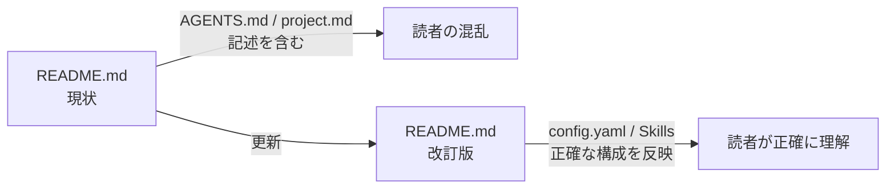

## Context

このリポジトリの `README.md` は OpenSpec v1 以前（`AGENTS.md` / `project.md` 構成）の時点で作成されたドキュメントである。
OpenSpec v1.x 系では `openspec init` がコマンドとスキルを自動生成する新アーキテクチャに移行しており、
現在の README は実態と異なる説明を含んでいる。

対象ファイルは `README.md` 一本のみで、コードや外部APIへの影響はなし。

## Goals / Non-Goals

**Goals:**
- `README.md` のディレクトリ構成表を OpenSpec v1 の実態（`config.yaml`・`commands/opsx/`・`skills/`）に合わせて更新する
- 開発フロー概要を `/opsx:new`・`/opsx:continue`・`/opsx:apply`・`/opsx:archive` コマンドベースの記述に更新する
- `openspec init` で自動生成される点を明記する

**Non-Goals:**
- README の全面リライトや構成変更
- 英語翻訳の追加
- `docs/` 以下のドキュメントの更新

## Decisions

**方針: 既存の README 構造を維持しつつ最小変更で修正する**
- ディレクトリ構成表の `AGENTS.md` 行 → `config.yaml` 行に置き換える
- `project.md` 行 → 削除（config.yaml の説明内に吸収）
- `.claude/` の説明行に `commands/opsx/`・`skills/` を追記する
- 開発フロー（箇条書き）を v1 コマンド名に更新する

全面リライトは避ける理由: 既存の日本語文体・構成は適切であり、変更箇所を最小化することでレビューを簡単にする。

## Risks / Trade-offs

- [リスク] 将来の OpenSpec バージョンアップで再び構成が変わる可能性 → 「init が生成する」と動的表現にすることで変化に強い文章にする
- [トレードオフ] 最小変更にするため、README の他の説明の質は据え置きになる → 今回のスコープは v1 対応のみと割り切る
