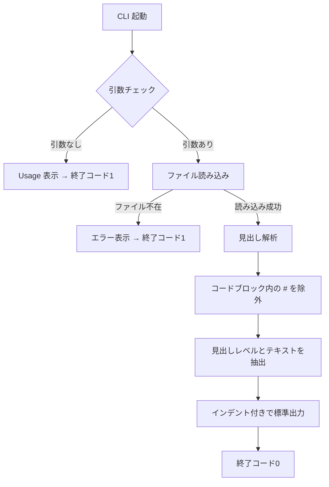

## Context

マークダウンファイルの見出し一覧を出力する Go CLI ツールを新規実装する。
`src/` ディレクトリに Go モジュールとして配置し、単一バイナリとしてビルド可能にする。

外部ライブラリには依存せず、標準ライブラリのみで実装する。
マークダウンの見出し解析はATX形式（`#` プレフィックス）のみを対象とし、
コードブロック内の `#` を誤検出しない程度の解析精度を確保する。



## Goals / Non-Goals

**Goals:**
- `src/` に Go モジュール（`go.mod`）を配置し、`go build` でビルド可能にする
- `main.go` でCLIのエントリポイントを実装する
- 見出し解析ロジックを `parser` パッケージとして分離し、テスト可能にする
- ユニットテストで主要シナリオ（正常系・異常系・コードブロック除外）をカバーする

**Non-Goals:**
- Setext形式の見出し（`===` / `---` による下線形式）のサポート
- 複数ファイルの一括処理
- 出力フォーマットの切り替え（JSON、ツリー表示等）
- マークダウンの完全なAST解析

## Decisions

**方針: 標準ライブラリのみで実装する**
- 外部依存を持たないことで、Go 環境さえあればビルド・テストが可能になる
- マークダウン解析は行単位の正規表現マッチで十分であり、ASTパーサーは不要

**方針: parser パッケージを分離する**
- `main.go`（CLI エントリポイント）と `parser/`（解析ロジック）を分離する
- 解析ロジックの単体テストが容易になる
- `main.go` は引数処理・ファイル読み込み・出力のみを担当する

**方針: コードブロック内の # は状態フラグで除外する**
- 行を順次走査しながら ``` の出現でコードブロック内外の状態を切り替える
- コードブロック内の行は見出し解析をスキップする

## Risks / Trade-offs

- [トレードオフ] 行単位の解析のため、インラインコード（`` ` ``）内の `#` は対応しない → 実用上ほぼ問題ない
- [リスク] ネストしたコードブロック（`````）に対応しきれない可能性 → 最初のバッククォート3つ以上での開閉で対応し、一般的なケースをカバーする
