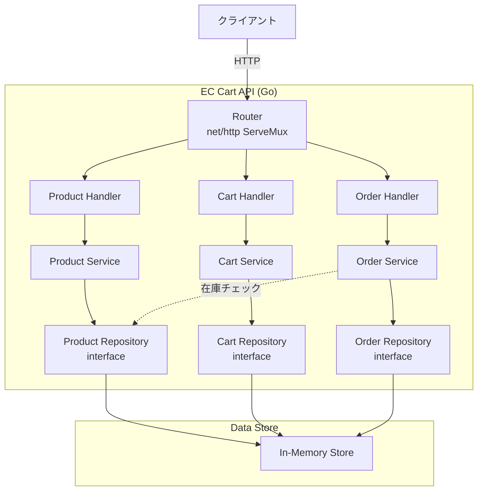
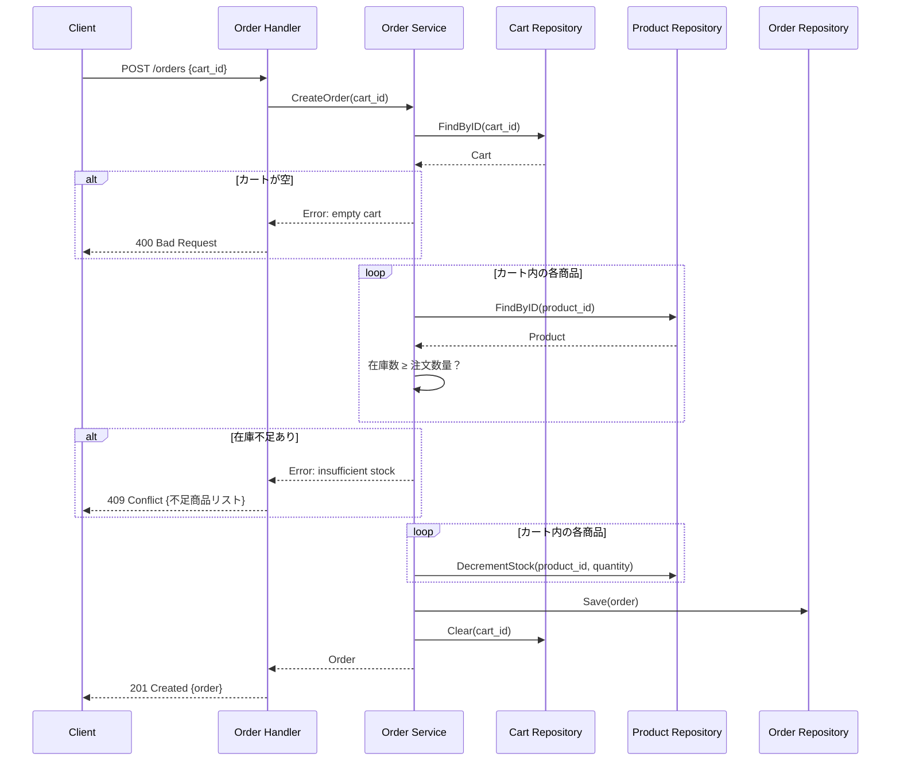

## Context

Go 言語で小規模な EC カート API を実装する。
プロダクト参照・カート操作・注文確定の3ドメインを REST API として提供する。

外部フレームワークへの依存は最小限に抑え、Go 標準ライブラリの `net/http` をベースとする。
ルーティングには Go 1.22 以降の `http.ServeMux` の拡張パターンマッチ（メソッド＋パスパラメータ対応）を活用する。
データストアは初期実装ではインメモリとし、将来的に永続化層を差し替え可能な設計にする。

## Data Model

### Product（プロダクト）

| フィールド | 型 | 説明 |
|-----------|-----|------|
| ID | string | プロダクト一意識別子（UUID） |
| Name | string | 商品名 |
| Description | string | 商品説明 |
| Price | int64 | 単価（税込、最小通貨単位） |
| Stock | int32 | 在庫数 |

### Cart（カート）

| フィールド | 型 | 説明 |
|-----------|-----|------|
| ID | string | カート一意識別子（UUID） |
| Items | []CartItem | カート内の商品リスト |

### CartItem（カート内商品）

| フィールド | 型 | 説明 |
|-----------|-----|------|
| ProductID | string | プロダクトID |
| ProductName | string | 商品名（表示用、追加時にスナップショット） |
| Quantity | int32 | 数量 |
| UnitPrice | int64 | 単価（追加時にスナップショット） |

### Order（注文）

| フィールド | 型 | 説明 |
|-----------|-----|------|
| ID | string | 注文一意識別子（UUID） |
| Items | []OrderItem | 注文商品リスト |
| TotalAmount | int64 | 合計金額 |
| Status | string | 注文ステータス（"confirmed"） |
| CreatedAt | time.Time | 注文日時 |

### OrderItem（注文商品）

| フィールド | 型 | 説明 |
|-----------|-----|------|
| ProductID | string | プロダクトID |
| ProductName | string | 商品名 |
| Quantity | int32 | 数量 |
| UnitPrice | int64 | 単価 |
| Subtotal | int64 | 小計（UnitPrice × Quantity） |

### ErrorResponse（共通エラー）

| フィールド | 型 | 説明 |
|-----------|-----|------|
| Error | string | エラーメッセージ |
| Details | []string | 詳細情報（在庫不足時の不足商品リスト等、任意） |

## API Endpoints

| メソッド | パス | 説明 | レスポンス |
|---------|------|------|-----------|
| GET | /products | プロダクト一覧取得 | 200: Product[] |
| GET | /products/{product_id} | プロダクト詳細取得 | 200: Product / 404 |
| GET | /carts/{cart_id} | カート内容取得 | 200: Cart / 404 |
| POST | /carts/{cart_id}/items | カートに商品追加（カート自動生成含む） | 201: Cart（新規）/ 200: Cart（数量加算）/ 400, 404 |
| PUT | /carts/{cart_id}/items/{product_id} | カート内商品の数量変更 | 200: Cart / 404 |
| DELETE | /carts/{cart_id}/items/{product_id} | カートから商品削除 | 204 / 404 |
| POST | /orders | 注文確定 | 201: Order / 400, 404, 409 |

補足:
- カートは `POST /carts/{cart_id}/items` の初回リクエスト時に自動生成される
- カートIDはクライアントが UUID 形式で生成して指定する
- 既存商品への数量加算時は 200、新規追加時は 201 を返す

## Package Structure

| パッケージ | パス | 役割 |
|-----------|------|------|
| main | src/ec-cart-api/main.go | エントリポイント、ルーター設定、DI |
| handler | src/ec-cart-api/handler/ | HTTP ハンドラー層（product.go, cart.go, order.go） |
| service | src/ec-cart-api/service/ | ビジネスロジック層（product.go, cart.go, order.go） |
| repository | src/ec-cart-api/repository/ | データアクセス層 interface（product.go, cart.go, order.go） |
| store | src/ec-cart-api/store/ | インメモリ実装（memory.go） |
| model | src/ec-cart-api/model/ | ドメインモデル（product.go, cart.go, order.go） |

## 注文確定シーケンス

## Goals / Non-Goals

**Goals:**
- 標準ライブラリベースのシンプルな REST API 設計
- Repository インターフェースによるデータストア抽象化
- 在庫チェックの整合性を保証する注文確定フロー
- テスト容易性（DI による Repository 差し替え）

**Non-Goals:**
- 認証・認可（JWT、セッション管理等）
- 決済連携（外部決済 API 呼び出し）
- 配送管理・注文履歴参照
- ページネーション・フィルタリング・ソート
- キャッシュ・レート制限
- データベース永続化（初期実装はインメモリ）

## Decisions

**方針: Go 標準ライブラリの net/http を採用する**
- Go 1.22 以降の `ServeMux` はメソッドベースルーティングとパスパラメータに対応している
- 外部ルーターライブラリ（gorilla/mux, chi 等）への依存を排除し、ビルド・デプロイを簡素化する
- 小規模 API にはミドルウェアスタック等の高機能ルーターは不要

**方針: 3層アーキテクチャ（Handler / Service / Repository）を採用する**
- Handler は HTTP の関心（リクエストパース・レスポンス構築）のみを担当する
- Service はビジネスロジック（在庫チェック・合計計算等）を担当する
- Repository はデータアクセスをインターフェースで抽象化し、テスト時にモック差し替え可能にする

**方針: 金額は最小通貨単位（int64）で扱う**
- 浮動小数点の丸め誤差を回避する
- 日本円の場合は1円単位、米ドルの場合は1セント単位

**方針: カートはクライアント指定IDで自動生成する**
- `POST /carts/{cart_id}/items` の初回リクエスト時にカートを自動生成する
- カートIDはクライアントが UUID 形式で生成して指定する
- 明示的なカート作成エンドポイントは設けない（API をシンプルに保つ）

**方針: Order Service は Product Repository を直接利用する**
- 在庫チェック・在庫減算は注文確定のビジネスロジック内で完結する操作
- Product Service を経由すると不要な抽象化が増えるため、OrderService のコンストラクタに CartRepository, ProductRepository, OrderRepository の3つを注入する

**方針: Order の Status は初期実装では "confirmed" の1値のみ**
- ステータス遷移（cancelled, shipped 等）は将来の拡張範囲とし、初期実装では扱わない
- 将来拡張を見据えて型は string とする

**方針: 在庫チェックと減算は同一トランザクション内で実行する**
- インメモリ実装では単一の sync.RWMutex をストア全体で共有する（読み取りと書き込みの分離）
- 注文確定時は Write Lock で Cart と Product の両方を保護する
- 将来的な DB 実装では DB トランザクションに置き換える

## Risks / Trade-offs

- [トレードオフ] インメモリストアのため、プロセス再起動でデータが失われる → 初期実装として割り切り、Repository インターフェースにより将来の永続化対応は容易
- [トレードオフ] カート内の価格はスナップショットのため、追加後の価格変更は反映されない → EC の一般的なパターンであり、注文確定時に最新価格との差異を検知する仕組みは将来課題
- [リスク] sync.Mutex による排他制御はシングルプロセスでのみ有効 → 水平スケーリング時には分散ロックまたは DB トランザクションへの移行が必要
